# Prishtina Air Pollution, Weather and Energy Production Pipeline (2023–2026)

<table>
  <tr>
    <td width="150" align="center" valign="center">
      
    </td>
    <td valign="top">
      <p><strong>Universiteti i Prishtinës</strong></p>
      <p>Fakulteti i Inxhinierisë Elektrike dhe Kompjuterike</p>
      <p>Inxhinieri Kompjuterike dhe Softuerike – Programi Master</p>
      <p><strong>Projekti nga lënda:</strong> Përgatitja dhe vizualizimi i të dhënave</p>
      <p><strong>Profesor:</strong> Dr. Sc. Lule Ahmedi</p>
      <p><strong>Asistent:</strong> Dr. Sc. Mërgim H. Hoti</p>
      <p><strong>Studentët:</strong></p>
      <ul>
        <li>Diellza Përvetica</li>
        <li>Fatjeta Gashi</li>
        <li>Festina Klinaku</li>
      </ul>
    </td>
  </tr>
</table>

---

## Përmbajtja

1. [Përmbledhje e projektit](#përmbledhje-e-projektit)
2. [Qëllimi i punimit](#qëllimi-i-punimit)
3. [Dashboard](#dashboard)
4. [Struktura e repository-t](#struktura-e-repository-t)
5. [01 Përgatitja e modelit](#01-përgatitja-e-modelit)
   - [Burimet e të dhënave](#burimet-e-të-dhënave)
   - [Përshkrimi i dataset-eve hyrëse](#përshkrimi-i-dataset-eve-hyrëse)
   - [Topologjia e pipeline-it](#topologjia-e-pipeline-it)
   - [Përshkrimi i detajuar i çdo skripte](#përshkrimi-i-detajuar-i-çdo-skripte)
     - [Data collection](#data-collection)
     - [Integration](#integration)
     - [Distinct values](#distinct-values)
     - [Data cleaning](#data-cleaning)
     - [Feature engineering](#feature-engineering)
     - [Preprocessing](#preprocessing)
   - [Artefaktet dhe output-et e krijuara](#artefaktet-dhe-output-et-e-krijuara)
   - [Vizualizimet e gjeneruara](#vizualizimet-e-gjeneruara)
   - [Teknikat e zbatuara dhe lidhja me lëndën](#teknikat-e-zbatuara-dhe-lidhja-me-lëndën)
   - [Ekzekutimi i projektit](#ekzekutimi-i-projektit)
   - [Rezultati final i pipeline-it](#rezultati-final-i-pipeline-it)
6. [02 Modelimi dhe analiza](#02-modelimi-dhe-analiza)
   - [Qasja e përgjithshme](#qasja-e-përgjithshme)
   - [CatBoost për parashikimin e PM2.5](#catboost-për-parashikimin-e-pm25)
   - [LightGBM për parashikimin e PM2.5](#lightgbm-për-parashikimin-e-pm25)
   - [SARIMAX për parashikimin e PM2.5](#sarimax-për-parashikimin-e-pm25)
   - [HDBSCAN për analizë unsupervised](#hdbscan-për-analizë-unsupervised)
   - [Gaussian Mixture për analizë unsupervised](#gaussian-mixture-për-analizë-unsupervised)
   - [Isolation Forest për analizë unsupervised](#isolation-forest-për-analizë-unsupervised)
   - [Ekzekutimi i fazës së dytë](#ekzekutimi-i-fazës-së-dytë)
   - [Krahasimi i harmonizuar i modeleve](#krahasimi-i-harmonizuar-i-modeleve)
   - [Rezultatet, metrikat dhe interpretimi i fazës së dytë](#rezultatet-metrikat-dhe-interpretimi-i-fazës-së-dytë)
   - [Artefaktet e krijuara nga modelet](#artefaktet-e-krijuara-nga-modelet)
   - [Vizualizimet e fazës së dytë](#vizualizimet-e-fazës-së-dytë)
   - [Rezultati i zgjeruar i pipeline-it](#rezultati-i-zgjeruar-i-pipeline-it)
7. [03 Rievaluimi dhe përmirësimi i modelit](#03-rievaluimi-dhe-përmirësimi-i-modelit)
   - [Rrjedha metodologjike e fazës së tretë](#rrjedha-metodologjike-e-fazës-së-tretë)
   - [Pika fillestare e fazës së tretë](#pika-fillestare-e-fazës-së-tretë)
   - [Fine-tuning i CatBoost](#fine-tuning-i-catboost)
   - [Krahasimi CatBoost faza 2 kundrejt fazës 3](#krahasimi-catboost-faza-2-kundrejt-fazës-3)
   - [Interpretueshmëria e modelit](#interpretueshmëria-e-modelit)
   - [Stabiliteti kohor dhe sezonal](#stabiliteti-kohor-dhe-sezonal)
   - [Snapshot offline për parashikim të ditës së ardhshme](#snapshot-offline-për-parashikim-të-ditës-së-ardhshme)
   - [Pamja dhe karakteristikat e dashboard-it Streamlit në fazën e tretë](#pamja-dhe-karakteristikat-e-dashboard-it-streamlit-në-fazën-e-tretë)
   - [Vizualizimet e fazës së tretë](#vizualizimet-e-fazës-së-tretë)
   - [Ekzekutimi dhe riprodhueshmëria e fazës së tretë](#ekzekutimi-dhe-riprodhueshmëria-e-fazës-së-tretë)
   - [Artefaktet e fazës së tretë](#artefaktet-e-fazës-së-tretë)
   - [Interpretimi final i fazës së tretë](#interpretimi-final-i-fazës-së-tretë)
   - [Kush përfiton dhe si?](#kush-përfiton-dhe-si)
8. [Konkluzione](#konkluzione)
9. [Perspektiva të ardhshme dhe rekomandime](#perspektiva-të-ardhshme-dhe-rekomandime)
10. [Anëtarët e grupit](#anëtarët-e-grupit)
11. [Acknowledgments](#acknowledgments)

---

## Përmbledhje e projektit

Ky projekt implementon një pipeline të plotë, modular dhe të riprodhueshëm për ndërtimin e një dataset-i analitik dhe model-ready për analizën dhe parashikimin e ndotjes së ajrit në Prishtinë, me fokus të veçantë te `PM2.5`.

Pipeline-i ndërtohet mbi integrimin e tre burimeve të ndryshme të të dhënave, të mbledhura për periudhën 2023–2026:

1. të dhënat për prodhimin e energjisë elektrike nga termocentralet e Kosovës,
2. të dhënat meteorologjike për Prishtinën,
3. të dhënat për ndotjen e ajrit në Prishtinë.

Më pas, këto burime:

- harmonizohen në nivel kohor orë-pas-ore,
- pastrohen,
- validohen,
- plotësohen për vlerat mungesë,
- pasurohen me karakteristika të reja,
- trajtohen për outlier-a dhe skewness,
- standardizohen,
- dhe në fund reduktohen në një subset tiparesh më të qëndrueshëm për modelim.

Ky projekt demonstron të gjithë ciklin e përgatitjes së të dhënave: nga kolektimi, integrimi dhe kontrolli i cilësisë, deri te feature engineering, transformimi statistikor dhe feature selection.

Në fazën e dytë, dataset-i final `data/phase_1/4E_selected_dataset.csv` është përdorur për modelim, krahasim dhe interpretim të avancuar. Konkretisht, janë implementuar tre modele supervised (`CatBoostRegressor`, `LightGBM`, `SARIMAX`) për parashikimin e `PM2.5`, si dhe tre modele unsupervised (`HDBSCAN`, `Gaussian Mixture`, `Isolation Forest`) për identifikimin e regjimeve mjedisore, cluster-ëve, noise points dhe anomalive. Për më tepër, rezultatet e të gjitha modeleve janë harmonizuar në `data/phase_2/` dhe `pictures/phase_2/`, në mënyrë që krahasimi dhe dokumentimi të jenë sa më të qarta dhe të riprodhueshme.

Në fazën e tretë, projekti fokusohet në rievaluimin dhe përmirësimin e modelit më të mirë supervised. `CatBoost` është tunuar në mënyrë të kontrolluar, është krahasuar me versionin e fazës së dytë, është interpretuar me `feature importance` dhe `SHAP`, dhe është lidhur me një përdorim praktik për forecast 24-orësh të `PM2.5` duke kombinuar planin day-ahead të prodhimit të energjisë nga KOSTT me parashikimin e motit nga Open-Meteo.

---

## Qëllimi i punimit

Qëllimi kryesor i këtij projekti është të ndërtojë një dataset të pastër dhe analitikisht të qëndrueshëm për të studiuar marrëdhëniet ndërmjet:

- prodhimit të energjisë elektrike,
- kushteve meteorologjike,
- dhe ndotësve atmosferikë në Prishtinë,

me fokus të veçantë në përdorimin e këtyre të dhënave për parashikimin e `PM2.5`.

Nga pikëpamja akademike, projekti është ndërtuar në tre shtresa të lidhura ngushtë:

- **faza e parë**, ku ndërtohet dataset-i final i pastër dhe model-ready;
- **faza e dytë**, ku testohet vlera reale e këtij dataset-i për regresion, clustering dhe anomaly detection;
- **faza e tretë**, ku modeli më i mirë supervised përmirësohet, interpretohet dhe përdoret për një forecast praktik 24-orësh.

Një komponent plotësues i rëndësishëm është edhe `app.py`, i cili shërben si dashboard interaktiv dhe e bën më të lehtë demonstrimin vizual të historikut, skenarëve, rezultateve të modeleve dhe forecast-it praktik për ditën e ardhshme.

Objektivat kryesore janë:

- të integrohen burime heterogjene të të dhënave në një bosht të përbashkët kohor;
- të kontrollohet cilësia e të dhënave dhe të korrigjohen vlera të pasakta;
- të trajtohen mungesat pa humbur informacion të vlefshëm;
- të krijohen tipare të reja kohore, meteorologjike dhe ndërvepruese;
- të zbutet ndikimi i outlier-ave dhe shpërndarjeve shumë të shtrembëruara;
- të standardizohet dataset-i për përdorim në modele statistikore dhe machine learning;
- të eliminohet multikolineariteti i tepërt përmes VIF-based feature selection;
- të përdoret dataset-i final i përzgjedhur për ndërtimin dhe validimin e modeleve supervised për parashikimin e `PM2.5`;
- të analizohet struktura e brendshme e të dhënave përmes metodave unsupervised clustering dhe anomaly detection;
- të rievaluohet dhe përmirësohet modeli më i mirë supervised përmes tuning, interpretueshmërisë dhe stabilitetit kohor;
- të demonstrohet përdorimi praktik i modelit për forecast 24-orësh duke përdorur burime të jashtme operative si KOSTT dhe Open-Meteo;
- të ndërtohet një dokumentim i plotë, i detajuar dhe profesional për të gjithë ciklin e projektit.

---

## Dashboard

Ky projekt përfshin edhe një dashboard interaktiv të ndërtuar me Streamlit në `app.py`, i cili shërben si shtresë vizuale dhe demonstrative mbi të gjithë pipeline-in. Në versionin aktual, dashboard-i nuk është më vetëm një simulator i thjeshtë, por një mjedis i zgjeruar ku bashkohen eksplorimi i të dhënave historike, testimi i skenarëve, prezantimi i rezultateve të modeleve dhe forecast-i praktik 24-orësh i fazës së tretë.

Nga pikëpamja funksionale, dashboard-i lejon:

- manipulimin interaktiv të parametrave energjetikë dhe meteorologjikë;
- shikimin e ndikimit të tyre në ndotësit kryesorë atmosferikë;
- paraqitjen më të qartë të rolit të `PM2.5` si target kryesor i projektit;
- interpretimin më intuitiv të rezultateve të modeleve supervised dhe unsupervised;
- shfaqjen e snapshot-it të ruajtur për forecast-in e ditës së ardhshme nga KOSTT, Open-Meteo dhe `CatBoost` i tunuar.

Në këtë version të zgjeruar, dashboard-i pasqyron edhe gjashtë modelet kryesore të përdorura në fazën e dytë:

- `CatBoost`, `LightGBM` dhe `SARIMAX` për forecast të `PM2.5`;
- `HDBSCAN`, `Gaussian Mixture` dhe `Isolation Forest` për clustering, profile mjedisore dhe anomaly detection.

Kjo do të thotë se `app.py` funksionon si nyje lidhëse mes:

- të dhënave të pastruara dhe të përpunuara;
- modeleve të trajnuara;
- figurave dhe rezultateve të ruajtura në repo;
- snapshot-it praktik të fazës së tretë;
- dhe prezantimit praktik të projektit në formë të kuptueshme për përdoruesin ose profesorin.

Prandaj, nga ana e dokumentimit, ky komponent paraqitet menjëherë pas qëllimit të punimit, sepse tregon që projekti nuk përfundon vetëm me skripta analitikë, por shtrihet edhe në një shtresë prezantimi interaktiv.

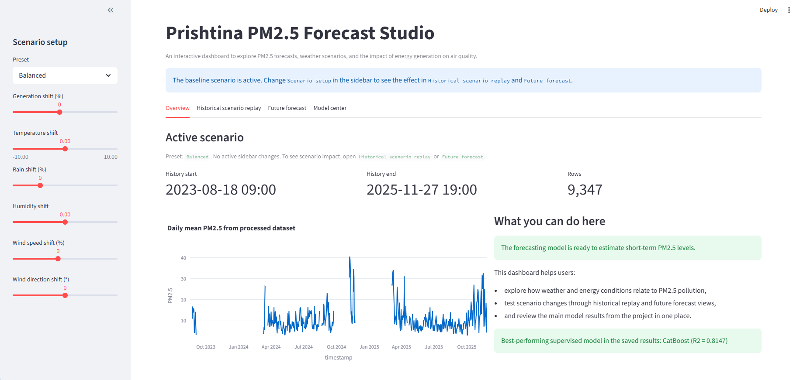

Kjo pamje paraqet faqen kryesore të dashboard-it, ku shihen periudha e dataset-it, statusi i modelit dhe seria historike ditore e `PM2.5`.

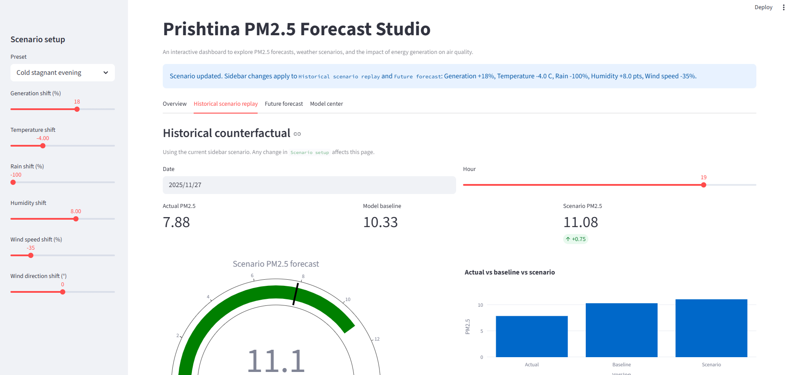

Kjo pamje tregon analizën kundërfaktuale, ku përdoruesi mund të ndryshojë prodhimin e energjisë dhe kushtet meteorologjike për të parë si ndryshon parashikimi i `PM2.5`.

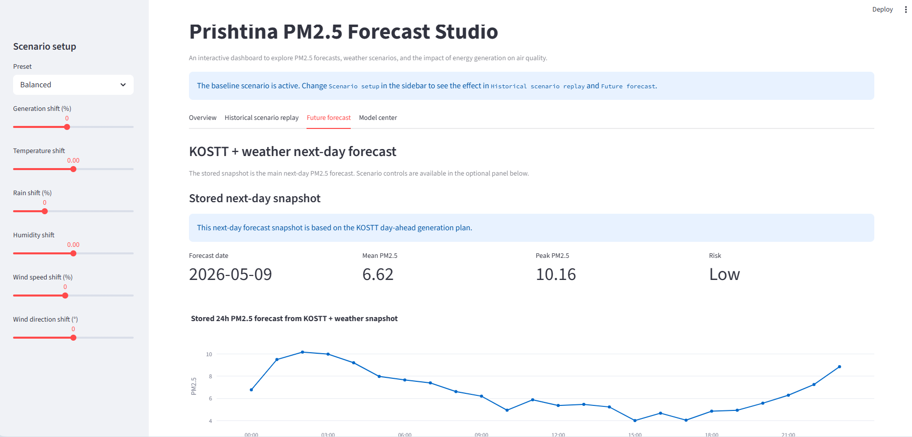

Kjo pamje paraqet snapshot-in praktik të fazës së tretë: forecast 24-orësh i `PM2.5` i ndërtuar nga plani day-ahead i KOSTT-it, parashikimi i motit nga Open-Meteo dhe modeli `CatBoost` i tunuar.

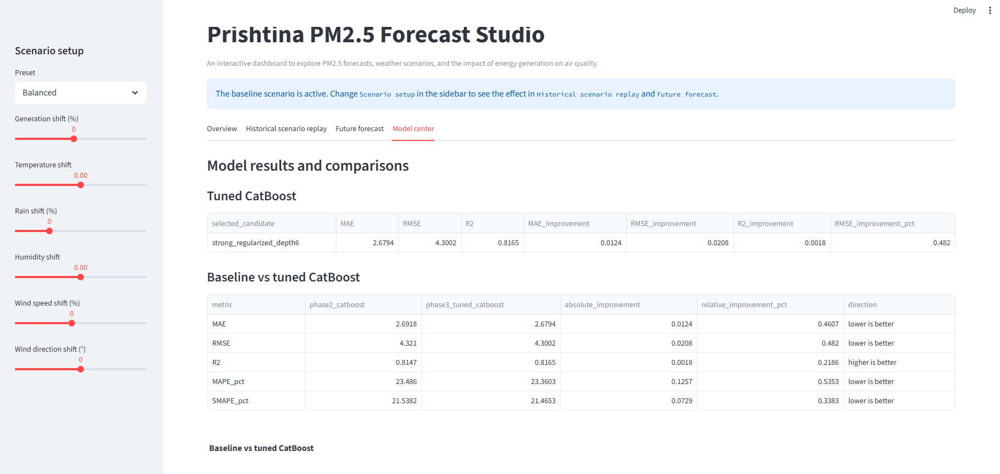

Kjo pamje përmbledh rezultatet kryesore të modeleve në dashboard dhe e bën më të lehtë prezantimin e performancës së `CatBoost` të tunuar krahas versionit bazë.

Rezultatet e plota të modelimit dokumentohen më poshtë në seksionet e fazës së dytë dhe fazës së tretë me figura, tabela dhe metrika të dedikuara.

---

## Struktura e repository-t

Struktura e mëposhtme paraqet gjendjen aktuale të repository-t dhe fokusohet te file-t kryesorë të projektit: skriptat e pipeline-it, modelet, dataset-et dhe output-et më të rëndësishme për dokumentim. Për qartësi nuk paraqiten folderët teknikë si `.venv`, `.idea`, `.vscode` dhe `__pycache__`.

```text
AIR_POLLUTION_PREDICTION_PRISHTINA/
│
├── app.py
├── README.md
├── test.py
│
├── src/
│   ├── phase_1/
│   │   ├── data_collection/
│   │   │   ├── get_kosova_air_quality_data.ps1
│   │   │   └── get_prishtina_air_quality_data.ipynb
│   │   ├── integration/
│   │   │   └── 1A_merge_data.py
│   │   ├── distinct_values/
│   │   │   └── 1B_distinct_values.py
│   │   ├── data_cleaning/
│   │   │   ├── 2A_datetime_and_duplicates.py
│   │   │   ├── 2B_data_quality_cleaning.py
│   │   │   ├── 2C_missing_values_handling.py
│   │   │   └── 2D_validate_final_dataset.py
│   │   ├── feature_engineering/
│   │   │   ├── 3A_target_analysis.py
│   │   │   └── 3B_feature_engineering.py
│   │   └── preprocessing/
│   │       ├── 4A_outlier_treatment.py
│   │       ├── 4B_skewness_treatment.py
│   │       ├── 4C_visualization_before_after.py
│   │       ├── 4D_feature_scaling.py
│   │       └── 4E_feature_selection.py
│   │
│   ├── phase_2/
│   │   ├── supervised/
│   │   │   ├── catboost_model/
│   │   │   │   └── catboost_model.py
│   │   │   ├── lightgbm_model/
│   │   │   │   ├── lightgbm_model.py
│   │   │   │   ├── baseline_model/
│   │   │   │   └── improved_model/
│   │   │   └── sarimax_model/
│   │   │       └── sarimax_model.py
│   │   ├── unsupervised/
│   │   │   ├── gaussian_mixture_model/
│   │   │   │   └── gaussian_mixture_model.py
│   │   │   ├── hdbscan_model/
│   │   │   │   └── hdbscan_model.py
│   │   │   └── isolation_forest_model/
│   │   │       ├── isolation_forest_model.py
│   │   │       └── isolation_forest_extended_outputs.py
│   │   └── comparison/
│   │       └── build_phase2_standardized_outputs.py
│
│   └── phase_3/
│       ├── supervised/
│       │   └── catboost_phase3_tuning.py
│       ├── forecasting/
│       │   └── build_next_day_forecast_snapshot.py
│       └── comparison/
│           └── build_phase3_standardized_outputs.py
│
├── data/
│   ├── raw/
│   │   ├── prishtina_air_quality_2023_2025.csv
│   │   ├── prishtina_energy_production_2023_2026.csv
│   │   ├── prishtina_weather_2023_2026.csv
│   │   ├── thermocentral_A_emissions.csv
│   │   └── thermocentral_B_emissions.csv
│   ├── phase_1/
│   │   ├── 1A_merged_data_hourly_2023_2025.csv
│   │   ├── 1B_distinct_values/
│   │   ├── 2A_cleaned_no_duplicates.csv
│   │   ├── 2B_quality_checked.csv
│   │   ├── 2C_missing_values_handled.csv
│   │   ├── 2D_validated_final_dataset.csv
│   │   ├── 3B_engineered_dataset.csv
│   │   ├── 4A_outliers_handled.csv
│   │   ├── 4B_skewness_handled.csv
│   │   ├── 4D_scaled_dataset.csv
│   │   └── 4E_selected_dataset.csv
│   ├── phase_2/
│   │   ├── supervised/
│   │   │   ├── catboost/
│   │   │   │   ├── catboost_feature_importance.csv
│   │   │   │   ├── catboost_forecasts.csv
│   │   │   │   ├── catboost_metrics.csv
│   │   │   │   ├── catboost_run_info.json
│   │   │   │   └── catboost_split_summary.csv
│   │   │   ├── lightgbm_improved/
│   │   │   │   ├── feature_importance.csv
│   │   │   │   └── metrics_summary.txt
│   │   │   └── sarimax/
│   │   │       ├── sarimax_candidate_results.csv
│   │   │       ├── sarimax_coefficients.csv
│   │   │       ├── sarimax_forecasts.csv
│   │   │       ├── sarimax_metrics.csv
│   │   │       ├── sarimax_residuals.csv
│   │   │       ├── sarimax_run_info.json
│   │   │       └── sarimax_split_summary.csv
│   │   ├── unsupervised/
│   │   │   ├── gaussian_mixture/
│   │   │   │   ├── gmm_clustered_dataset.csv
│   │   │   │   ├── gmm_cluster_summary.csv
│   │   │   │   ├── gmm_feature_summary.csv
│   │   │   │   ├── gmm_metrics.csv
│   │   │   │   ├── gmm_model_selection.csv
│   │   │   │   └── gmm_run_info.json
│   │   │   ├── hdbscan/
│   │   │   │   ├── hdbscan_clustered_dataset.csv
│   │   │   │   ├── hdbscan_cluster_summary.csv
│   │   │   │   ├── hdbscan_feature_summary.csv
│   │   │   │   ├── hdbscan_metrics.csv
│   │   │   │   └── hdbscan_run_info.json
│   │   │   └── isolation_forest/
│   │   │       ├── isolation_forest_feature_summary.csv
│   │   │       ├── isolation_forest_metrics.csv
│   │   │       ├── isolation_forest_run_info.json
│   │   │       ├── isolation_forest_scored_dataset.csv
│   │   │       └── isolation_forest_top_anomalies.csv
│   │   ├── comparison/
│   │   │   ├── supervised_model_comparison.csv
│   │   │   └── unsupervised_model_comparison.csv
│   │   └── phase2_manifest.json
│   └── phase_3/
│       ├── supervised/
│       │   └── catboost_tuned/
│       │       ├── catboost_tuned_feature_importance.csv
│       │       ├── catboost_tuned_forecasts.csv
│       │       ├── catboost_tuned_metrics.csv
│       │       ├── catboost_tuned_monthly_stability.csv
│       │       ├── catboost_tuned_oof_predictions.csv
│       │       ├── catboost_tuned_run_info.json
│       │       ├── catboost_tuned_seasonal_stability.csv
│       │       ├── catboost_tuned_shap_global_importance.csv
│       │       ├── catboost_tuned_timeseries_fold_metrics.csv
│       │       └── catboost_tuning_candidates.csv
│       ├── forecasting/
│       │   ├── external/
│       │   │   ├── kostt_generation_plan_next_day_snapshot.xlsx
│       │   │   ├── open_meteo_next_day_weather_snapshot.csv
│       │   │   └── open_meteo_next_day_weather_snapshot.json
│       │   ├── kostt_hourly_generation_profile_from_daily_total.csv
│       │   ├── kostt_next_day_generation_snapshot.csv
│       │   ├── next_day_forecast_snapshot_run_info.json
│       │   ├── next_day_pm25_daily_summary_snapshot.csv
│       │   └── next_day_pm25_hourly_forecast_snapshot.csv
│       └── comparison/
│           ├── catboost_phase2_vs_phase3_improvement.csv
│           ├── catboost_phase3_tuning_reference.csv
│           ├── next_day_forecast_snapshot_reference.csv
│           ├── phase2_supervised_reference.csv
│           └── phase3_comparison_run_info.json
│
├── models/
│   ├── scaler.pkl
│   ├── catboost_model/
│   │   ├── catboost_feature_columns.pkl
│   │   └── catboost_pm25_model.cbm
│   ├── gaussian_mixture_model/
│   │   ├── gmm_feature_columns.pkl
│   │   ├── gmm_model.pkl
│   │   ├── gmm_pca.pkl
│   │   └── gmm_scaler.pkl
│   ├── hdbscan_model/
│   │   ├── hdbscan_model.pkl
│   │   ├── hdbscan_scaler.pkl
│   │   └── hdbscan_umap.pkl
│   ├── isolation_forest_model/
│   │   ├── isolation_forest_feature_columns.pkl
│   │   └── isolation_forest_model.pkl
│   ├── sarimax_model/
│   │   ├── sarimax_feature_columns.pkl
│   │   ├── sarimax_pm25_model.pkl
│   │   └── sarimax_summary.txt
│   └── phase_3/
│       └── catboost_tuned/
│           ├── catboost_phase3_feature_columns.pkl
│           └── catboost_phase3_tuned_model.cbm
│
└── pictures/
    ├── img.png
    ├── dashboard/
    │   ├── dashboard_overview.png
    │   ├── dashboard_historical_scenario_replay.png
    │   ├── dashboard_future_forecast.png
    │   └── dashboard_model_center.png
    ├── phase_1/
    │   ├── pollutant_correlation_heatmap.png
    │   ├── pollutant_vs_predictors_heatmap.png
    │   └── 4C_visualization_before_after/
    ├── phase_2/
    │   ├── supervised/
    │   │   ├── catboost/
    │   │   │   ├── catboost_actual_vs_predicted.png
    │   │   │   ├── catboost_feature_importance.png
    │   │   │   ├── catboost_forecast_interactive.html
    │   │   │   ├── catboost_metrics_table.png
    │   │   │   └── catboost_residual_diagnostics.png
    │   │   ├── lightgbm_improved/
    │   │   │   ├── lightgbm_actual_vs_predicted.png
    │   │   │   ├── lightgbm_feature_importance.png
    │   │   │   ├── lightgbm_learning_curve.png
    │   │   │   └── lightgbm_metrics_table.png
    │   │   └── sarimax/
    │   │       ├── sarimax_actual_vs_predicted.png
    │   │       ├── sarimax_coefficients.png
    │   │       ├── sarimax_forecast_interactive.html
    │   │       ├── sarimax_metrics_table.png
    │   │       └── sarimax_residual_diagnostics.png
    │   ├── unsupervised/
    │   │   ├── gaussian_mixture/
    │   │   │   ├── gmm_cluster_profile_heatmap.png
    │   │   │   ├── gmm_metrics_table.png
    │   │   │   ├── gmm_model_selection.png
    │   │   │   ├── gmm_pca_interactive.html
    │   │   │   ├── gmm_pm25_by_cluster.png
    │   │   │   └── gmm_scatter.png
    │   │   ├── hdbscan/
    │   │   │   ├── hdbscan_feature_shift_panel.png
    │   │   │   ├── hdbscan_metrics_table.png
    │   │   │   ├── hdbscan_pm25_by_cluster.png
    │   │   │   ├── hdbscan_scatter.png
    │   │   │   └── hdbscan_umap_interactive.html
    │   │   └── isolation_forest/
    │   │       ├── isolation_forest_energy.png
    │   │       ├── isolation_forest_metrics_table.png
    │   │       ├── isolation_forest_pm25.png
    │   │       ├── isolation_forest_pm25_zoom.png
    │   │       ├── isolation_forest_scatter.png
    │   │       └── isolation_forest_score_distribution.png
    │   └── comparison/
    │       ├── supervised_comparison_table.png
    │       ├── supervised_error_metrics.png
    │       ├── supervised_feature_panels.png
    │       ├── supervised_r2_comparison.png
    │       ├── unsupervised_clustering_quality.png
    │       ├── unsupervised_comparison_table.png
    │       ├── unsupervised_feature_panels.png
    │       ├── unsupervised_pm25_profiles.png
    │       └── unsupervised_special_ratio_and_groups.png
    └── phase_3/
        ├── supervised/
        │   └── catboost_tuned/
        │       ├── catboost_tuned_actual_vs_predicted.png
        │       ├── catboost_tuned_feature_importance.png
        │       ├── catboost_tuned_monthly_stability.png
        │       ├── catboost_tuned_residual_diagnostics.png
        │       ├── catboost_tuned_seasonal_stability.png
        │       ├── catboost_tuned_shap_direction.png
        │       ├── catboost_tuned_shap_global_importance.png
        │       └── catboost_tuning_candidates.png
        ├── forecasting/
        │   └── next_day_pm25_forecast_snapshot.png
        └── comparison/
            ├── catboost_phase2_vs_phase3_improvement_table.png
            ├── catboost_phase2_vs_phase3_metrics.png
            ├── catboost_phase3_tuning_reference_table.png
            ├── next_day_forecast_snapshot_table.png
            ├── phase2_supervised_metrics_reference.png
            └── phase2_supervised_reference_table.png
```

---

## 01 Përgatitja e modelit

### Burimet e të dhënave

Ky projekt bazohet në tre burime kryesore të të dhënave:

#### 1. Prodhimi i energjisë elektrike nga termocentralet e Kosovës

Dataset-i përmban prodhimin orar të njësive energjetike:

- `A3_MW`
- `A4_MW`
- `A5_MW`
- `B1_MW`
- `B2_MW`

Nga këto është ndërtuar edhe:

- `total_generation_mw`

Të dhënat janë marrë nga KOSTT dhe janë harmonizuar në nivel orar.

#### 2. Të dhënat meteorologjike për Prishtinën

Dataset-i meteorologjik përmban atribute si:

- temperatura,
- reshjet,
- bora,
- lagështia relative,
- drejtimi i erës,
- shpejtësia e erës.

Këto të dhëna janë përdorur për të modeluar kushtet atmosferike që ndikojnë në përhapjen ose stagnimin e ndotjes. Të dhënat janë marrë nga OpenMeteo.

#### 3. Të dhënat e ndotjes së ajrit në Prishtinë

Dataset-i i cilësisë së ajrit përmban matje të ndotësve:

- `co`
- `no2`
- `o3`
- `pm10`
- `pm25`
- `so2`

Këto të dhëna janë mbledhur dhe konsoliduar për Prishtinën përmes burimeve të tipit OpenAQ / arkivave përkatëse / notebook-ut të kolektimit të përdorur në projekt.

#### Shtrirja kohore

Burimet hyrëse mbulojnë periudhën 2023–2026. Megjithatë, dataset-i i integruar final ruan vetëm intervalin ku të tre burimet kanë mbulim të përbashkët orar, prandaj output-i i parë i integruar ruhet si:

- `1A_merged_data_hourly_2023_2025.csv`

Kjo e bën integrimin kohor të saktë dhe shmang boshllëqet e krijuara nga mungesa e përbashkët midis burimeve.

#### Dataset-i i integruar

Pas bashkimit (`merge`) të tre burimeve me `inner join`, dataset-i final përmban vetëm intervalin e përbashkët kohor:

- Numri i rreshtave: **9,370**
- Numri i kolonave: **22**
- Numri total i vlerave: **206,140**
- Intervali kohor: **2023-08-01 → 2025-11-27**

- Reduktimi i numrit të rreshtave është rezultat i sinkronizimit strikt kohor ndërmjet burimeve, ku ruhen vetëm momentet për të cilat ekzistojnë të dhëna në të tre dataset-et.

---

### Përshkrimi i dataset-eve hyrëse

Pipeline-i përdor tre skedarë bruto të ruajtur në `data/raw/`:

- `prishtina_air_quality_2023_2025.csv`
- `prishtina_weather_2023_2026.csv`
- `prishtina_energy_production_2023_2026.csv`

#### Dataset-i i ndotjes së ajrit

Përmban kolonën `datetime` dhe ndotësit kryesorë atmosferikë:

- `co`
- `no2`
- `o3`
- `pm10`
- `pm25`
- `so2`

Karakteristikat e dataset-it:

- Numri i rreshtave: **10,147**
- Numri i kolonave: **7**
- Numri total i vlerave: **71,029**
- Intervali kohor: **2023-03-14 → 2025-11-27**

#### Dataset-i meteorologjik

Përmban kolonën kohore dhe atributet:

- `temperature_2m (°C)`
- `rain (mm)`
- `snowfall (cm)`
- `relative_humidity_2m (%)`
- `wind_direction_10m (°)`
- `wind_speed_10m (km/h)`

Karakteristikat e dataset-it:

- Numri i rreshtave: **27,813**
- Numri i kolonave: **7**
- Numri total i vlerave: **194,691**
- Intervali kohor: **2023-01-01 → 2026-03-05**

#### Dataset-i i energjisë

Përmban:

- kolonën e datës,
- kolonën e orës,
- prodhimin për secilën njësi termocentrali,
- dhe totalin e gjenerimit të energjisë.

Gjatë leximit, ky dataset kërkon pastrim shtesë të header-it, sepse struktura e tij fillestare nuk është menjëherë tabulare në formën standarde CSV.

Karakteristikat e dataset-it:

- Numri i rreshtave: **22,581**
- Numri i kolonave: **7**
- Numri total i vlerave: **158,067**
- Intervali kohor: **2023-08-01 → 2026-03-03**

---

### Topologjia e pipeline-it

Pipeline-i është ndërtuar si një sekuencë hapash modularë, ku secili skript:

- lexon një output të fazës paraprake,
- kryen një transformim të caktuar,
- dhe shkruan një output të ri të versionuar.

Rrjedha logjike është kjo:

1. **Mbledhja e të dhënave**  
   Shkarkimi / përgatitja e burimeve bruto.

2. **Integrimi i të dhënave**  
   Bashkimi i ndotjes, motit dhe energjisë në një dataset të përbashkët orar.

3. **Distinct value profiling**  
   Nxjerrja e vlerave unike për atribute kyçe numerike.

4. **Data cleaning dhe quality checks**  
   Heqja e duplikateve, korrigjimi i vlerave jo-logjike, plotësimi i mungesave, validimi kronologjik dhe fizik.

5. **Target analysis dhe exploratory correlation analysis**  
   Analiza statistikore fillestare e ndotësve dhe lidhjeve me tiparet shpjeguese.

6. **Feature engineering**  
   Krijimi i tipareve kohore, lag-ve, rolling windows, ndërveprimeve dhe vektorëve të erës.

7. **Outlier handling**  
   Kufizimi i vlerave ekstreme me quantile capping.

8. **Skewness handling**  
   Transformime `log1p` dhe `Yeo-Johnson` për kolonat e shtrembëruara.

9. **Before/after visualization**  
   Krahasime histogramash para dhe pas transformimeve.

10. **Scaling**  
    Standardizimi i të gjitha kolonave numerike.

11. **Feature selection**  
    Heqja e tipareve problematike dhe reduktimi i multikolinearitetit me VIF.

---

### Përshkrimi i detajuar i çdo skripte

### Data collection

#### `get_kosova_air_quality_data.ps1`

Ky skript PowerShell përdoret për shkarkimin e të dhënave arkivore nga OpenAQ për disa `location IDs` të lidhura me Prishtinën ose pikat përkatëse të matjes.

##### Çfarë bën skripta

- krijon folder-in bazë të ruajtjes në disk,
- iteron mbi një listë `location IDs`,
- për secilin lokacion përdor komandën `aws s3 cp` për të shkarkuar skedarët `.csv.gz` nga arkiva publike e OpenAQ,
- ruan të dhënat në nënfolderë të ndarë sipas `location ID`.

##### Qëllimi

Ky hap siguron mbledhjen e të dhënave bruto të ndotjes / matjeve për përpunim të mëtejshëm.

##### Lokacionet e përdorura

Në versionin aktual përdoren:

- `2536`
- `7674`
- `7931`
- `7933`
- `9337`

##### Output

Skedarët bruto ruhen lokalisht në strukturë të ndarë sipas lokacionit.

---

#### `get_prishtina_air_quality_data.ipynb`

Ky notebook shërben si mjedis interaktiv për mbledhje, eksplorim, filtrime dhe/ose konsolidim të të dhënave të cilësisë së ajrit për Prishtinën.

Meqë logjika e plotë e notebook-ut nuk është përfshirë këtu në README, roli i tij në projekt është:

- të ndihmojë në eksplorimin fillestar të të dhënave,
- të përgatisë ose eksportojë skedarët bruto/finalë të përdorur më pas në pipeline,
- të shërbejë si hap ndërmjetës midis burimeve online dhe CSV-ve në `data/raw/`.

---

### Integration

#### `1A_merge_data.py`

Ky është hapi themelor i integrimit të të tre burimeve.

##### Input

- `data/raw/prishtina_air_quality_2023_2025.csv`
- `data/raw/prishtina_weather_2023_2026.csv`
- `data/raw/prishtina_energy_production_2023_2026.csv`

##### Hapat kryesorë

1. Lexon dataset-in e ndotjes së ajrit.
2. Lexon dataset-in meteorologjik, duke anashkaluar rreshtat hyrës jo-standardë.
3. Lexon dataset-in e energjisë pa header standard dhe e zbulon automatikisht rreshtin e header-it.

```python
energy_raw = pd.read_csv(energy_path, header=None)

header_idx = None
for i in range(min(10, len(energy_raw))):
    row_text = " ".join(map(str, energy_raw.iloc[i].tolist())).lower()
    if "hour" in row_text and "date" in row_text:
        header_idx = i
        break

if header_idx is None:
    raise ValueError("Header row for energy dataset was not found.")
```
   
4. Normalizon emrat e kolonave të energjisë:
   - `Ora Hour` → `hour`
   - `DATA Date` → `date`
   - `A3 (MW)` → `A3_MW`
   - `A4 (MW)` → `A4_MW`
   - `A5 (MW)` → `A5_MW`
   - `B1 (MW)` → `B1_MW`
   - `B2 (MW)` → `B2_MW`

```python
energy = energy_raw.iloc[header_idx:].copy()
energy.columns = energy.iloc[0]
energy = energy.iloc[1:].copy()
energy.columns = [" ".join(str(col).replace("\n", " ").split()) for col in energy.columns]

energy = energy.rename(columns={
    "Ora Hour": "hour",
    "DATA Date": "date",
    "A3 (MW)": "A3_MW",
    "A4 (MW)": "A4_MW",
    "A5 (MW)": "A5_MW",
    "B1 (MW)": "B1_MW",
    "B2 (MW)": "B2_MW",
})
```

5. Konverton kolonat kohore në `datetime`.
6. Harmonizon timezone-in e ndotjes dhe motit në `Europe/Belgrade`, pastaj i kthen në naive timestamps.

```python
air["datetime"] = pd.to_datetime(air["datetime"], errors="coerce", utc=True)
air["datetime"] = air["datetime"].dt.tz_convert("Europe/Belgrade").dt.tz_localize(None)
air = air.dropna(subset=["datetime"])
air = air.drop_duplicates(subset=["datetime"])
air = air.sort_values("datetime").reset_index(drop=True)

weather = weather.rename(columns={"time": "datetime"})
weather["datetime"] = pd.to_datetime(weather["datetime"], errors="coerce", utc=True)
weather["datetime"] = weather["datetime"].dt.tz_convert("Europe/Belgrade").dt.tz_localize(None)
weather = weather.dropna(subset=["datetime"])
weather = weather.drop_duplicates(subset=["datetime"])
weather = weather.sort_values("datetime").reset_index(drop=True)
```

7. Pastron duplikatet sipas `datetime`.
8. Për dataset-in e energjisë:

- konverton `date`,
- konverton `hour`,
- krijon `datetime`,
- llogarit `total_generation_mw`.

```python
energy["date"] = pd.to_datetime(energy["date"], dayfirst=True, errors="coerce")
energy["hour"] = pd.to_numeric(energy["hour"], errors="coerce")

for col in ["A3_MW", "A4_MW", "A5_MW", "B1_MW", "B2_MW"]:
    energy[col] = pd.to_numeric(energy[col], errors="coerce")

energy = energy.dropna(subset=["date", "hour"])
energy["hour_zero_based"] = energy["hour"] - 1
energy["datetime"] = energy["date"] + pd.to_timedelta(energy["hour_zero_based"], unit="h")
energy["datetime"] = energy["datetime"] + pd.Timedelta(hours=1)
energy["total_generation_mw"] = energy[["A3_MW", "A4_MW", "A5_MW", "B1_MW", "B2_MW"]].sum(axis=1)
```

9. Zgjedh vetëm kolonat relevante nga secili burim.

```python
air = air[["datetime", "co", "no2", "o3", "pm10", "pm25", "so2"]]
energy = energy[[
    "datetime", "A3_MW", "A4_MW", "A5_MW",
    "B1_MW", "B2_MW", "total_generation_mw"
]]
```

10. Kryen dy merge-e me `how="inner"`:
    - ndotja + moti,
    - pastaj rezultati + energjia.
11. Krijon kolonat `date`, `hour` dhe `interval_start`.
```python
merged = air.merge(weather, on="datetime", how="inner")
merged = merged.merge(energy, on="datetime", how="inner")
merged = merged.sort_values("datetime").reset_index(drop=True)

merged["date"] = merged["datetime"].dt.date
merged["hour"] = merged["datetime"].dt.hour
merged["interval_start"] = merged["datetime"] - pd.Timedelta(hours=1)
```

##### Output

- `data/phase_1/1A_merged_data_hourly_2023_2025.csv`

```python
print("MERGED DATASET")
print(f"Rows: {merged.shape[0]}")
print(f"Columns: {merged.shape[1]}")
print(f"Total values: {merged.shape[0] * merged.shape[1]}")
print(f"Datetime range: {merged['datetime'].min()} -> {merged['datetime'].max()}")
```


##### Roli në pipeline

Ky skript krijon dataset-in e parë të integruar orar, që shërben si bazë për të gjitha hapat pasues.

---

### Distinct values

#### `1B_distinct_values.py`

Ky skript bën profilizimin e vlerave unike për një grup kolonash kryesore.

##### Input

- `data/phase_1/1A_merged_data_hourly_2023_2025.csv`

##### Kolonat e përfshira

- ndotësit: `co`, `no2`, `o3`, `pm10`, `pm25`, `so2`
- atributet meteorologjike:
  - temperatura
  - reshjet
  - bora
  - lagështia relative
  - drejtimi i erës
  - shpejtësia e erës
- kolonat e energjisë:
  - `A3_MW`
  - `A4_MW`
  - `A5_MW`
  - `B1_MW`
  - `B2_MW`
  - `total_generation_mw`

##### Çfarë bën

- lexon dataset-in e integruar,

```python
df = pd.read_csv(input_path)

pollution_cols = ["co", "no2", "o3", "pm10", "pm25", "so2"]
energy_cols = ["A3_MW", "A4_MW", "A5_MW", "B1_MW", "B2_MW", "total_generation_mw"]
all_cols = pollution_cols + weather_cols + energy_cols
```

- për secilën kolonë nxjerr vlerat unike jo-null,
- i rendit,
- dhe i ruan si CSV të ndarë në folderin `data/phase_1/1B_distinct_values/`.

```python
for col in all_cols:
    if col in df.columns:
        distinct_vals = pd.DataFrame(df[col].dropna().unique(), columns=[col])
        distinct_vals = distinct_vals.sort_values(by=col)

        file_name = clean_name(col)
        distinct_vals.to_csv(output_dir / f"distinct_{file_name}.csv", index=False)
    else:
        print(f"Kolona '{col}' nuk u gjet ne dataset!")
```

##### Output

Folderi `1B_distinct_values/` përmban një skedar të veçantë për secilin atribut, p.sh.:

- `distinct_co.csv`
- `distinct_no2.csv`
- `distinct_o3.csv`
- `distinct_pm10.csv`
- `distinct_pm25.csv`
- `distinct_so2.csv`
- `distinct_a3_mw.csv`
- `distinct_a4_mw.csv`
- `distinct_a5_mw.csv`
- `distinct_b1_mw.csv`
- `distinct_b2_mw.csv`
- `distinct_total_generation_mw.csv`
- si dhe skedarët për atributet meteorologjike të pastruara sipas emërtimit.

Pamje nga skedaret unik:

```text
data/phase_1/1B_distinct_values/
├── distinct_co.csv
├── distinct_no2.csv
├── distinct_o3.csv
├── distinct_pm10.csv
├── distinct_pm25.csv
├── distinct_so2.csv
├── distinct_a3_mw.csv
├── distinct_a4_mw.csv
├── distinct_a5_mw.csv
├── distinct_b1_mw.csv
├── distinct_b2_mw.csv
└── distinct_total_generation_mw.csv
```

##### Roli në pipeline

Ky hap mbështet eksplorimin fillestar të shpërndarjeve dhe kontrollin e domenit të vlerave.

---

### Data cleaning

#### `2A_datetime_and_duplicates.py`

Ky skript kryen pastrimin fillestar të dimensionit kohor dhe duplikateve.

##### Input

- `data/phase_1/1A_merged_data_hourly_2023_2025.csv`

##### Çfarë bën

- konverton `datetime` në format korrekt,
- heq rreshtat ku `datetime` është invalid,
- rendit dataset-in sipas kohës,

```python
df["datetime"] = pd.to_datetime(df["datetime"], errors="coerce")
df = df.dropna(subset=["datetime"]).sort_values("datetime").reset_index(drop=True)
```

- numëron duplikatet,
- heq duplikatet e plota.

```python
duplicate_count = df.duplicated().sum()
print(f"Numri i duplikateve: {duplicate_count}")

df = df.drop_duplicates().reset_index(drop=True)
df.to_csv(output_path, index=False)
```

##### Output

- `data/phase_1/2A_cleaned_no_duplicates.csv`

##### Roli ne pipeline

Siguron që dataset-i i integruar të ketë rend kronologjik korrekt dhe të mos ketë rreshta të përsëritur.

---

#### `2B_data_quality_cleaning.py`

Ky skript zbaton rregulla të cilësisë së të dhënave.

##### Input

- `data/phase_1/2A_cleaned_no_duplicates.csv`

##### Çfarë bën

1. Për ndotësit:
   - zëvendëson vlerat negative me `NaN`, sepse fizikisht nuk kanë kuptim.

```python
pollution_cols = ["pm10", "pm25", "co", "no2", "o3", "so2"]
for col in pollution_cols:
    if col in df.columns:
        negative_count = (df[col] < 0).sum()
        df[col] = df[col].apply(lambda x: np.nan if pd.notnull(x) and x < 0 else x)
        print(f"{col}: {negative_count} vlera negative u kthyen ne NaN")
```

2. Për drejtimin e erës:
   - normalizon këndet me operatorin `% 360`.

```python
wind_col = "wind_direction_10m (°)"
if wind_col in df.columns:
    df[wind_col] = df[wind_col].apply(lambda x: x % 360 if pd.notnull(x) else x)
```

3. Për reshjet dhe borën:
   - kufizon vlerat minimale në `0`.

```python
for col in ["rain (mm)", "snowfall (cm)"]:
    if col in df.columns:
        negative_count = (df[col] < 0).sum()
        df[col] = df[col].clip(lower=0)
        print(f"{col}: {negative_count} vlera negative u korrigjuan ne 0")
```

4. Për kolonat e energjisë:
   - kufizon vlerat negative në `0`.

```python
energy_cols = ["A3_MW", "A4_MW", "A5_MW", "B1_MW", "B2_MW", "total_generation_mw"]
for col in energy_cols:
    if col in df.columns:
        negative_count = (df[col] < 0).sum()
        df[col] = df[col].clip(lower=0)
        print(f"{col}: {negative_count} vlera negative u korrigjuan ne 0")
```

5. Për lagështinë relative:
   - kufizon vlerat në intervalin `[0, 100]`.

```python
if "relative_humidity_2m (%)" in df.columns:
    below_zero = (df["relative_humidity_2m (%)"] < 0).sum()
    above_hundred = (df["relative_humidity_2m (%)"] > 100).sum()
    df["relative_humidity_2m (%)"] = df["relative_humidity_2m (%)"].clip(0, 100)
    print(f"relative_humidity_2m (%): {below_zero + above_hundred} vlera u kufizuan ne intervalin 0-100")
```

6. Për `total_generation_mw`:
   - e rillogarit nga `A3_MW + A4_MW + A5_MW + B1_MW + B2_MW`
   - dhe korrigjon mospërputhjet me totalin ekzistues.

```python
energy_units = ["A3_MW", "A4_MW", "A5_MW", "B1_MW", "B2_MW"]
if all(col in df.columns for col in energy_units) and "total_generation_mw" in df.columns:
    original_total = df["total_generation_mw"].copy()
    recalculated_total = df[energy_units].sum(axis=1)
    mismatch_count = (original_total.round(3) != recalculated_total.round(3)).sum()
    print(f"total_generation_mw: {mismatch_count} raste me mospërputhje u korrigjuan")
    df["total_generation_mw"] = recalculated_total
```

7. Rrumbullakon kolonat numerike në 3 shifra dhjetore.

```python
numeric_cols = df.select_dtypes(include=["float64", "int64"]).columns
df[numeric_cols] = df[numeric_cols].round(3)

df.to_csv(output_path, index=False)
```

##### Output

- `data/phase_1/2B_quality_checked.csv`

##### Roli në pipeline

Ky hap vendos validim fizik dhe konsistencë numerike mbi të dhënat.

---

#### `2C_missing_values_handling.py`

Ky skript trajton vlerat mungesë.

##### Input

- `data/phase_1/2B_quality_checked.csv`

##### Strategjia e trajtimit

- `pm10` dhe `pm25`: plotësohen me `backfill`
- `co`, `no2`, `o3`, `so2`: plotësohen me `forward fill`
- në fund aplikohet kombinimi `ffill().bfill()` për gjithë dataset-in

##### Çfarë bën

- llogarit mungesat për kolonë dhe përqindjen e tyre,

```python
missing_count = df.isnull().sum().reset_index()
missing_count.columns = ["Column", "Missing_Values"]
missing_count["Percentage"] = (missing_count["Missing_Values"] / len(df)) * 100
```

- raporton sa vlera janë plotësuar për secilin ndotës,

```python
before_pm10 = df["pm10"].isnull().sum() if "pm10" in df.columns else 0
before_pm25 = df["pm25"].isnull().sum() if "pm25" in df.columns else 0

print(f"PM10: U mbushën {before_pm10} vlera.")
print(f"PM25: U mbushën {before_pm25} vlera.")
```

- plotëson vlerat mungesë sipas logjikës së përcaktuar,

```python
if "pm10" in df.columns:
    df["pm10"] = df["pm10"].bfill()

if "pm25" in df.columns:
    df["pm25"] = df["pm25"].bfill()
```

```python
gases = ["co", "no2", "o3", "so2"]
for col in gases:
    if col in df.columns:
        before_missing = df[col].isnull().sum()
        df[col] = df[col].ffill()
        print(f"{col}: U mbushën {before_missing} vlera.")

df = df.ffill().bfill()
```

- verifikon sa `NULL` mbeten në fund.

```python
df.to_csv(output_path, index=False)

print(f"Dataseti final u ruajt te: {output_path}")
print("Vlera Null të mbetura:", df.isnull().sum().sum())
```

##### Output

- `data/phase_1/2C_missing_values_handled.csv`

##### Roli në pipeline

Ky hap shmang humbjen e rreshtave dhe prodhon një dataset të plotë për analizat pasuese.

---

#### `2D_validate_final_dataset.py`

Ky skript bën validimin final të dataset-it pas trajtimit të mungesave.

##### Input

- `data/phase_1/2C_missing_values_handled.csv`

##### Çfarë bën

1. Kontrollon raportin fizik ndërmjet:
   - `pm25`
   - `pm10`

   dhe korrigjon rastet kur `pm25 > pm10` duke vendosur `pm25 = pm10`.

```python
if "pm10" in df.columns and "pm25" in df.columns:
    bad_ratio_mask = df["pm25"] > df["pm10"]
    pm_anomaly_count = bad_ratio_mask.sum()
    df.loc[bad_ratio_mask, "pm25"] = df.loc[bad_ratio_mask, "pm10"]
    print(f"Raste ku PM2.5 > PM10 u korrigjuan: {pm_anomaly_count}")
```

2. Kontrollon gaps kohore:
   - konverton `datetime`,
   - llogarit diferencën ndërmjet rreshtave,
   - numëron boshllëqet më të mëdha se 1 orë.

```python
df["datetime"] = pd.to_datetime(df["datetime"], errors="coerce")
df = df.sort_values("datetime").reset_index(drop=True)

time_diff = df["datetime"].diff()
gap_count = (time_diff > pd.Timedelta(hours=1)).sum()

if gap_count == 0:
    print("Nuk ka gaps ne timeline.")
else:
    print(f"U gjeten {gap_count} gaps ne timeline.")
```

3. Kontrollon nëse kanë mbetur `NULL`.

```python
total_nulls = df.isnull().sum().sum()
if total_nulls == 0:
    print("Nuk ka vlera NULL ne dataset.")
else:
    print(f"Ka ende {total_nulls} vlera NULL ne dataset.")
```

##### Output

- `data/phase_1/2D_validated_final_dataset.csv`


##### Roli në pipeline

Ky është dataset-i final i pastruar dhe validuar, mbi të cilin kryhen analiza dhe inxhinierim tiparesh.

---

### Feature engineering

#### `3A_target_analysis.py`

Ky skript kryen analizën fillestare të target-it dhe marrëdhënieve të tij me tiparet shpjeguese.

##### Input

- `data/phase_1/2D_validated_final_dataset.csv`

##### Çfarë bën

1. Gjeneron statistika përmbledhëse për ndotësit:
   - `co`
   - `no2`
   - `o3`
   - `pm10`
   - `pm25`
   - `so2`

```python
POLLUTANTS = ["co", "no2", "o3", "pm10", "pm25", "so2"]

summary_stats = df[POLLUTANTS].describe().T
print("\n=== Pollutant summary statistics ===")
print(summary_stats)
```

2. Formon një subset me:
   - ndotësit,
   - kolonat e energjisë,
   - kolonat meteorologjike.

3. Llogarit matricën e korrelacionit.

```python
predictors = ENERGY_FEATURES + WEATHER_FEATURES
subset = df[POLLUTANTS + predictors].dropna()
corr = subset[POLLUTANTS + predictors].corr()

corr_pollutant_predictors = corr.loc[POLLUTANTS, predictors].round(3)
corr_pollutant = corr.loc[POLLUTANTS, POLLUTANTS].round(3)
```

4. Krijon dy heatmap-a:
   - korrelacioni i ndotësve me energjinë dhe motin,
   - korrelacioni mes vetë ndotësve.

##### Output

- `pictures/phase_1/pollutant_vs_predictors_heatmap.png`
- `pictures/phase_1/pollutant_correlation_heatmap.png`

##### Roli në pipeline

Ky hap ndihmon në identifikimin e lidhjeve lineare fillestare dhe në justifikimin e tipareve të përdorura më pas në feature engineering.

---

#### `3B_feature_engineering.py`

Ky skript ndërton dataset-in e pasuruar me tipare të reja.

##### Input

- `data/phase_1/2D_validated_final_dataset.csv`

##### Target

- `pm25`

##### Çfarë bën

###### 1. Përgatitje kohore

- konverton `datetime`,
- rendit dataset-in kronologjikisht,
- nxjerr:
  - `hour`
  - `day_of_week`
  - `month`

```python
df["datetime"] = pd.to_datetime(df["datetime"], errors="coerce")
df = df.dropna(subset=["datetime"]).sort_values("datetime").reset_index(drop=True)

df["hour"] = df["datetime"].dt.hour
df["day_of_week"] = df["datetime"].dt.dayofweek
df["month"] = df["datetime"].dt.month
```

###### 2. Encodim ciklik

Krijon:

- `hour_sin`
- `hour_cos`
- `month_sin`
- `month_cos`

```python
df["hour_sin"] = np.sin(2 * np.pi * df["hour"] / 24)
df["hour_cos"] = np.cos(2 * np.pi * df["hour"] / 24)
df["month_sin"] = np.sin(2 * np.pi * df["month"] / 12)
df["month_cos"] = np.cos(2 * np.pi * df["month"] / 12)
```

Qëllimi është të përfaqësojë natyrën ciklike të orës dhe muajit.

###### 3. Lag features

Për kolonat:

- `total_generation_mw`
- `wind_speed_10m (km/h)`
- `temperature_2m (°C)`

krijohen lag-e:

- `lag_1h`
- `lag_3h`
- `lag_6h`

```python
LAG_COLS = ["total_generation_mw", "wind_speed_10m (km/h)", "temperature_2m (°C)"]

for col in LAG_COLS:
    for lag in [1, 3, 6]:
        df[f"{col}_lag_{lag}h"] = df[col].shift(lag)
```

###### 4. Rolling features

Krijohen:

- `total_gen_rolling_sum_12h`
- `total_gen_rolling_sum_24h`

```python
for window in [12, 24]:
    df[f"total_gen_rolling_sum_{window}h"] = (
        df["total_generation_mw"].rolling(window=window, min_periods=window).sum()
    )
```

###### 5. Interaction features

Krijohen:

- `temp_wind_interact`
- `generation_humidity_interact`

```python
df["temp_wind_interact"] = df["temperature_2m (°C)"] * df["wind_speed_10m (km/h)"]
df["generation_humidity_interact"] = df["total_generation_mw"] * df["relative_humidity_2m (%)"]
```

###### 6. Stagnation proxy

Krijohet:

- `pollution_stagnation_index = total_generation_mw / (wind_speed + 0.1)`

Ky indikator përpiqet të përfaqësojë situatat kur ka prodhim të lartë dhe erë të ulët, pra kushte më të favorshme për grumbullim ndotjesh.

```python
df["pollution_stagnation_index"] = (
    df["total_generation_mw"] / (df["wind_speed_10m (km/h)"] + 0.1)
)
```

###### 7. Wind vector decomposition

Nga shpejtësia dhe drejtimi i erës krijohen:

- `wind_x_vector`
- `wind_y_vector`

```python
wv = df["wind_speed_10m (km/h)"]
wd_rad = df["wind_direction_10m (°)"] * np.pi / 180

df["wind_x_vector"] = wv * np.cos(wd_rad)
df["wind_y_vector"] = wv * np.sin(wd_rad)
```

###### 8. Heqja e rreshtave me `NaN`

Pas krijimit të lag-eve dhe rolling windows hiqen rreshtat fillestarë që mbeten pa vlera të plota.

```python
df = df.dropna().reset_index(drop=True)
df.to_csv(OUTPUT, index=False)
```

##### Output

- `data/phase_1/3B_engineered_dataset.csv`

##### Roli në pipeline

Ky është dataset-i i parë i pasuruar me tipare që modelojnë dinamikat kohore, ndikimet meteorologjike dhe ndërveprimet me prodhimin e energjisë.

---

### Preprocessing

#### `4A_outlier_treatment.py`

Ky skript trajton outlier-at me quantile capping.

##### Input

- `data/phase_1/3B_engineered_dataset.csv`

##### Strategjia

Për secilën kolonë numerike kandidate:

- kufiri i poshtëm = quantile `0.1%`
- kufiri i sipërm = quantile `99%`

Vlerat jashtë këtij intervali nuk fshihen, por priten në kufijtë përkatës.

##### Kolonat e përjashtuara

- `datetime`
- `date`
- disa tipare ciklike dhe vektorë strukturorë si:
  - `hour_sin`
  - `hour_cos`
  - `month_sin`
  - `month_cos`
  - `wind_x_vector`
  - `wind_y_vector`

##### Çfarë bën

- identifikon kolonat numerike kandidate,

```python
candidate_cols = [
    col for col in df.columns
    if col not in NON_FEATURE_COLS
    and col not in EXCLUDED_COLS
    and pd.api.types.is_numeric_dtype(df[col])
]
```

- llogarit kufijtë e poshtëm dhe të sipërm,

```python
for col in candidate_cols:
    original = df[col]

    lower = original.quantile(LOWER_Q)
    upper = original.quantile(UPPER_Q)

    low_count = int((original < lower).sum())
    high_count = int((original > upper).sum())

    df[col] = original.clip(lower=lower, upper=upper)
```

- numëron sa vlera u cap-en në secilin krah,

```python
summary.append({
    "feature": col,
    "capped_low": low_count,
    "capped_high": high_count,
    "total_capped": low_count + high_count
})
```

- krijon një raport për tiparet me më shumë vlera të kufizuara.

```python
summary_df = pd.DataFrame(summary).sort_values(
    by="total_capped",
    ascending=False
)

print("Top features with most capped values:")
print(summary_df.head(10))
```

##### Output

- `data/phase_1/4A_outliers_handled.csv`

##### Roli në pipeline

Ky hap redukton ndikimin e vlerave ekstreme pa humbur rreshta.

---

#### `4B_skewness_treatment.py`

Ky skript trajton shtrembërimin e shpërndarjes së kolonave numerike.

##### Input

- `data/phase_1/4A_outliers_handled.csv`

##### Strategjia

Për secilën kolonë numerike:

- llogaritet skewness,
- nëse `|skew| > 1.0`, zbatohet transformim.

##### Llojet e transformimit

- nëse kolona ka vetëm vlera jo-negative:
  - përdoret `log1p`
- ndryshe:
  - përdoret `PowerTransformer(method="yeo-johnson")`

##### Çfarë bën

- krahason skewness para dhe pas transformimit,

```python
skew_before_all = df[candidate_cols].skew()
results = []

for col in candidate_cols:
    original = df[col].copy()
    skew_before = original.skew()
    method = "none"
```

- ruan metodën e përdorur për secilën kolonë,

```python
if abs(skew_before) > SKEW_THRESHOLD:
    if (original >= 0).all():
        transformed = np.log1p(original)
        method = "log1p"
    else:
        transformer = PowerTransformer(method="yeo-johnson", standardize=False)
        transformed = transformer.fit_transform(original.to_frame()).flatten()
        method = "yeo-johnson"

    df_transformed[col] = transformed
else:
    df_transformed[col] = original
```

- raporton mean absolute skewness dhe median absolute skewness para/pas.

```python
mean_abs_skew_before = skew_before_all.abs().mean()
mean_abs_skew_after = df_transformed[candidate_cols].skew().abs().mean()

median_abs_skew_before = skew_before_all.abs().median()
median_abs_skew_after = df_transformed[candidate_cols].skew().abs().median()
```

##### Output

- `data/phase_1/4B_skewness_handled.csv`


##### Roli në pipeline

Ky hap i bën shpërndarjet më të përshtatshme për standardizim, analiza lineare dhe modele machine learning.

---

#### `4C_visualization_before_after.py`

Ky skript gjeneron histogramat krahasuese para dhe pas trajtimit të outlier-ave dhe skewness.

##### Input

- `data/phase_1/3B_engineered_dataset.csv`
- `data/phase_1/4A_outliers_handled.csv`
- `data/phase_1/4B_skewness_handled.csv`

##### Tiparet e vizualizuara

- `pm25`
- `total_generation_mw`
- `pollution_stagnation_index`
- `rain (mm)`
- `temp_wind_interact`

##### Çfarë bën

Për secilin atribut:

- vizaton tre histogramë në të njëjtën figurë:
  - para trajtimit,
  - pas trajtimit të outlier-ave,
  - pas trajtimit të skewness.

##### Output

Folderi:

- `pictures/phase_1/4C_visualization_before_after/`

me figurat:

##### PM2.5 Distribution Comparison


##### Total Generation MW Distribution Comparison


##### Pollution Stagnation Index Distribution Comparison


##### Rain (mm) Distribution Comparison


##### Temperature-Wind Interaction Distribution Comparison


##### Roli ne pipeline

Ky hap dokumenton vizualisht efektin e transformimeve statistikore.

---

#### `4D_feature_scaling.py`

Ky skript standardizon të gjitha kolonat numerike.

##### Input

- `data/phase_1/4B_skewness_handled.csv`

##### Çfarë bën

- ndan kolonat jo-numerike:
  - `datetime`
  - `date`
```python
df_datetime = df[NON_NUMERIC_COLS].copy()
df_numeric = df.drop(columns=NON_NUMERIC_COLS)
```

- standardizon të gjitha kolonat e tjera me `StandardScaler`,

```python
scaler = StandardScaler()
scaler.fit(df_numeric)

df_numeric_scaled = pd.DataFrame(
    scaler.transform(df_numeric),
    columns=df_numeric.columns,
    index=df_numeric.index,
)
```

- rikombinon kolonat kohore me kolonat e shkallëzuara,

```python
df_scaled = pd.concat([df_datetime, df_numeric_scaled], axis=1)
df_scaled.to_csv(OUTPUT, index=False)
```

- ruan scaler-in e trajnuar.

```python
with open(SCALER_PATH, "wb") as f:
    pickle.dump(scaler, f)
```

##### Output

- `data/phase_1/4D_scaled_dataset.csv`
- `models/scaler.pkl`

##### Roli në pipeline

Ky hap siguron që tiparet numerike të jenë në të njëjtën shkallë dhe gati për feature selection ose modelim.

---

#### `4E_feature_selection.py`

Ky skript kryen reduktimin final të tipareve.

##### Input

- `data/phase_1/4D_scaled_dataset.csv`

##### Target

- `pm25`

##### Strategjia e seleksionimit

###### 1. Heqje manuale e kolonave jo të dëshiruara

Hiqen:

- ndotësit e tjerë si variabla hyrëse:
  - `co`
  - `no2`
  - `o3`
  - `pm10`
  - `so2`
- kolona strukturore:
  - `A3_MW`
  - `A4_MW`
  - `A5_MW`
  - `B1_MW`
  - `B2_MW`
  - `hour`
  - `month`
  - `day_of_week`
- të gjitha kolonat me `lag` në emër
- çdo kolonë tjetër që përmban `pm25` përveç target-it

```python
cols_to_drop = [c for c in df_numeric.columns if "lag" in c.lower()]
cols_to_drop += [c for c in df_numeric.columns if "pm25" in c and c != TARGET]
cols_to_drop += [
    c for c in POLLUTANTS_TO_DROP + STRUCTURAL_TO_DROP
    if c in df_numeric.columns
]

df_numeric = df_numeric.drop(columns=list(set(cols_to_drop)))
```

###### 2. Heqje e kolonave konstante ose pothuajse konstante

- kolona me vetëm 1 vlerë unike
- kolona me devijim standard pothuajse zero

```python
X = df_numeric.drop(columns=[TARGET])

constant_cols = [col for col in X.columns if X[col].nunique() <= 1]
if constant_cols:
    X = X.drop(columns=constant_cols)

near_constant_cols = [col for col in X.columns if X[col].std() < 1e-8]
if near_constant_cols:
    X = X.drop(columns=near_constant_cols)
```

###### 3. VIF-based elimination

Për kolonat e mbetura:

- llogaritet `Variance Inflation Factor (VIF)`
- hiqet iterativisht kolona me VIF më të lartë derisa:
  - VIF maksimal të jetë më i vogël ose i barabartë me `7.0`

```python
def calculate_vif(df_numeric):
    vif_data = pd.DataFrame()
    vif_data["Feature"] = df_numeric.columns
    vif_data["VIF"] = [
        variance_inflation_factor(df_numeric.values, i)
        for i in range(df_numeric.shape[1])
    ]
    return vif_data.sort_values("VIF", ascending=False)
```

```python
while True:
    vif_results = calculate_vif(X)
    vif_results = vif_results.replace([float("inf"), -float("inf")], pd.NA).dropna()
    vif_results = vif_results[~vif_results["Feature"].isin(FORCE_KEEP)]

    if vif_results.empty:
        break

    max_vif = vif_results.iloc[0]["VIF"]
    if max_vif > VIF_THRESHOLD:
        feature_to_drop = vif_results.iloc[0]["Feature"]
        X = X.drop(columns=[feature_to_drop])
    else:
        break
```

###### 4. Raportim

Në fund raportohet:

- madhësia e dataset-it fillestar,
- madhësia e dataset-it final,
- numri i tipareve finale,
- tiparet e mbajtura, të renditura sipas korrelacionit absolut me `pm25`.

```python
final_features = X.columns.tolist() + [TARGET]
df_selected = df_numeric[final_features].copy()
df_final = pd.concat([df_datetime, df_selected], axis=1)

df_final.to_csv(OUTPUT, index=False)
```

##### Output

- `data/phase_1/4E_selected_dataset.csv`


##### Roli në pipeline

Ky është dataset-i final i reduktuar, i përgatitur për modelim statistikor ose machine learning me target `pm25`.

---

### Artefaktet dhe output-et e krijuara

#### Dataset-et e ruajtura ne `data/`

- `1A_merged_data_hourly_2023_2025.csv`  
  Dataset-i i parë i integruar orar.

- `2A_cleaned_no_duplicates.csv`  
  Versioni pa duplikate dhe me `datetime` të validuar.

- `2B_quality_checked.csv`  
  Versioni pas rregullave të cilësisë.

- `2C_missing_values_handled.csv`  
  Versioni pas imputimit dhe plotësimit të mungesave.

- `2D_validated_final_dataset.csv`  
  Dataset-i final i pastruar dhe validuar.

- `3B_engineered_dataset.csv`  
  Dataset-i me tipare të reja.

- `4A_outliers_handled.csv`  
  Dataset-i pas outlier capping.

- `4B_skewness_handled.csv`  
  Dataset-i pas transformimeve kundër skewness.

- `4D_scaled_dataset.csv`  
  Dataset-i i standardizuar.

- `4E_selected_dataset.csv`  
  Dataset-i final i reduktuar për modelim.

#### Artefakte shtesë

- `models/scaler.pkl`  
  Objekti i `StandardScaler` për ripërdorim në inferencë ose pipeline të mëtejshme.

- `data/phase_1/1B_distinct_values/`  
  Folder me vlera unike për atributet kryesore.

---

### Vizualizimet e gjeneruara

#### 1. Heatmap-at nga analiza fillestare

##### `pictures/phase_1/pollutant_vs_predictors_heatmap.png`

Paraqet korrelacionin ndërmjet ndotësve dhe tipareve të energjisë + motit.

##### `pictures/phase_1/pollutant_correlation_heatmap.png`

Paraqet korrelacionin ndërmjet vetë ndotësve atmosferikë.

#### 2. Histogramat krahasuese para/pas

Folderi `pictures/phase_1/4C_visualization_before_after/` përmban figura që krahasojnë shpërndarjen:

- para trajtimit,
- pas trajtimit të outlier-ave,
- pas trajtimit të skewness.

##### Figurat aktuale

- `pm25_distribution_comparison.png`
- `pollution_stagnation_index_distribution_comparison.png`
- `rain_mm_distribution_comparison.png`
- `temp_wind_interact_distribution_comparison.png`
- `total_generation_mw_distribution_comparison.png`

#### Figurat e projektit

##### Pollutant vs Predictors Heatmap


##### Pollutant Correlation Heatmap


##### PM2.5 Distribution Comparison


##### Total Generation MW Distribution Comparison


##### Pollution Stagnation Index Distribution Comparison


##### Rain (mm) Distribution Comparison


##### Temperature-Wind Interaction Distribution Comparison


### Teknikat e zbatuara dhe lidhja me lëndën

Ky projekt përmbush në mënyrë të drejtpërdrejtë temat kryesore të lëndës “Machine Learning”.

#### 1. Data collection

- Shkarkim dhe konsolidim i të dhënave nga burime të ndryshme.
- Përdorim i PowerShell, notebook-ut dhe CSV-ve bruto.

#### 2. Data integration

- Bashkim i tre burimeve heterogjene mbi bosht kohor të përbashkët.
- Harmonizim i formateve të kohës dhe timezone.

#### 3. Data cleaning

- Heqja e duplikateve.
- Korrigjimi i vlerave jo-logjike.
- Kufizim i vlerave fizike jashtë intervaleve të pranueshme.

#### 4. Missing value handling

- Forward fill
- Backfill
- Plotësim i të dhënave pa heqje agresive të rreshtave

#### 5. Validation

- Kontrolli fizik `PM2.5 <= PM10`
- Kontrolli i gaps kohore
- Kontrolli final i `NULL`

#### 6. Exploratory data analysis

- Statistika përmbledhëse
- Matrica korrelacioni
- Heatmap-a për target-in dhe predictor-at

#### 7. Feature engineering

- Encodim ciklik i kohës
- Lag features
- Rolling features
- Interaction terms
- Wind decomposition
- Domain-inspired stagnation index

#### 8. Outlier handling

- Quantile capping me kufijtë `0.5%` dhe `99.5%`
- Qasje robuste pa fshirje të rreshtave

#### 9. Skewness handling

- `log1p`
- `Yeo-Johnson`
- Krahasim para/pas me statistika dhe vizualizime

#### 10. Scaling

- Standardizim i kolonave numerike me `StandardScaler`

#### 11. Feature selection

- Heqje manuale e kolonave jorelevante ose problematike
- Heqje e kolonave konstante
- Reduktim i multikolinearitetit përmes `VIF`

---

### Ekzekutimi i projektit

#### Parakushtet

- Python 3.10+ ose më i ri
- `pip`
- mjedis virtual i rekomanduar
- për skriptin PowerShell: qasje në `aws cli` nëse përdoret shkarkimi nga OpenAQ archive

#### Instalimi i librarive

```bash
pip install pandas numpy matplotlib seaborn scikit-learn statsmodels
```

#### Ekzekutimi i pipeline-it

Skriptat ekzekutohen sipas rendit logjik:

```bash
python src/phase_1/integration/1A_merge_data.py
python src/phase_1/distinct_values/1B_distinct_values.py

python src/phase_1/data_cleaning/2A_datetime_and_duplicates.py
python src/phase_1/data_cleaning/2B_data_quality_cleaning.py
python src/phase_1/data_cleaning/2C_missing_values_handling.py
python src/phase_1/data_cleaning/2D_validate_final_dataset.py

python src/phase_1/feature_engineering/3A_target_analysis.py
python src/phase_1/feature_engineering/3B_feature_engineering.py

python src/phase_1/preprocessing/4A_outlier_treatment.py
python src/phase_1/preprocessing/4B_skewness_treatment.py
python src/phase_1/preprocessing/4C_visualization_before_after.py
python src/phase_1/preprocessing/4D_feature_scaling.py
python src/phase_1/preprocessing/4E_feature_selection.py
```

#### Renditja e varësive

Çdo skript varet nga output-i i mëparshëm. Prandaj rekomandohet ekzekutimi në rend strikt.

---

### Rezultati final i pipeline-it

Produkti final i këtij projekti është:

- një dataset i integruar, i pastër dhe i validuar,
- një dataset i pasuruar me tipare domethënëse kohore dhe meteorologjike,
- një version i trajtuar për outlier-a dhe skewness,
- një version i standardizuar,
- dhe në fund një subset final tiparesh me multikolinearitet të reduktuar.

Dataset-i final:

- `data/phase_1/4E_selected_dataset.csv`

është forma më e përshtatshme për:

- modelim prediktiv të `PM2.5`,
- regresion,
- krahasim modelesh machine learning,
- analiza statistikore të marrëdhënieve mes energjisë, motit dhe ndotjes.

---

## 02 Modelimi dhe analiza

Pas përfundimit të pipeline-it të përgatitjes së të dhënave, dataset-i final `data/phase_1/4E_selected_dataset.csv` është përdorur si hyrje për një fazë të dytë të projektit, e fokusuar në modelim dhe analizë të avancuar. Kjo fazë e zgjeron projektin nga një pipeline i pastrimit dhe përgatitjes së të dhënave në një workflow të plotë të machine learning dhe data analysis.

Në këtë fazë janë zhvilluar disa qasje komplementare:

- qasje **supervised**, për parashikimin e `PM2.5` me `CatBoostRegressor`, `LightGBM` dhe `SARIMAX`;
- qasje **unsupervised**, për analizimin e strukturës së brendshme të të dhënave me `HDBSCAN`, `Gaussian Mixture` dhe `Isolation Forest`.

Qëllimi i kësaj pjese nuk është vetëm ndërtimi i modeleve, por edhe demonstrimi që dataset-i final i krijuar nga pipeline-i është realisht i përdorshëm për:

- parashikim,
- validim korrekt kohor,
- interpretim të tipareve,
- dhe eksplorim të cluster-ëve dhe outlier-ave në të dhënat mjedisore dhe energjetike.

---

### Qasja e përgjithshme

Faza e modelimit është ndërtuar mbi parimet e mëposhtme:

1. **Përdorim i dataset-it final të selektuar**
   - Input kryesor për modelet është:
     - `data/phase_1/4E_selected_dataset.csv`

2. **Ruajtje e rendit kronologjik**
   - Për modelin supervised, ndarja e të dhënave është bërë sipas kohës dhe jo rastësisht, për të shmangur leakage dhe për të simuluar më mirë një skenar real parashikimi.

3. **Përdorim i tipareve numerike të përzgjedhura**
   - Dataset-i final tashmë përmban një përzgjedhje tiparesh të reduktuara përmes preprocessing dhe VIF-based feature selection, prandaj është përdorur drejtpërdrejt si bazë për modelim.

4. **Ruajtje e artefakteve**
   - Çdo model ruan output-et e veta në `data/phase_2/`, `models/` dhe `pictures/phase_2/`, në mënyrë që rezultatet të jenë të gjurmueshme dhe të riprodhueshme.

5. **Harmonizim për krahasim**
   - Përtej output-eve native të modeleve, është ndërtuar edhe një shtresë standardizimi me `src/phase_2/comparison/build_phase2_standardized_outputs.py`, e cila mbledh metrikat, figurat dhe tabelat krahasuese në një strukturë të përbashkët për dokumentim.

---

### CatBoost për parashikimin e PM2.5

Për modelimin supervised është përdorur `CatBoostRegressor`, një algoritëm gradient boosting shumë i përshtatshëm për të dhëna tabulare, marrëdhënie jo-lineare dhe ndërveprime komplekse ndërmjet tipareve meteorologjike, energjetike dhe kohore.

Ky model është zgjedhur sepse:

- punon shumë mirë me të dhëna tabulare të përpunuara paraprakisht,
- është më i lehtë për t’u trajnuar sesa modelet deep learning të tipit time-series,
- është i qëndrueshëm ndaj noise-it dhe feature interactions,
- dhe jep lehtësisht interpretim përmes `feature importance`.

#### Input

Modeli lexon dataset-in final:

- `data/phase_1/4E_selected_dataset.csv`

dhe identifikon kolonën kohore (`datetime` ose `date`) për të ruajtur renditjen kronologjike të vëzhgimeve.

#### Target

Target-i i përzgjedhur për modelin supervised është:

- `pm25`

#### Feature-at hyrëse

Pas leximit të dataset-it:

- kolonat boolean, nëse ekzistojnë, kthehen në `int`,
- mbahen kolonat numerike,
- target-i hiqet nga lista e feature-ave,
- përjashtohen kolonat teknike me prapashtesë `"_was_missing"` nëse ekzistojnë.

Në ekzekutimin aktual, modeli ka përdorur këto feature-a:

- `pm25_lag_1`
- `pm25_lag_24`
- `hour_sin`
- `hour_cos`
- `month_sin`
- `month_cos`
- `pollution_stagnation_index`
- `wind_x_vector`
- `wind_y_vector`
- `total_generation_mw`
- `temperature_2m (°C)`
- `rain (mm)`
- `relative_humidity_2m (%)`
- `wind_direction_10m (°)`
- `wind_speed_10m (km/h)`

#### Fragment kyç i kodit: konfigurimi i hyrjes

```python
BASE_DIR = Path(__file__).resolve().parent.parent.parent.parent.parent

INPUT_CANDIDATES = [
    BASE_DIR / "data" / "4E_selected_dataset.csv",
    BASE_DIR / "data" / "phase_1" / "4E_selected_dataset.csv",
]

MODEL_DIR = BASE_DIR / "models" / "catboost_model"
PLOTS_DIR = BASE_DIR / "pictures" / "phase_2" / "supervised" / "catboost"
PHASE2_DATA_DIR = BASE_DIR / "data" / "phase_2" / "supervised" / "catboost"

OUTPUT_FORECASTS = PHASE2_DATA_DIR / "catboost_forecasts.csv"
OUTPUT_METRICS = PHASE2_DATA_DIR / "catboost_metrics.csv"
OUTPUT_FEATURES = PHASE2_DATA_DIR / "catboost_feature_importance.csv"
OUTPUT_SPLIT_SUMMARY = PHASE2_DATA_DIR / "catboost_split_summary.csv"

TARGET = "pm25"
TIME_CANDIDATES = ["datetime", "date"]
```

#### Data quality check në këtë fazë

Para trajnimit, skripta bën kontrollin bazë të cilësisë për këtë fazë të modelimit:

- kontrollon ekzistencën e target-it,
- kontrollon mungesat në target dhe feature-a,
- zëvendëson `inf` dhe `-inf` me `NaN`,
- dhe heq rreshtat jo të plotë vetëm nëse janë të nevojshëm.

Në ekzekutimin e raportuar:

- numri i rreshtave hyrës ka qenë **9347**
- numri i feature-ave ka qenë **15**
- mungesa në kolonat e modelit kanë qenë **0**
- rreshta të hequr pas cleaning: **0**

#### Fragment kyç i kodit: kontrollet para modelit

```python
numeric_cols = df.select_dtypes(include=[np.number]).columns.tolist()
feature_cols = [c for c in numeric_cols if c != TARGET and not c.endswith("_was_missing")]

for c in [TARGET] + feature_cols:
    df[c] = pd.to_numeric(df[c], errors="coerce")

df[[TARGET] + feature_cols] = df[[TARGET] + feature_cols].replace([np.inf, -np.inf], np.nan)
df = df.dropna(subset=[TARGET] + feature_cols).copy()
```

#### Validimi korrekt pa leakage

Për këtë model nuk është përdorur `random train_test_split`, por një ndarje kronologjike në tri pjesë:

- `train`
- `validation`
- `test`

Kjo qasje është shumë e rëndësishme për problemin tonë, sepse të dhënat janë kohore dhe modeli duhet të testojë aftësinë për të parashikuar të ardhmen nga e kaluara, jo nga vlera të përziera rastësisht.

Në ekzekutimin aktual, ndarja ka qenë:

- `Train rows: 6542`
- `Val rows: 1402`
- `Test rows: 1403`

me intervale:

- `Train range: 2023-08-18 09:00:00 -> 2025-07-17 21:00:00`
- `Val range: 2025-07-17 22:00:00 -> 2025-09-18 12:00:00`
- `Test range: 2025-09-18 13:00:00 -> 2025-11-27 19:00:00`

#### Fragment kyç i kodit: ndarja kronologjike

```python
n = len(df)
train_end_idx = int(n * TRAIN_RATIO)
val_end_idx = int(n * (TRAIN_RATIO + VAL_RATIO))

train_df = df.iloc[:train_end_idx].copy()
val_df = df.iloc[train_end_idx:val_end_idx].copy()
test_df = df.iloc[val_end_idx:].copy()
```

#### Parametrat e modelit

Modeli `CatBoostRegressor` është inicializuar me parametrat:

- `iterations = 600`
- `learning_rate = 0.03`
- `depth = 6`
- `loss_function = "RMSE"`
- `eval_metric = "RMSE"`
- `early_stopping_rounds = 50`

Ky konfigurim është zgjedhur për të krijuar një model mjaftueshëm të fuqishëm për parashikim, por njëkohësisht praktik për trajnim dhe debug në mjedis lokal.

#### Fragment kyç i kodit: inicializimi i modelit

```python
model = CatBoostRegressor(
    iterations=600,
    learning_rate=0.03,
    depth=6,
    loss_function="RMSE",
    eval_metric="RMSE",
    random_seed=42,
    verbose=100
)
```

#### Trajnimi

Gjatë trajnimit, skripta:

- përdor `train` për mësim,
- përdor `validation` për kontroll të performancës,
- aktivizon `use_best_model=True`,
- dhe përdor `early_stopping_rounds=50`.

#### Fragment kyç i kodit: trajnimi dhe validimi

```python
model.fit(
    X_train, y_train,
    eval_set=(X_val, y_val),
    use_best_model=True,
    early_stopping_rounds=50
)
```

Në ekzekutimin aktual, modeli ka arritur:

- `bestTest = 0.7030203514`
- `bestIteration = 599`

dhe është ruajtur në:

- `models/catboost_model/catboost_pm25_model.cbm`

#### Predikimi dhe metrikat

Pas trajnimit, modeli gjeneron parashikime mbi test set-in dhe llogarit metrikat:

- `MAE`
- `RMSE`
- `MAPE`
- `SMAPE`
- `R²`

Në aspektin e vlerësimit real në njësinë e `PM2.5`, modeli ka raportuar:

Në `validation`:

- `MAE = 1.2160`
- `RMSE = 1.9520`
- `MAPE = 17.31%`
- `SMAPE = 16.09%`
- `R² = 0.7406`

Në `test`:

- `MAE = 2.6918`
- `RMSE = 4.3210`
- `MAPE = 23.49%`
- `SMAPE = 21.54%`
- `R² = 0.8147`

Këto rezultate e vendosin `CatBoost` si modelin me performancën më të fortë në `holdout test` brenda familjes supervised, duke ruajtur ekuilibër të mirë mes gabimeve absolute dhe shpjegimit të variancës së `PM2.5`.

#### Fragment kyç i kodit: metrikat

```python
metrics = {
    "MAE": mae(y_true, y_pred),
    "RMSE": rmse(y_true, y_pred),
    "MAPE_pct": mape(y_true, y_pred),
    "SMAPE_pct": smape(y_true, y_pred),
    "R2": float(r2_score(y_true, y_pred))
}
```

#### Çfarë printohet gjatë ekzekutimit

Skripta e CatBoost-it printon në console këto seksione:

- `DATA QUALITY CHECK`
- `CHRONOLOGICAL SPLIT SUMMARY`
- `TRAINING`
- `PREDICTION + METRICS`
- `DONE`

Pra, gjatë ekzekutimit përdoruesi mund të shohë në mënyrë të drejtpërdrejtë:

- numrin e rreshtave hyrës,
- numrin e feature-ave,
- mungesat para cleaning,
- ndarjen train/val/test,
- progresin e trajnimit,
- metrikat finale,
- dhe rrugët ku ruhen file-t.

#### Artefaktet e gjeneruara nga CatBoost

Skripta ruan këto output-e:

- `data/phase_2/supervised/catboost/catboost_forecasts.csv`
  Parashikimet në test set bashkë me vlerat reale dhe residuals.

- `data/phase_2/supervised/catboost/catboost_metrics.csv`
  Tabela e metrikave finale.

- `data/phase_2/supervised/catboost/catboost_feature_importance.csv`
  Rëndësia e secilit feature.

- `data/phase_2/supervised/catboost/catboost_split_summary.csv`
  Përmbledhja e ndarjes kronologjike.

- `models/catboost_model/catboost_pm25_model.cbm`
  Modeli i trajnuar.

- `data/phase_2/supervised/catboost/catboost_run_info.json`
  Përmbledhje e konfigurimit dhe output-eve.

#### Vizualizimet

Grafiku kryesor i parashikimit:


Kjo figurë tregon se `CatBoost` ndjek relativisht mirë dinamikën e serisë reale dhe kap pjesën më të madhe të luhatjeve kryesore në test set.

Rëndësia e feature-ave:


Kjo figurë tregon cilët faktorë kohorë, meteorologjikë dhe energjetikë kanë kontribuar më shumë në parashikimin e `PM2.5`.

Diagnostika e residualeve:


Kjo figurë ndihmon të shihet shpërndarja e gabimeve dhe nëse residualet mbeten të përqendruara rreth zeros apo shfaqin devijime sistematike.

Pamja statike e forecast-it interaktiv:


Kjo figurë paraqet të njëjtin forecast në format të përshtatshëm për dokumentim dhe e bën më të qartë sjelljen kohore të modelit në test set.

Përveç figurave statike, është ruajtur edhe vizualizimi interaktiv:

- `pictures/phase_2/supervised/catboost/catboost_forecast_interactive.html`
- `pictures/phase_2/supervised/catboost/catboost_forecast_interactive.png`

Ky vizualizim lejon inspektim më të detajuar të sjelljes së parashikimit në boshtin kohor dhe është veçanërisht i vlefshëm në prezantim.

Tabela përmbledhëse e metrikave:


Kjo figurë përmbledh në një vend metrikat kryesore të modelit dhe e bën më të lehtë krahasimin me `LightGBM` dhe `SARIMAX`.

---

### LightGBM për parashikimin e PM2.5

Përveç `CatBoost`, në këtë projekt është përdorur edhe `LightGBM`, një model gradient boosting shumë i përshtatshëm për të dhëna tabulare, trajnim të shpejtë dhe interpretim të qartë përmes `feature importance`.

Implementimi ndodhet në:

- `src/phase_2/supervised/lightgbm_model/lightgbm_model.py`

#### Pse LightGBM?

Ky model është zgjedhur sepse:

- është shumë efikas në trajnim edhe kur përdoren ndarje të shumta kohore;
- funksionon shumë mirë me feature-a numerike të përgatitura nga pipeline-i i fazës së parë;
- ofron interpretim të drejtpërdrejtë të rolit të secilit feature;
- dhe është një benchmark shumë i fortë për krahasim me `CatBoost` dhe `SARIMAX`.

#### Input

Modeli përdor si dataset hyrës:

- `data/phase_1/4E_selected_dataset.csv`

#### Target

Target-i i modelit është:

- `pm25`

#### Strategjia e modelimit

Në këtë model janë përdorur dy skenarë:

- **Baseline model**, ku përdoren vetëm feature-at e dataset-it final pa lag features;
- **Improved model**, ku shtohen edhe `pm25_lag_1` dhe `pm25_lag_24`.

Për krahasimin e harmonizuar në fazën e dytë është përdorur skenari:

- `Improved model`

Kjo është edhe zgjedhja më e arsyeshme metodologjikisht, sepse e vendos modelin në të njëjtin kontekst fizik me problemin real të parashikimit të `PM2.5`: ndotja nuk varet vetëm nga moti dhe energjia në orën aktuale, por edhe nga gjendja e saj në orët e mëparshme.

#### Fragment kyç i kodit: konfigurimi i skenarit

```python
INPUT_PATH = BASE_DIR / "data" / "phase_1" / "4E_selected_dataset.csv"
INCLUDE_ADDITIONAL_FEATURES = True
SCENARIO_NAME = "improved_model" if INCLUDE_ADDITIONAL_FEATURES else "baseline_model"

def load_and_preprocess_data(use_lags=True):
    df = pd.read_csv(INPUT_PATH)
    df['datetime'] = pd.to_datetime(df['datetime'])
    df = df.sort_values('datetime')
    target = 'pm25'

    if use_lags:
        for lag in [1, 24]:
            df[f'pm25_lag_{lag}'] = df[target].shift(lag)

    df = df.dropna().reset_index(drop=True)
    return df, target
```

#### Validimi korrekt pa leakage

Ndryshe nga ndarja klasike rastësore, `LightGBM` është vlerësuar me:

- `TimeSeriesSplit(n_splits=5)`

Kjo do të thotë se në secilin fold modeli trajnohet mbi të kaluarën dhe testohet mbi një segment më të ri kohor, pa i përzier observimet. Kjo është shumë e rëndësishme akademikisht, sepse mban rendin kohor dhe shmang leakage.

Pasi target-i `pm25` në këtë projekt është i skaluar dhe i transformuar nga faza e parë, skripta e kthen parashikimin përsëri në njësi reale `µg/m³` përpara llogaritjes së metrikave. Pra, `MAE`, `RMSE`, `MAPE` dhe `SMAPE` në raportim interpretohen në hapësirën reale të `PM2.5`.

#### Fragment kyç i kodit: validimi kohor

```python
tscv = TimeSeriesSplit(n_splits=5)

for fold, (train_idx, test_idx) in enumerate(tscv.split(X)):
    X_train, X_test = X.iloc[train_idx], X.iloc[test_idx]
    y_train, y_test = y.iloc[train_idx], y.iloc[test_idx]
```

#### Parametrat kryesorë të modelit

Në konfigurimin aktual janë përdorur:

- `n_estimators = 1000`
- `learning_rate = 0.05`
- `num_leaves = 31`
- `importance_type = "gain"`
- `early_stopping_rounds = 50`

Ky konfigurim krijon një model mjaftueshëm fleksibël për marrëdhënie jo-lineare, por njëkohësisht të qëndrueshëm për validim me disa folds kohore.

#### Rezultatet e raportuara

Në skenarin `baseline`, pa lag features, modeli ka raportuar:

- `R² = 0.1944`
- `RMSE = 5.9440`
- `MAE = 4.1805`

Ky rezultat është i rëndësishëm metodologjikisht, sepse tregon se vetëm feature-at meteorologjikë dhe energjetikë nuk mjaftojnë për ta kapur mirë sjelljen e `PM2.5` pa komponentin autoregresiv.

Në skenarin `improved`, me `pm25_lag_1` dhe `pm25_lag_24`, modeli ka arritur:

- `MAE = 2.0827`
- `RMSE = 3.2537`
- `R² = 0.7454`
- `MAPE = 20.78%`
- `SMAPE = 19.90%`

Pra, kalimi nga `baseline` në `improved model` e ngre ndjeshëm performancën dhe konfirmon që kujtesa kohore e ndotjes është thelbësore për parashikim të saktë.

Sipas `metrics_summary.txt`, pesë feature-at më të rëndësishme në konfigurimin final kanë dalë:

- `pm25_lag_1 = 79.37%`
- `hour_cos = 4.14%`
- `pm25_lag_24 = 3.42%`
- `hour_sin = 3.12%`
- `total_generation_mw = 1.86%`

Kjo tregon qartë se `LightGBM` e konsideron komponentin kohor si dominues, por gjithashtu ruan rol të dukshëm për ritmin ditor dhe prodhimin e energjisë.

#### Vizualizimet

Krahasimi mes vlerave reale dhe parashikimit:


Kjo figurë paraqet sa mirë modeli ndjek dinamikën reale të `PM2.5` në fold-in e fundit të validimit kohor.

Rëndësia e feature-ave:


Kjo figurë tregon peshën relative të feature-ave në modelin final dhe e bën shumë të qartë dominimin e lag features.

Kurba e të mësuarit:


Kjo figurë ndihmon të shihet ecuria e humbjes gjatë trajnimit dhe nëse modeli stabilizohet pa overfitting të theksuar.

Tabela përmbledhëse e metrikave:

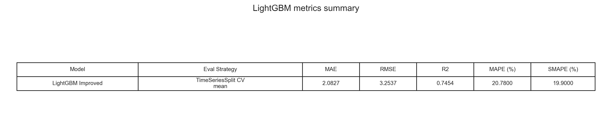

Kjo figurë i vendos në një kornizë të vetme metrikat kryesore të `LightGBM` për krahasim me `CatBoost` dhe `SARIMAX`.

#### Artefaktet e gjeneruara nga LightGBM

Skripta native e modelit ruan:

- `src/phase_2/supervised/lightgbm_model/improved_model/improved_model.joblib`
- `src/phase_2/supervised/lightgbm_model/improved_model/metrics_summary.txt`
- `src/phase_2/supervised/lightgbm_model/improved_model/feature_importance.csv`
- `src/phase_2/supervised/lightgbm_model/improved_model/feature_importance.png`
- `src/phase_2/supervised/lightgbm_model/improved_model/actual_vs_predicted.png`
- `src/phase_2/supervised/lightgbm_model/improved_model/learning_curve.png`

Për krahasimin e harmonizuar në fazën e dytë përdoren edhe:

- `data/phase_2/supervised/lightgbm_improved/metrics_summary.txt`
- `data/phase_2/supervised/lightgbm_improved/feature_importance.csv`
- `pictures/phase_2/supervised/lightgbm_improved/lightgbm_actual_vs_predicted.png`
- `pictures/phase_2/supervised/lightgbm_improved/lightgbm_feature_importance.png`
- `pictures/phase_2/supervised/lightgbm_improved/lightgbm_learning_curve.png`
- `pictures/phase_2/supervised/lightgbm_improved/lightgbm_metrics_table.png`

---

### SARIMAX për parashikimin e PM2.5

Përveç modeleve tree-based, në këtë projekt është implementuar edhe `SARIMAX` (`Seasonal AutoRegressive Integrated Moving Average with eXogenous variables`), një model statistikor shumë i përshtatshëm për seri kohore me:

- varësi autoregresive,
- sezonalitet të qartë,
- dhe ndikim nga variabla të jashtëm si moti dhe prodhimi i energjisë.

Kjo e bën `SARIMAX` një zgjedhje shumë të fortë akademikisht për temën tonë, sepse jo vetëm parashikon `PM2.5`, por edhe lejon interpretim të drejtpërdrejtë të:

- memorjes kohore të ndotjes,
- sezonalitetit 24-orësh,
- dhe rolit të faktorëve meteorologjikë dhe energjetikë si variabla exogenous.

Implementimi ndodhet në:

- `src/phase_2/supervised/sarimax_model/sarimax_model.py`

#### Pse SARIMAX?

Ky model është zgjedhur sepse:

- është benchmark statistikor i fortë për seri kohore mjedisore;
- kap njëkohësisht komponentin autoregresiv, moving average dhe sezonalitetin ditor;
- lejon shtimin e feature-ave exogenous pa e humbur interpretueshmërinë;
- dhe prodhon koeficientë statistikisht të lexueshëm, gjë shumë e vlefshme për dokumentim akademik.

Në termat e projektit tonë, `SARIMAX` i përgjigjet drejtpërdrejt pyetjes nëse `PM2.5` në Prishtinë mund të shpjegohet si kombinim i:

- gjendjes së vet në të kaluarën,
- ciklit ditor të ndotjes,
- kushteve atmosferike,
- dhe prodhimit të energjisë.

#### Input

Skripta përdor si lokacion standard dataset-in final:

- `data/phase_1/4E_selected_dataset.csv`

Në ekzekutimin aktual të raportuar në repo, input-i real ka qenë:

- `data/phase_1/4E_selected_dataset.csv`

#### Target

Target-i i modelit supervised është:

- `pm25`

#### Feature-at exogenous të përdorura

Në konfigurimin final janë përdorur 9 feature-a exogenous:

- `hour_sin`
- `hour_cos`
- `pollution_stagnation_index`
- `wind_x_vector`
- `wind_y_vector`
- `total_generation_mw`
- `temperature_2m (°C)`
- `rain (mm)`
- `relative_humidity_2m (%)`

Kjo zgjedhje është shumë e arsyeshme për një model statistikor si `SARIMAX`, sepse mban vetëm tiparet më kuptimplota dhe shmang fryrjen e panevojshme të modelit me shumë variabla të njëkohshme.

#### Fragment kyç i kodit: konfigurimi i modelit

```python
TARGET = "pm25"
FORECAST_HORIZON = 24

EXOG_FEATURE_PRIORITY = [
    "hour_sin",
    "hour_cos",
    "pollution_stagnation_index",
    "wind_x_vector",
    "wind_y_vector",
    "total_generation_mw",
    "temperature_2m (°C)",
    "rain (mm)",
    "relative_humidity_2m (%)",
]

MODEL_CANDIDATES = [
    {"order": (1, 0, 1), "seasonal_order": (1, 0, 1, 24), "trend": "c"},
    {"order": (2, 0, 1), "seasonal_order": (1, 0, 1, 24), "trend": "c"},
    {"order": (1, 0, 2), "seasonal_order": (1, 0, 1, 24), "trend": "c"},
    {"order": (1, 0, 1), "seasonal_order": (1, 1, 1, 24), "trend": "c"},
]
```

#### Përgatitja e të dhënave

Para trajnimit, skripta:

- identifikon kolonën kohore (`datetime` ose `date`);
- i rendit vëzhgimet në mënyrë kronologjike;
- heq duplikatet eventuale sipas timestamp-it;
- konverton target-in dhe feature-at në formë numerike;
- zëvendëson `inf` dhe `-inf` me `NaN`;
- dhe ruan vetëm rreshtat validë për target-in dhe feature-at exogenous.

Pas këtij hapi janë përdorur:

- `9347` rreshta totale
- `9` feature-a exogenous

#### Validimi korrekt pa leakage

Një pikë shumë e rëndësishme metodologjikisht është se `SARIMAX` nuk është trajnuar me ndarje rastësore, por me ndarje kronologjike `train/validation/test`. Kjo është qasja e duhur për seri kohore, sepse modeli duhet të parashikojë të ardhmen nga e kaluara, jo nga të dhëna të përziera.

Ndarja finale ka qenë:

- `Train rows: 6542`
- `Validation rows: 1402`
- `Test rows: 1403`

me intervale:

- `Train range: 2023-08-18 09:00:00 -> 2025-07-17 21:00:00`
- `Validation range: 2025-07-17 22:00:00 -> 2025-09-18 12:00:00`
- `Test range: 2025-09-18 13:00:00 -> 2025-11-27 19:00:00`

#### Fragment kyç i kodit: ndarja kronologjike

```python
n = len(df)
train_end_idx = int(n * TRAIN_RATIO)
val_end_idx = int(n * (TRAIN_RATIO + VAL_RATIO))

train_df = df.iloc[:train_end_idx].copy()
val_df = df.iloc[train_end_idx:val_end_idx].copy()
test_df = df.iloc[val_end_idx:].copy()
```

#### Zgjedhja e modelit final

Përzgjedhja nuk është bërë me vetëm një konfigurim të vetëm, por me krahasim të katër kandidatëve `SARIMAX` mbi validation set. Kjo është shumë e rëndësishme për dokumentim akademik, sepse tregon se modeli final është zgjedhur mbi bazë performance dhe jo vetëm mbi intuitë.

Kandidatët e testuar kanë qenë:

- `(1, 0, 1) x (1, 0, 1, 24)` me `trend = c`
- `(2, 0, 1) x (1, 0, 1, 24)` me `trend = c`
- `(1, 0, 2) x (1, 0, 1, 24)` me `trend = c`
- `(1, 0, 1) x (1, 1, 1, 24)` me `trend = c`

Sipas `validation_RMSE`, modeli më i mirë ka dalë:

- `order = (1, 0, 1)`
- `seasonal_order = (1, 0, 1, 24)`
- `trend = "c"`

me rezultat:

- `Validation RMSE = 2.0431`
- `Validation R² = 0.7140`

Modeli final më pas është ritrajnuar mbi `train + validation`, ndërsa testimi final është bërë vetëm mbi `test`, duke ruajtur një holdout të pastër kohor.

#### Fragment kyç i kodit: zgjedhja dhe ritrajnimi final

```python
for candidate in MODEL_CANDIDATES:
    record, _ = evaluate_candidate(train_df, val_df, feature_cols, candidate, scaler)
    candidate_rows.append(record)

combined_df = pd.concat([train_df, val_df], axis=0).reset_index(drop=True)
final_result = fit_sarimax(combined_df[TARGET], combined_df[feature_cols], final_candidate)
```

#### Mënyra e parashikimit

Parashikimi në test set është kryer me qasje `state_space_one_step_ahead`, pra modeli ecën hap pas hapi në kohë duke përditësuar gjendjen e tij. Kjo është një mënyrë shumë e përshtatshme për një problem real forecast-imi.

Për secilin timestamp në test ruhen:

- vlera reale e `PM2.5`,
- parashikimi i modelit,
- kufiri i poshtëm i intervalit,
- kufiri i sipërm i intervalit,
- dhe residual-i.

#### Rezultatet e raportuara

Në `validation` modeli ka arritur:

- `MAE = 1.3354`
- `RMSE = 2.0431`
- `MAPE = 19.12%`
- `SMAPE = 17.96%`
- `R² = 0.7140`

Në `test` modeli ka arritur:

- `MAE = 3.1125`
- `RMSE = 4.7654`
- `MAPE = 28.01%`
- `SMAPE = 25.47%`
- `R² = 0.7748`

Gjithashtu janë ruajtur edhe metrika shtesë të modelit statistik:

- `AIC = 9795.08`
- `BIC = 9899.73`

Këto rezultate e bëjnë `SARIMAX` një model shumë serioz dhe të balancuar për raportim akademik: ai është më i interpretueshëm sesa boosting methods dhe njëkohësisht jep performancë të mirë në të dhëna reale.

#### Interpretimi i koeficientëve

Nga `data/phase_2/supervised/sarimax/sarimax_coefficients.csv`, koeficientët më domethënës janë:

- `ar.L1 = 0.8815`, që tregon memorje të fortë autoregresive të `PM2.5`;
- `ar.S.L24 = 0.7981`, që konfirmon sezonalitetin ditor 24-orësh;
- `ma.S.L24 = -0.5190`, që tregon korrigjim sezonal në komponentin e gabimit;
- `hour_sin = 0.3071` dhe `hour_cos = 0.1411`, që tregojnë ndikim të qartë të ciklit ditor;
- `temperature_2m (°C) = 0.0985`, që ka dalë pozitiv dhe statistikisht i rëndësishëm;
- `wind_x_vector = -0.0287`, që sugjeron efekt shpërndarës të erës në një nga komponentët e saj.

Në aspekt interpretimi, këto vlera tregojnë se:

- `PM2.5` në Prishtinë ka inercion të fortë kohor;
- ekziston një ritëm i qartë ditor në nivelin e ndotjes;
- dhe moti nuk vepron i izoluar, por si modulator mbi një proces që tashmë ka kujtesë atmosferike.

#### Vizualizimet

Grafiku kryesor i parashikimit:


Kjo figurë tregon përputhjen mes vlerave reale të `PM2.5` dhe forecast-it të modelit në test set.

Paneli shtesë i koeficientëve më të fortë:


Kjo figurë përmbledh parametrat më domethënës të modelit dhe e bën më të lehtë interpretimin statistik të komponentëve autoregresivë, sezonalë dhe exogenous.

Diagnostika e residualeve:


Kjo figurë ndihmon të vlerësohet nëse residualet janë të balancuara dhe nëse mbeten struktura sistematike të pa kapura nga modeli.

Përveç figurave statike, është ruajtur edhe vizualizimi interaktiv:

- `pictures/phase_2/supervised/sarimax/sarimax_forecast_interactive.html`

Tabela përmbledhëse e metrikave:


Kjo figurë i vendos në një vend metrikat kryesore të `SARIMAX` dhe ndihmon krahasimin e tij me modelet e tjera supervised.

#### Artefaktet e gjeneruara nga SARIMAX

Skripta ruan këto output-e:

- `data/phase_2/supervised/sarimax/sarimax_forecasts.csv`
  Parashikimet në test set, intervalet e besimit dhe residuals.

- `data/phase_2/supervised/sarimax/sarimax_metrics.csv`
  Metrikat në validation dhe test, si dhe AIC/BIC.

- `data/phase_2/supervised/sarimax/sarimax_coefficients.csv`
  Koeficientët finalë dhe p-value-t për secilin parametër.

- `data/phase_2/supervised/sarimax/sarimax_candidate_results.csv`
  Krahasimi i konfigurimeve kandidate gjatë model selection.

- `data/phase_2/supervised/sarimax/sarimax_split_summary.csv`
  Përmbledhja e ndarjes kronologjike.

- `data/phase_2/supervised/sarimax/sarimax_residuals.csv`
  Residuals në njësinë reale të `PM2.5`.

- `data/phase_2/supervised/sarimax/sarimax_run_info.json`
  Konfigurimi i plotë i ekzekutimit dhe rrugët e output-eve.

- `models/sarimax_model/sarimax_pm25_model.pkl`
  Modeli final i trajnuar.

- `models/sarimax_model/sarimax_summary.txt`
  Përmbledhja statistikore e `statsmodels`.

- `models/sarimax_model/sarimax_feature_columns.pkl`
  Lista e feature-ave exogenous të përdorura.

- `pictures/phase_2/supervised/sarimax/sarimax_actual_vs_predicted.png`
- `pictures/phase_2/supervised/sarimax/sarimax_residual_diagnostics.png`
- `pictures/phase_2/supervised/sarimax/sarimax_forecast_interactive.html`
- `pictures/phase_2/supervised/sarimax/sarimax_coefficients.png`

---

### HDBSCAN për analizë unsupervised

Për analizën unsupervised është përdorur `HDBSCAN`, një algoritëm clustering i bazuar në densitet, i cili nuk kërkon përcaktim paraprak të numrit të cluster-ëve dhe është shumë i përshtatshëm për të dhëna reale me shape të parregullt, densitete të ndryshme dhe presence të outlier-ave.

Kjo pjesë është ndërtuar për të eksploruar strukturën latente të dataset-it final dhe për të identifikuar:

- profile të ngjashme të vëzhgimeve,
- cluster-a me kushte të ngjashme meteorologjike dhe energjetike,
- si dhe pikat që sillen si noise ose anomali.

#### Input

Si edhe te CatBoost, hyrja është:

- `data/phase_1/4E_selected_dataset.csv`

#### Përgatitja e feature-ave

Për HDBSCAN përdoren kolonat numerike të dataset-it final. Në këtë fazë:

- kolonat boolean, nëse ekzistojnë, kthehen në `int`,
- zgjidhen kolonat numerike,
- përjashtohen kolonat teknike ose kolonat që krijohen nga vetë clustering-u,
- përjashtohen kolonat me prapashtesë `"_was_missing"`.

#### Fragment kyç i kodit: përzgjedhja e kolonave numerike

```python
def numeric_feature_columns(df: pd.DataFrame) -> list[str]:
    bool_cols = df.select_dtypes(include=["bool"]).columns.tolist()
    for c in bool_cols:
        df[c] = df[c].astype(int)

    num_cols = df.select_dtypes(include=[np.number]).columns.tolist()

    drop_like = {
        "unnamed: 0",
        "cluster_label",
        "cluster_probability",
        "outlier_score",
        "umap_1",
        "umap_2",
    }

    num_cols = [c for c in num_cols if c not in drop_like and not c.endswith("_was_missing")]
    return num_cols
```

#### Standardizimi

Para clustering-ut, tiparet standardizohen me `StandardScaler`, në mënyrë që kolonat me shkallë të ndryshme të mos dominojnë ndërtimin e cluster-ëve.

#### Fragment kyç i kodit: scaling

```python
scaler = StandardScaler()
X_scaled = scaler.fit_transform(X)
joblib.dump(scaler, SCALER_PATH)
```

#### Parametrat e HDBSCAN

Modeli është konfiguruar me:

- `min_cluster_size = 80`
- `min_samples = 20`
- `cluster_selection_method = "eom"`
- `metric = "euclidean"`

#### Fragment kyç i kodit: inicializimi i HDBSCAN

```python
clusterer = hdbscan.HDBSCAN(
    min_cluster_size=MIN_CLUSTER_SIZE,
    min_samples=MIN_SAMPLES,
    cluster_selection_method=CLUSTER_SELECTION_METHOD,
    metric=METRIC,
    prediction_data=True,
    gen_min_span_tree=True,
)
```

#### Çfarë prodhon HDBSCAN

Pas trajnimit, modeli gjeneron për çdo vëzhgim:

- `cluster_label`
- `cluster_probability`
- `outlier_score`

Këto kolona shtohen në dataset-in final të cluster-uar.

#### Reduktimi dimensional për vizualizim

Për të vizualizuar cluster-at në 2 dimensione, skripta përdor `UMAP` me konfigurim:

- `n_neighbors = 30`
- `min_dist = 0.05`
- `n_components = 2`

#### Fragment kyç i kodit: UMAP

```python
reducer = umap.UMAP(
    n_neighbors=30,
    min_dist=0.05,
    n_components=2,
    metric="euclidean",
    random_state=42,
)

embedding = reducer.fit_transform(X_scaled)
```

Pas këtij hapi krijohen kolonat:

- `umap_1`
- `umap_2`

të cilat përdoren për vizualizimin interaktiv të cluster-ëve.

#### Metrikat e clustering-ut

Për vlerësimin e strukturës së cluster-ëve, skripta llogarit:

- `silhouette_score`
- `davies_bouldin_score`
- `calinski_harabasz_score`

duke përjashtuar pikat `noise` (`cluster_label = -1`) aty ku kërkohet.

#### Fragment kyç i kodit: metrikat e brendshme

```python
internal = {
    "silhouette_score": silhouette_score(X_core, y_core),
    "davies_bouldin_score": davies_bouldin_score(X_core, y_core),
    "calinski_harabasz_score": calinski_harabasz_score(X_core, y_core),
}
```

#### Çfarë printohet gjatë ekzekutimit

Skripta e HDBSCAN është ndërtuar që të printojë në console këto seksione:

- `DATA QUALITY CHECK`
- `SCALING`
- `HDBSCAN TRAINING`
- `UMAP EMBEDDING`
- `CLUSTERING METRICS`
- `INTERACTIVE VISUALIZATION`
- `DONE`

Pra, gjatë ekzekutimit përdoruesi mund të shohë:

- sa rreshta ka dataset-i para dhe pas cleaning,
- cilat feature përdoren,
- metrikat e clustering-ut,
- sa cluster-a janë gjetur,
- sa pika janë klasifikuar si noise,
- dhe ku janë ruajtur output-et.

#### Rezultatet e raportuara

Në konfigurimin aktual të repo-s, `HDBSCAN` ka prodhuar këto rezultate kryesore:

- `Rows used = 9347`
- `Number of clusters (excluding noise) = 2`
- `Noise ratio = 73.54%`
- `Silhouette score = 0.2658`
- `Davies-Bouldin score = 1.2785`
- `Calinski-Harabasz score = 266.11`
- `Average cluster persistence = 0.0323`

Interpretimi akademik i këtyre rezultateve është se `HDBSCAN` po sillet si një model density-based konservativ: ai ruan vetëm dy struktura të dendura si cluster-e bazë, ndërsa pjesën më të madhe të vëzhgimeve i klasifikon si `noise`. Në të dhëna reale mjedisore kjo nuk është domosdoshmërisht dobësi, sepse tregon që modeli po shmang grupimet artificiale dhe po i pranon vetëm regjimet më të qëndrueshme.

#### Vizualizimet

Pamja 2D e cluster-ëve në hapësirën e reduktuar:


Kjo figurë paraqet cluster-at dhe pikat `noise` në embedding-un `UMAP`, pra pamjen vizuale më të drejtpërdrejtë të ndarjes së bërë nga modeli.

Përmasat relative të cluster-ëve:


Kjo figurë tregon sa të mëdha janë grupet kryesore të zbuluara dhe sa e përqendruar apo e rrallë mbetet struktura e të dhënave.

Profili i `PM2.5` sipas cluster-it:


Kjo figurë tregon si ndryshon niveli mesatar i `PM2.5` ndërmjet cluster-ëve bazë të zbuluar nga `HDBSCAN`.

Ecuria kohore e `PM2.5` me ngjyrat e cluster-ëve:


Kjo figurë ndihmon të shihet nëse cluster-at lidhen me periudha të caktuara kohore ose me episode të veçanta të ndotjes.

Pamja e zmadhuar e episodeve më përfaqësuese:


Kjo figurë e bën më të lehtë identifikimin e periudhave të shkurtra ku cluster-at ndryshojnë më qartë në raport me nivelin e `PM2.5`.

Shpërndarja e vëzhgimeve në raport me energjinë dhe `PM2.5`:


Kjo figurë e bën më të qartë si ndahen vëzhgimet dhe ku përqendrohen pikat e klasifikuara si `noise`.

Shpërndarja e probabilitetit të anëtarësimit:


Kjo figurë tregon sa të sigurt janë etiketimet e modelit për pikat që nuk janë `noise`.

Paneli i ndryshimit të feature-ave:


Kjo figurë përmbledh cilat tipare dallojnë më shumë ndërmjet cluster-ëve dhe mesatares globale të dataset-it.

Tabela përmbledhëse e metrikave:


Kjo figurë përmbledh metrikat kryesore të modelit dhe e bën më të qartë profilin konservativ të `HDBSCAN`.

#### Artefaktet e gjeneruara nga HDBSCAN

Skripta ruan këto output-e:

- `data/phase_2/unsupervised/hdbscan/hdbscan_clustered_dataset.csv`
  Dataset-i final me kolonat `cluster_label`, `cluster_probability`, `outlier_score`, `umap_1`, `umap_2`.

- `data/phase_2/unsupervised/hdbscan/hdbscan_metrics.csv`
  Metrikat e clustering-ut dhe përmbledhja e modelit.

- `data/phase_2/unsupervised/hdbscan/hdbscan_cluster_summary.csv`
  Përmbledhje statistikore për çdo cluster.

- `data/phase_2/unsupervised/hdbscan/hdbscan_feature_summary.csv`
  Përmbledhje e tipareve që dallojnë më shumë cluster-at.

- `models/hdbscan_model/hdbscan_model.pkl`
  Modeli i trajnuar.

- `models/hdbscan_model/hdbscan_scaler.pkl`
  Scaler-i i përdorur për standardizim.

- `models/hdbscan_model/hdbscan_umap.pkl`
  Objekti i ruajtur i reduktimit dimensional.

- `data/phase_2/unsupervised/hdbscan/hdbscan_run_info.json`
  Informacion për konfigurimin dhe rrugët e output-eve.

#### Vizualizimi interaktiv

Vizualizimi interaktiv i cluster-ëve gjenerohet në:

- `pictures/phase_2/unsupervised/hdbscan/hdbscan_umap_interactive.html`
- `pictures/phase_2/unsupervised/hdbscan/hdbscan_umap_interactive.png`

Për krahasim të harmonizuar janë gjeneruar edhe:

- `pictures/phase_2/unsupervised/hdbscan/hdbscan_cluster_sizes.png`
- `pictures/phase_2/unsupervised/hdbscan/hdbscan_pm25_by_cluster.png`
- `pictures/phase_2/unsupervised/hdbscan/hdbscan_pm25_timeline.png`
- `pictures/phase_2/unsupervised/hdbscan/hdbscan_pm25_zoom.png`
- `pictures/phase_2/unsupervised/hdbscan/hdbscan_scatter.png`
- `pictures/phase_2/unsupervised/hdbscan/hdbscan_confidence_distribution.png`
- `pictures/phase_2/unsupervised/hdbscan/hdbscan_feature_shift_panel.png`
- `pictures/phase_2/unsupervised/hdbscan/hdbscan_metrics_table.png`

Ky vizualizim lejon:

- dallimin e cluster-ëve në plan 2D,
- evidentimin e noise/outlier points,
- dhe inspektimin e feature-ave kryesore për secilin vëzhgim përmes hover.

---

### Gaussian Mixture për analizë unsupervised

Përveç `HDBSCAN`, në këtë projekt është implementuar edhe `Gaussian Mixture Model (GMM)`, një metodë probabilistike clustering që modelon të dhënat si kombinim i disa shpërndarjeve Gaussiane.

Kjo qasje është shumë e vlefshme në kontekstin tonë, sepse kushtet atmosferike dhe regjimet e ndotjes nuk janë gjithmonë të ndara në cluster-a të prerë fort. Shpesh kemi profile që mbivendosen, dhe `GMM` e kap pikërisht këtë me:

- anëtarësim probabilistik në cluster,
- fleksibilitet në forma eliptike të shpërndarjes,
- dhe interpretim të regjimeve mjedisore si profile të buta, jo si ndarje strikte.

Implementimi ndodhet në:

- `src/phase_2/unsupervised/gaussian_mixture_model/gaussian_mixture_model.py`

#### Pse Gaussian Mixture?

`Gaussian Mixture` është zgjedhur sepse:

- jep soft clustering, jo vetëm etiketim të fortë;
- është shumë i përshtatshëm kur profilet mjedisore mbivendosen pjesërisht;
- lejon krahasim formal modelesh me `BIC` dhe `AIC`;
- dhe shërben si kundërpeshë metodologjike ndaj `HDBSCAN`, i cili është density-based.

Nga pikëpamja akademike, kjo e forcon shumë projektin, sepse demonstron dy filozofi të ndryshme unsupervised:

- një qasje me densitet dhe noise handling (`HDBSCAN`);
- dhe një qasje probabilistike me model-based clustering (`Gaussian Mixture`).

#### Input

Ashtu si te `SARIMAX`, skripta përdor si lokacion standard dataset-in final:

- `data/phase_1/4E_selected_dataset.csv`

Në ekzekutimin aktual është përdorur:

- `data/phase_1/4E_selected_dataset.csv`

#### Feature-at e përdorura për clustering

Modeli është trajnuar mbi 12 feature-a numerike:

- `hour_sin`
- `hour_cos`
- `month_sin`
- `month_cos`
- `pollution_stagnation_index`
- `wind_x_vector`
- `wind_y_vector`
- `total_generation_mw`
- `temperature_2m (°C)`
- `rain (mm)`
- `relative_humidity_2m (%)`
- `wind_speed_10m (km/h)`

Është shumë e rëndësishme të theksohet se:

- `pm25` nuk përdoret si input për të ndërtuar cluster-at;
- `pm25` përdoret vetëm pas trajnimit për interpretim post-hoc, përmes kolonës `pm25_real`.

Kjo e bën analizën më të pastër metodologjikisht: cluster-at nuk “detyrohen” të formohen sipas target-it, por më pas kontrollohet si sillet `PM2.5` brenda secilit regjim të zbuluar.

#### Fragment kyç i kodit: konfigurimi i feature-ave dhe kandidatëve

```python
PCA_VARIANCE_THRESHOLD = 0.95
N_COMPONENT_CANDIDATES = [2, 3, 4, 5, 6]
COVARIANCE_TYPES = ["full", "diag", "tied"]
MIN_CLUSTER_RATIO = 0.05

FEATURE_PRIORITY = [
    "hour_sin",
    "hour_cos",
    "month_sin",
    "month_cos",
    "pollution_stagnation_index",
    "wind_x_vector",
    "wind_y_vector",
    "total_generation_mw",
    "temperature_2m (°C)",
    "rain (mm)",
    "relative_humidity_2m (%)",
    "wind_speed_10m (km/h)",
]
```

#### Standardizimi dhe PCA

Para clustering-ut, tiparet standardizohen me `StandardScaler`, që asnjë kolonë me shkallë më të madhe të mos dominojë modelin.

Më pas aplikohet `PCA` me prag:

- `explained variance >= 95%`

Në ekzekutimin aktual kjo ka dhënë:

- `12` feature-a hyrëse
- `9` PCA components
- `97.12%` explained variance

Kjo do të thotë se reduktimi dimensional e ruan pothuajse të gjithë informacionin kryesor, ndërsa e bën clustering-un më stabil dhe më të lehtë për vizualizim.

#### Fragment kyç i kodit: scaling dhe PCA

```python
scaler = StandardScaler()
X_scaled = scaler.fit_transform(df[feature_cols].to_numpy(dtype=float))

pca = PCA(n_components=PCA_VARIANCE_THRESHOLD, svd_solver="full")
X_pca = pca.fit_transform(X_scaled)
```

#### Përzgjedhja e modelit final

Përzgjedhja e modelit është bërë në mënyrë të strukturuar, duke testuar kombinime të:

- `n_components = 2, 3, 4, 5, 6`
- `covariance_type = full, diag, tied`

Për secilin kandidat janë llogaritur:

- `BIC`
- `AIC`
- `silhouette_score`
- `davies_bouldin_score`
- `calinski_harabasz_score`
- `min_cluster_ratio`
- `avg_cluster_confidence`

Një kandidat konsiderohet valid për zgjedhje finale vetëm nëse:

- `min_cluster_ratio >= 0.05`

Modeli final zgjidhet kryesisht sipas `BIC` më të ulët, dhe në rast afërsie përdoret `silhouette_score` si kriter dytësor.

Konfigurimi më i mirë në këtë repo ka dalë:

- `n_components = 6`
- `covariance_type = "full"`

#### Fragment kyç i kodit: logjika e model selection

```python
if row["min_cluster_ratio"] < MIN_CLUSTER_RATIO:
    continue

if best_row is None:
    best_row = row
    continue

if row["bic"] < best_row["bic"] - 1e-9:
    best_row = row
    continue

if np.isclose(row["bic"], best_row["bic"]) and row["silhouette_score"] > best_row["silhouette_score"]:
    best_row = row
```

#### Rezultatet e raportuara

Në konfigurimin final janë marrë këto rezultate:

- `Rows used = 9347`
- `Number of clusters = 6`
- `Covariance type = full`
- `BIC = 154996.08`
- `AIC = 152646.10`
- `Silhouette score = 0.0899`
- `Davies-Bouldin score = 2.0751`
- `Calinski-Harabasz score = 950.04`
- `Min cluster ratio = 0.1128`
- `Max cluster ratio = 0.2679`
- `Average cluster confidence = 0.9688`

Këtu vlen një interpretim i kujdesshëm akademik:

- `silhouette_score` është relativisht i ulët, që tregon se cluster-at nuk janë të ndarë në mënyrë shumë të fortë;
- kjo është normale për të dhëna reale mjedisore, ku regjimet atmosferike shpesh mbivendosen;
- ndërkohë, `avg_cluster_confidence = 0.9688` dhe raportet e balancuara të cluster-ëve tregojnë se modeli po prodhon ndarje të përdorshme dhe të qëndrueshme.

Pra, te `GMM` nuk duhet parë vetëm silhouette, por kombinimi i:

- `BIC/AIC`,
- balancës së cluster-ëve,
- probabiliteteve të anëtarësimit,
- dhe interpretueshmërisë së profileve të gjetura.

#### Interpretimi i cluster-ëve

Nga `data/phase_2/unsupervised/gaussian_mixture/gmm_cluster_summary.csv` dhe `data/phase_2/unsupervised/gaussian_mixture/gmm_feature_summary.csv`, dalin disa profile shumë interesante:

- `Cluster 3` është regjimi me ndotjen mesatare më të lartë:
  - `pm25_real_mean = 17.51`
  - lidhet me temperaturë nën mesatare, lagështi më të lartë, prodhim energjie më të lartë dhe stagnation mbi mesatare.

- `Cluster 0` paraqet kushte më të pastra dhe më të ajrosura:
  - `pm25_real_mean = 7.56`
  - ka komponentë më të fortë të erës dhe stagnation më të ulët.

- `Cluster 5` përfaqëson regjim të lidhur me reshje:
  - `pm25_real_mean = 8.15`
  - `rain (mm)` është feature-i më devijues pozitiv në këtë cluster.

Kjo do të thotë se `Gaussian Mixture` nuk po ndan të dhënat vetëm sipas një variable të vetme, por po zbulon regjime mjedisore me kombinime të ndryshme të:

- stinës,
- orës së ditës,
- reshjeve,
- stagnation-it atmosferik,
- erës,
- dhe intensitetit të prodhimit energjetik.

#### Vizualizimet

Krahasimi i kandidatëve gjatë model selection:


Kjo figurë tregon si janë krahasuar konfigurimet e ndryshme sipas `BIC`, `AIC` dhe metrikave të tjera për të zgjedhur modelin final.

Heatmap-i i profileve të cluster-ëve:


Kjo figurë ndihmon të shihet cilat feature-a janë karakteristike për secilin cluster në raport me të tjerët.

Përmasat relative të cluster-ëve:


Kjo figurë tregon sa të balancuar janë gjashtë cluster-at e modelit final.

Profili i `PM2.5` sipas cluster-it:


Kjo figurë paraqet dallimet e nivelit mesatar të `PM2.5` ndërmjet cluster-ëve të zbuluar nga modeli.

Ecuria kohore e cluster-ëve:


Kjo figurë e vendos etiketimin e cluster-ëve mbi boshtin kohor dhe ndihmon në interpretimin e regjimeve mjedisore përgjatë serisë.

Pamja e zmadhuar e episodeve më përfaqësuese:


Kjo figurë e bën më të qartë sjelljen e cluster-ëve në periudha më të shkurtra dhe më intensive të `PM2.5`.

Shpërndarja e cluster-ëve në raport me energjinë dhe `PM2.5`:


Kjo figurë tregon si ndahen cluster-at në raport me prodhimin e energjisë dhe ndotjen reale.

Shpërndarja e besimit të anëtarësimit:


Kjo figurë paraqet sa i sigurt është modeli për etiketimin e observimeve në cluster-et përkatëse.

Paneli i devijimeve të feature-ave:


Kjo figurë përmbledh feature-at që e dallojnë më fort secilin cluster nga mesatarja globale e dataset-it.

Vizualizimi interaktiv në hapësirën e reduktuar me `PCA` ruhet në:

- `pictures/phase_2/unsupervised/gaussian_mixture/gmm_pca_interactive.html`

Tabela përmbledhëse e metrikave:


Kjo figurë përmbledh rezultatet kryesore të modelit final në një format të përshtatshëm për krahasim me `HDBSCAN`.

#### Artefaktet e gjeneruara nga Gaussian Mixture

Skripta ruan këto output-e:

- `data/phase_2/unsupervised/gaussian_mixture/gmm_clustered_dataset.csv`
  Dataset-i me etiketat e cluster-it, probabilitetet e anëtarësimit dhe koordinatat `PCA`.

- `data/phase_2/unsupervised/gaussian_mixture/gmm_metrics.csv`
  Përmbledhja e metrikave finale të clustering-ut.

- `data/phase_2/unsupervised/gaussian_mixture/gmm_cluster_summary.csv`
  Statistika për secilin cluster, përfshirë `pm25_real_mean`.

- `data/phase_2/unsupervised/gaussian_mixture/gmm_feature_summary.csv`
  Feature-at që dallojnë më së shumti secilin cluster nga mesatarja globale.

- `data/phase_2/unsupervised/gaussian_mixture/gmm_model_selection.csv`
  Tabela e plotë e kandidatëve të testuar.

- `data/phase_2/unsupervised/gaussian_mixture/gmm_run_info.json`
  Informacioni i konfigurimit dhe rrugët e output-eve.

- `models/gaussian_mixture_model/gmm_model.pkl`
  Modeli final i trajnuar.

- `models/gaussian_mixture_model/gmm_scaler.pkl`
  Scaler-i i përdorur për standardizim.

- `models/gaussian_mixture_model/gmm_pca.pkl`
  Objekti `PCA` i ruajtur.

- `models/gaussian_mixture_model/gmm_feature_columns.pkl`
  Lista e feature-ave të përdorura.

- `pictures/phase_2/unsupervised/gaussian_mixture/gmm_model_selection.png`
- `pictures/phase_2/unsupervised/gaussian_mixture/gmm_cluster_profile_heatmap.png`
- `pictures/phase_2/unsupervised/gaussian_mixture/gmm_cluster_sizes.png`
- `pictures/phase_2/unsupervised/gaussian_mixture/gmm_pca_interactive.html`
- `pictures/phase_2/unsupervised/gaussian_mixture/gmm_pm25_by_cluster.png`
- `pictures/phase_2/unsupervised/gaussian_mixture/gmm_pm25_timeline.png`
- `pictures/phase_2/unsupervised/gaussian_mixture/gmm_pm25_zoom.png`
- `pictures/phase_2/unsupervised/gaussian_mixture/gmm_scatter.png`
- `pictures/phase_2/unsupervised/gaussian_mixture/gmm_confidence_distribution.png`
- `pictures/phase_2/unsupervised/gaussian_mixture/gmm_feature_shift_panel.png`
- `pictures/phase_2/unsupervised/gaussian_mixture/gmm_metrics_table.png`

---

### Isolation Forest për analizë unsupervised

`Isolation Forest` është qasja unsupervised e përdorur për anomaly detection. Ndryshe nga `HDBSCAN` dhe `Gaussian Mixture`, ky model nuk synon të ndërtojë cluster-a, por të izolojë observimet që devijojnë nga sjellja normale e kombinimit mes motit, energjisë dhe ndotjes.

Implementimi ndodhet në:

- `src/phase_2/unsupervised/isolation_forest_model/isolation_forest_model.py`

Për gjenerimin e output-eve të harmonizuara të fazës së dytë përdoret edhe:

- `src/phase_2/unsupervised/isolation_forest_model/isolation_forest_extended_outputs.py`

#### Pse Isolation Forest?

Ky model është zgjedhur sepse:

- funksionon shumë mirë për zbulimin e rasteve të rralla në dataset-e me shumë feature-a numerike;
- nuk kërkon etiketa paraprake për anomalitë;
- është i përshtatshëm kur duam të kapim jo vetëm vlera të larta të `PM2.5`, por kombinime jo të zakonshme të variablave;
- dhe e plotëson shumë mirë analizën clustering të `HDBSCAN` dhe `GMM`.

Në kontekstin e projektit tonë, kjo do të thotë se `Isolation Forest` nuk pyet vetëm “kur ajri është i ndotur?”, por edhe “kur sjellja e sistemit është e pazakontë krahasuar me modelet tipike meteorologjike dhe energjetike?”.

#### Input

Modeli përdor si hyrje:

- `data/phase_1/4E_selected_dataset.csv`

#### Feature-at e përdorura

Sipas `isolation_forest_run_info.json`, modeli është trajnuar mbi 13 feature-a:

- `hour_sin`
- `hour_cos`
- `month_sin`
- `month_cos`
- `pollution_stagnation_index`
- `wind_x_vector`
- `wind_y_vector`
- `total_generation_mw`
- `temperature_2m (°C)`
- `rain (mm)`
- `relative_humidity_2m (%)`
- `wind_speed_10m (km/h)`
- `pm25`

Pra, ndryshe nga `HDBSCAN` dhe `GMM`, këtu edhe `pm25` përdoret si pjesë e hapësirës së anomaly detection. Kjo është e arsyeshme, sepse qëllimi i modelit nuk është të zbulojë profile mjedisore pa target, por të identifikojë raste kur kombinimi i plotë i sistemit sillet në mënyrë të pazakontë.

#### Fragment kyç i kodit: konfigurimi i modelit

```python
iso_forest = IsolationForest(
    n_estimators=100,
    contamination=0.05,
    random_state=42,
    n_jobs=-1
)
```

Ky konfigurim i thotë modelit të izolojë afërsisht `5%` të observimeve si raste potencialisht anormale.

#### Rezultatet e raportuara

Në ekzekutimin e harmonizuar të fazës së dytë janë raportuar:

- `Rows used = 9347`
- `Number of features = 13`
- `Number of anomalies = 468`
- `Anomaly ratio = 5.01%`
- `Contamination = 0.05`
- `n_estimators = 100`
- `Mean anomaly severity = 0.0267`
- `PM2.5 mean (normal) = 10.42`
- `PM2.5 mean (anomaly) = 8.07`
- `Total generation mean (normal) = 555.29 MW`
- `Total generation mean (anomaly) = 574.12 MW`

Këtu një pikë shumë interesante akademikisht është se anomalitë nuk janë domosdoshmërisht orët me `PM2.5` më të lartë. Përkundrazi, mesatarja e `PM2.5` te anomalitë është më e ulët sesa te grupi normal, ndërsa prodhimi mesatar i energjisë është më i lartë. Kjo tregon se modeli po kap pikërisht kombinime jo të zakonshme, si p.sh. ajër relativisht i pastër në kushte ku pritet ndotje më e lartë.

#### Interpretimi i anomalive

Nga `isolation_forest_feature_summary.csv`, feature-at që dallojnë më së shumti grupin anormal nga ai normal janë:

- `rain (mm)`
- `wind_speed_10m (km/h)`
- `pollution_stagnation_index`
- `wind_x_vector`
- `month_cos`
- `pm25`

Kjo do të thotë se anomalitë janë të lidhura fort me ndryshime të reshjeve, erës dhe stagnation-it atmosferik, pra me situata ku kushtet meteorologjike modifikojnë sjelljen e zakonshme të ndotjes.

Nga `isolation_forest_top_anomalies.csv` del qartë edhe një tipar interesant: disa nga rastet më ekstreme janë orë me prodhim shumë të lartë energjie dhe `PM2.5` shumë të ulët. Kjo e forcon interpretimin që modeli po kap raste të “ajrit të pastër anomal”, jo vetëm episode smogu.

#### Vizualizimet

Ecuria kohore e anomalive në `PM2.5`:


Kjo figurë tregon se ku shfaqen anomalitë mbi serinë kohore të `PM2.5`.

Ecuria kohore e anomalive në prodhimin e energjisë:


Kjo figurë e lidh anomaly detection me dimensionin energjetik të problemit.

Pamja e zmadhuar e episodeve më të ndjeshme:


Kjo figurë ndihmon të shihet më qartë sjellja e anomalive në periudhat më kritike kohore.

Shpërndarja `PM2.5` kundrejt energjisë:


Kjo figurë tregon se ku ndodhen pikat anormale në raport me prodhimin total të energjisë dhe ndotjen reale.

Shpërndarja e score-ve të anomalive:


Kjo figurë paraqet sa fort dallohen rastet anormale nga pjesa tjetër e observimeve.

Profili `Normal vs Anomaly` për `PM2.5`:


Kjo figurë krahason sjelljen mesatare të `PM2.5` mes observimeve normale dhe anormale.

Grafiku i devijimeve kryesore të feature-ave:


Kjo figurë tregon cilat feature-a kanë diferencat më të mëdha absolute mes anomalive dhe observimeve normale.

Paneli i plotë i devijimeve të feature-ave:


Kjo figurë e zgjeron interpretimin duke treguar profilin krahasues të feature-ave kryesore.

Tabela përmbledhëse e metrikave:


Kjo figurë përmbledh në një vend të vetëm parametrat dhe metrikat kryesore të modelit.

#### Artefaktet e gjeneruara nga Isolation Forest

Për dokumentimin e harmonizuar në fazën e dytë ruhen:

- `data/phase_2/unsupervised/isolation_forest/isolation_forest_scored_dataset.csv`
- `data/phase_2/unsupervised/isolation_forest/isolation_forest_metrics.csv`
- `data/phase_2/unsupervised/isolation_forest/isolation_forest_feature_summary.csv`
- `data/phase_2/unsupervised/isolation_forest/isolation_forest_top_anomalies.csv`
- `data/phase_2/unsupervised/isolation_forest/isolation_forest_run_info.json`
- `models/isolation_forest_model/isolation_forest_model.pkl`
- `models/isolation_forest_model/isolation_forest_feature_columns.pkl`
- `pictures/phase_2/unsupervised/isolation_forest/isolation_forest_pm25.png`
- `pictures/phase_2/unsupervised/isolation_forest/isolation_forest_energy.png`
- `pictures/phase_2/unsupervised/isolation_forest/isolation_forest_pm25_zoom.png`
- `pictures/phase_2/unsupervised/isolation_forest/isolation_forest_scatter.png`
- `pictures/phase_2/unsupervised/isolation_forest/isolation_forest_score_distribution.png`
- `pictures/phase_2/unsupervised/isolation_forest/isolation_forest_pm25_profile.png`
- `pictures/phase_2/unsupervised/isolation_forest/isolation_forest_feature_shift.png`
- `pictures/phase_2/unsupervised/isolation_forest/isolation_forest_feature_shift_panel.png`
- `pictures/phase_2/unsupervised/isolation_forest/isolation_forest_metrics_table.png`

Për kompatibilitet me versionin original të modelit ruhet edhe output-i legacy:

- `src/phase_2/unsupervised/isolation_forest_model/isolation_forest_results/top_anomalies_list.csv`

---

### Ekzekutimi i fazës së dytë

Pas sqarimit të secilit model, riprodhueshmëria e pipeline-it të fazës së dytë mund të dokumentohet qartë duke i ekzekutuar skriptat individualisht nga root-i i projektit me interpreter-in e environment-it virtual:

```powershell
.\.venv\Scripts\python.exe src\phase_2\supervised\catboost_model\catboost_model.py
.\.venv\Scripts\python.exe src\phase_2\supervised\lightgbm_model\lightgbm_model.py
.\.venv\Scripts\python.exe src\phase_2\supervised\sarimax_model\sarimax_model.py

.\.venv\Scripts\python.exe src\phase_2\unsupervised\hdbscan_model\hdbscan_model.py
.\.venv\Scripts\python.exe src\phase_2\unsupervised\gaussian_mixture_model\gaussian_mixture_model.py
.\.venv\Scripts\python.exe src\phase_2\unsupervised\isolation_forest_model\isolation_forest_extended_outputs.py

.\.venv\Scripts\python.exe src\phase_2\comparison\build_phase2_standardized_outputs.py
```

Skripta e fundit është veçanërisht e rëndësishme për README dhe raportim, sepse:

- gjeneron `data/phase_2/comparison/supervised_model_comparison.csv`;
- gjeneron `data/phase_2/comparison/unsupervised_model_comparison.csv`;
- krijon figura krahasuese në `pictures/phase_2/comparison/`;
- dhe harmonizon vizualizimet statike për modelet supervised dhe unsupervised.

Kjo renditje e seksionit e bën README-n më të natyrshëm akademikisht: fillimisht prezantohen modelet individuale, pastaj dokumentohet mënyra e ekzekutimit të tyre, dhe më pas jepet krahasimi përmbyllës i rezultateve.

---

### Krahasimi i harmonizuar i modeleve

Për të pasur krahasim sa më të qartë dhe sa më profesional, output-et e fazës së dytë janë harmonizuar në dy familje:

- **supervised**, ku modelet krahasohen sipas `MAE`, `RMSE`, `R²`, `MAPE` dhe `SMAPE`;
- **unsupervised**, ku modelet krahasohen sipas numrit të grupeve kryesore, raportit të pikave speciale (`noise` ose `anomaly ratio`), si dhe metrikave të brendshme të clustering-ut kur këto janë të aplikueshme.

Ky harmonizim është shumë i rëndësishëm akademikisht, sepse:

- shmang krahasimet e paqarta mes output-eve heterogjene;
- bën të mundur dokumentimin paralel të modeleve të ndryshme;
- dhe lejon interpretim më të drejtë të rolit të secilit algoritëm brenda projektit.

Figura e mëposhtme përmbledh krahasimin standard të modeleve supervised:

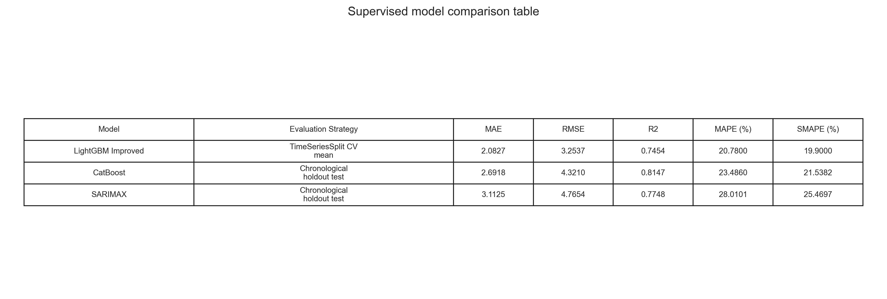

Kjo figurë tregon në një tabelë të vetme strategjinë e evaluimit dhe metrikat kryesore për `LightGBM`, `CatBoost` dhe `SARIMAX`. Ajo e bën të qartë që jo të gjitha modelet janë testuar me të njëjtën strategji vlerësimi, prandaj interpretimi duhet bërë me kujdes.

Për supervised, është gjeneruar edhe paneli i përbashkët i tipareve më të rëndësishme:


Ky panel ndihmon në krahasimin e tre logjikave të ndryshme të interpretimit:

- `feature importance` për modelet boosting;
- koeficientët për `SARIMAX`;
- dhe rolin e tipareve energjetike, meteorologjike dhe kohore në të tre qasjet.

Krahasimi i gabimeve absolute dhe kuadratike:


Kjo figurë tregon dallimet mes `MAE` dhe `RMSE` për modelet supervised dhe e bën më të lehtë dallimin mes performancës mesatare dhe ndjeshmërisë ndaj gabimeve të mëdha.

Krahasimi i `R²` mes modeleve supervised:


Kjo figurë përmbledh se cili model shpjegon më mirë variancën e `PM2.5` në konfigurimin e vet përkatës të evaluimit.

Për unsupervised, tabela e harmonizuar është kjo:


Kjo figurë vendos në të njëjtin kornizë `HDBSCAN`, `Gaussian Mixture` dhe `Isolation Forest`, duke i interpretuar sipas natyrës së tyre: clustering për dy të parat dhe anomaly detection për të fundit.

Për profilin e `PM2.5` në secilin model unsupervised është gjeneruar edhe figura:


Kjo figurë ndihmon shumë në raport, sepse e bën të dukshme si ndryshon niveli mesatar i `PM2.5` ndërmjet cluster-ëve apo ndërmjet grupeve `Normal/Anomaly`.

Krahasimi i numrit të grupeve dhe raportit të pikave speciale:


Kjo figurë përmbledh sa konservativ apo sa granular është secili model unsupervised në ndarjen e të dhënave.

Krahasimi i cilësisë së clustering-ut për modelet clustering:


Kjo figurë krahason `HDBSCAN` dhe `Gaussian Mixture` sipas metrikave të brendshme si `silhouette`, `Davies-Bouldin` dhe `Calinski-Harabasz`.

Paneli i përbashkët i devijimeve të feature-ave:


Kjo figurë ndihmon në krahasimin e profileve të feature-ave që karakterizojnë cluster-at ose anomalitë te modelet unsupervised.

---

### Rezultatet, metrikat dhe interpretimi i fazës së dytë

#### Rezultatet supervised

| Modeli | Strategjia e evaluimit | MAE | RMSE | R² | MAPE (%) | SMAPE (%) |
|---|---|---:|---:|---:|---:|---:|
| LightGBM Improved | TimeSeriesSplit CV mean | 2.0827 | 3.2537 | 0.7454 | 20.78 | 19.90 |
| CatBoost | Chronological holdout test | 2.6918 | 4.3210 | 0.8147 | 23.4860 | 21.5382 |
| SARIMAX | Chronological holdout test | 3.1125 | 4.7654 | 0.7748 | 28.0101 | 25.4697 |

Interpretimi i drejtë i kësaj tabele është:

- `CatBoost` ka performancën më të fortë në holdout test sipas `R²`;
- `LightGBM` ka gabimet mesatare më të ulëta në `TimeSeriesSplit CV`, por kjo nuk është plotësisht e krahasueshme një-me-një me holdout test;
- `SARIMAX` mbetet modeli më i interpretueshëm statistikisht dhe njëkohësisht jep performancë solide në test set.

#### Rezultatet unsupervised

| Modeli | Lloji | Rows | Feature-a | Grupet kryesore | Noise / Anomaly Ratio | Avg. Confidence / Severity | Silhouette | Davies-Bouldin | Calinski-Harabasz |
|---|---|---:|---:|---:|---:|---:|---:|---:|---:|
| HDBSCAN | Clustering | 9347 | 14 | 2 | 0.7354 | 0.9882 | 0.2658 | 1.2785 | 266.1120 |
| Gaussian Mixture | Clustering | 9347 | 12 | 6 | 0.0000 | 0.9688 | 0.0899 | 2.0751 | 950.0418 |
| Isolation Forest | Anomaly Detection | 9347 | 13 | 2 | 0.0501 | 0.0267 | N/A | N/A | N/A |

Interpretimi akademik i rezultateve unsupervised është:

- `HDBSCAN` ofron ndarje më të fortë mes cluster-ëve bazë, por me shumë pika të klasifikuara si `noise`, gjë që është normale për një metodë density-based konservative;
- `Gaussian Mixture` prodhon një ndarje më të imët në 6 regjime dhe është shumë i vlefshëm për interpretim probabilistik të profileve mjedisore;
- `Isolation Forest` nuk është model clustering, prandaj nuk krahasohet me `silhouette` ose `Davies-Bouldin`, por me cilësinë e zbulimit të anomalive dhe interpretimin e rasteve të veçanta.

---

#### Korniza e interpretimit

Në këtë kapitull rezultatet numerike dhe interpretimi i tyre lexohen në dy nivele:

#### 1. Interpretimi supervised

Te modelet supervised (`CatBoost`, `LightGBM`, `SARIMAX`), interpretimi bazohet në:

- metrikat e regresionit,
- krahasimin ndërmjet vlerave reale dhe të parashikuara,
- residuals,
- rëndësinë e feature-ave,
- dhe, në rastin e `SARIMAX`, edhe koeficientët statistikorë, `AIC/BIC` dhe diagnostikën e residualeve.

Kjo ndihmon në kuptimin se:

- sa mirë modeli e parashikon `PM2.5`,
- cilat tipare ndikojnë më shumë në parashikim,
- sa i fortë është komponenti kohor dhe sezonal,
- dhe sa e qëndrueshme është performanca në validation dhe test set.

#### 2. Interpretimi unsupervised

Te modelet unsupervised (`HDBSCAN`, `Gaussian Mixture` dhe `Isolation Forest`), interpretimi bazohet në:

- numrin dhe përmasat e cluster-ëve,
- pikat noise,
- probabilitetet e anëtarësimit në cluster,
- outlier scores,
- raportin e anomalive,
- `BIC/AIC` te modelet probabilistike,
- dhe përmbledhjet statistikore të feature-ave sipas cluster-it.

Kjo ndihmon për të kuptuar:

- nëse të dhënat ndahen në profile natyrore,
- nëse ekzistojnë regjime të ndryshme të ndotjes,
- sa të ndara apo të mbivendosura janë këto regjime,
- dhe cilat kombinime të motit dhe energjisë shfaqin sjellje të ngjashme.

---

### Artefaktet e krijuara nga modelet

Pas fazës së dytë të projektit, përveç output-eve të pipeline-it të përgatitjes së të dhënave, janë krijuar edhe artefakte të reja modelimi.

#### CatBoost

- `data/phase_2/supervised/catboost/catboost_forecasts.csv`
- `data/phase_2/supervised/catboost/catboost_metrics.csv`
- `data/phase_2/supervised/catboost/catboost_feature_importance.csv`
- `data/phase_2/supervised/catboost/catboost_split_summary.csv`
- `data/phase_2/supervised/catboost/catboost_run_info.json`
- `models/catboost_model/catboost_pm25_model.cbm`
- `pictures/phase_2/supervised/catboost/catboost_actual_vs_predicted.png`
- `pictures/phase_2/supervised/catboost/catboost_feature_importance.png`
- `pictures/phase_2/supervised/catboost/catboost_residual_diagnostics.png`
- `pictures/phase_2/supervised/catboost/catboost_forecast_interactive.html`
- `pictures/phase_2/supervised/catboost/catboost_forecast_interactive.png`
- `pictures/phase_2/supervised/catboost/catboost_metrics_table.png`

#### LightGBM

- `src/phase_2/supervised/lightgbm_model/improved_model/improved_model.joblib`
- `src/phase_2/supervised/lightgbm_model/improved_model/metrics_summary.txt`
- `src/phase_2/supervised/lightgbm_model/improved_model/feature_importance.csv`
- `src/phase_2/supervised/lightgbm_model/improved_model/feature_importance.png`
- `src/phase_2/supervised/lightgbm_model/improved_model/actual_vs_predicted.png`
- `src/phase_2/supervised/lightgbm_model/improved_model/learning_curve.png`
- `data/phase_2/supervised/lightgbm_improved/metrics_summary.txt`
- `data/phase_2/supervised/lightgbm_improved/feature_importance.csv`
- `pictures/phase_2/supervised/lightgbm_improved/lightgbm_actual_vs_predicted.png`
- `pictures/phase_2/supervised/lightgbm_improved/lightgbm_feature_importance.png`
- `pictures/phase_2/supervised/lightgbm_improved/lightgbm_learning_curve.png`
- `pictures/phase_2/supervised/lightgbm_improved/lightgbm_metrics_table.png`

#### SARIMAX

- `data/phase_2/supervised/sarimax/sarimax_forecasts.csv`
- `data/phase_2/supervised/sarimax/sarimax_metrics.csv`
- `data/phase_2/supervised/sarimax/sarimax_coefficients.csv`
- `data/phase_2/supervised/sarimax/sarimax_candidate_results.csv`
- `data/phase_2/supervised/sarimax/sarimax_split_summary.csv`
- `data/phase_2/supervised/sarimax/sarimax_residuals.csv`
- `data/phase_2/supervised/sarimax/sarimax_run_info.json`
- `models/sarimax_model/sarimax_pm25_model.pkl`
- `models/sarimax_model/sarimax_summary.txt`
- `models/sarimax_model/sarimax_feature_columns.pkl`
- `pictures/phase_2/supervised/sarimax/sarimax_actual_vs_predicted.png`
- `pictures/phase_2/supervised/sarimax/sarimax_coefficients.png`
- `pictures/phase_2/supervised/sarimax/sarimax_residual_diagnostics.png`
- `pictures/phase_2/supervised/sarimax/sarimax_forecast_interactive.html`
- `pictures/phase_2/supervised/sarimax/sarimax_metrics_table.png`

#### HDBSCAN

- `data/phase_2/unsupervised/hdbscan/hdbscan_clustered_dataset.csv`
- `data/phase_2/unsupervised/hdbscan/hdbscan_metrics.csv`
- `data/phase_2/unsupervised/hdbscan/hdbscan_cluster_summary.csv`
- `data/phase_2/unsupervised/hdbscan/hdbscan_feature_summary.csv`
- `data/phase_2/unsupervised/hdbscan/hdbscan_run_info.json`
- `models/hdbscan_model/hdbscan_model.pkl`
- `models/hdbscan_model/hdbscan_scaler.pkl`
- `models/hdbscan_model/hdbscan_umap.pkl`
- `pictures/phase_2/unsupervised/hdbscan/hdbscan_umap_interactive.html`
- `pictures/phase_2/unsupervised/hdbscan/hdbscan_umap_interactive.png`
- `pictures/phase_2/unsupervised/hdbscan/hdbscan_cluster_sizes.png`
- `pictures/phase_2/unsupervised/hdbscan/hdbscan_pm25_by_cluster.png`
- `pictures/phase_2/unsupervised/hdbscan/hdbscan_pm25_timeline.png`
- `pictures/phase_2/unsupervised/hdbscan/hdbscan_pm25_zoom.png`
- `pictures/phase_2/unsupervised/hdbscan/hdbscan_scatter.png`
- `pictures/phase_2/unsupervised/hdbscan/hdbscan_confidence_distribution.png`
- `pictures/phase_2/unsupervised/hdbscan/hdbscan_feature_shift_panel.png`
- `pictures/phase_2/unsupervised/hdbscan/hdbscan_metrics_table.png`

#### Gaussian Mixture

- `data/phase_2/unsupervised/gaussian_mixture/gmm_clustered_dataset.csv`
- `data/phase_2/unsupervised/gaussian_mixture/gmm_metrics.csv`
- `data/phase_2/unsupervised/gaussian_mixture/gmm_cluster_summary.csv`
- `data/phase_2/unsupervised/gaussian_mixture/gmm_feature_summary.csv`
- `data/phase_2/unsupervised/gaussian_mixture/gmm_model_selection.csv`
- `data/phase_2/unsupervised/gaussian_mixture/gmm_run_info.json`
- `models/gaussian_mixture_model/gmm_model.pkl`
- `models/gaussian_mixture_model/gmm_scaler.pkl`
- `models/gaussian_mixture_model/gmm_pca.pkl`
- `models/gaussian_mixture_model/gmm_feature_columns.pkl`
- `pictures/phase_2/unsupervised/gaussian_mixture/gmm_model_selection.png`
- `pictures/phase_2/unsupervised/gaussian_mixture/gmm_cluster_profile_heatmap.png`
- `pictures/phase_2/unsupervised/gaussian_mixture/gmm_cluster_sizes.png`
- `pictures/phase_2/unsupervised/gaussian_mixture/gmm_pca_interactive.html`
- `pictures/phase_2/unsupervised/gaussian_mixture/gmm_pm25_by_cluster.png`
- `pictures/phase_2/unsupervised/gaussian_mixture/gmm_pm25_timeline.png`
- `pictures/phase_2/unsupervised/gaussian_mixture/gmm_pm25_zoom.png`
- `pictures/phase_2/unsupervised/gaussian_mixture/gmm_scatter.png`
- `pictures/phase_2/unsupervised/gaussian_mixture/gmm_confidence_distribution.png`
- `pictures/phase_2/unsupervised/gaussian_mixture/gmm_feature_shift_panel.png`
- `pictures/phase_2/unsupervised/gaussian_mixture/gmm_metrics_table.png`

#### Isolation Forest

- `data/phase_2/unsupervised/isolation_forest/isolation_forest_scored_dataset.csv`
- `data/phase_2/unsupervised/isolation_forest/isolation_forest_metrics.csv`
- `data/phase_2/unsupervised/isolation_forest/isolation_forest_feature_summary.csv`
- `data/phase_2/unsupervised/isolation_forest/isolation_forest_top_anomalies.csv`
- `data/phase_2/unsupervised/isolation_forest/isolation_forest_run_info.json`
- `models/isolation_forest_model/isolation_forest_model.pkl`
- `models/isolation_forest_model/isolation_forest_feature_columns.pkl`
- `pictures/phase_2/unsupervised/isolation_forest/isolation_forest_pm25.png`
- `pictures/phase_2/unsupervised/isolation_forest/isolation_forest_energy.png`
- `pictures/phase_2/unsupervised/isolation_forest/isolation_forest_pm25_zoom.png`
- `pictures/phase_2/unsupervised/isolation_forest/isolation_forest_scatter.png`
- `pictures/phase_2/unsupervised/isolation_forest/isolation_forest_score_distribution.png`
- `pictures/phase_2/unsupervised/isolation_forest/isolation_forest_feature_shift.png`
- `pictures/phase_2/unsupervised/isolation_forest/isolation_forest_pm25_profile.png`
- `pictures/phase_2/unsupervised/isolation_forest/isolation_forest_feature_shift_panel.png`
- `pictures/phase_2/unsupervised/isolation_forest/isolation_forest_metrics_table.png`

#### Output-et krahasuese të fazës së dytë

- `data/phase_2/comparison/supervised_model_comparison.csv`
- `data/phase_2/comparison/unsupervised_model_comparison.csv`
- `pictures/phase_2/comparison/supervised_comparison_table.png`
- `pictures/phase_2/comparison/supervised_error_metrics.png`
- `pictures/phase_2/comparison/supervised_r2_comparison.png`
- `pictures/phase_2/comparison/supervised_feature_panels.png`
- `pictures/phase_2/comparison/unsupervised_comparison_table.png`
- `pictures/phase_2/comparison/unsupervised_special_ratio_and_groups.png`
- `pictures/phase_2/comparison/unsupervised_clustering_quality.png`
- `pictures/phase_2/comparison/unsupervised_feature_panels.png`
- `pictures/phase_2/comparison/unsupervised_pm25_profiles.png`

---

### Vizualizimet e fazës së dytë

Në këtë seksion paraqiten të gjitha figurat statike të fazës së dytë, të organizuara sipas modelit përkatës. Vizualizimet interaktive `.html` listohen si file të veçanta, ndërsa figurat `.png` shfaqen direkt për dokumentim dhe prezantim.

#### CatBoost


Kjo figurë krahason serinë reale me parashikimin e modelit në test set.


Kjo figurë paraqet rëndësinë relative të feature-ave në modelin final.


Kjo figurë shfaq diagnostikën kryesore të residualeve të `CatBoost`.

Vizualizimi interaktiv ruhet në:

- `pictures/phase_2/supervised/catboost/catboost_forecast_interactive.html`


Kjo figurë paraqet pamjen statike të forecast-it interaktiv të `CatBoost`.


Kjo figurë përmbledh metrikat kryesore të `CatBoost` në një tabelë të vetme.

#### LightGBM


Kjo figurë paraqet përputhjen mes vlerave reale dhe parashikimit të `LightGBM`.


Kjo figurë tregon peshën e feature-ave në modelin final `LightGBM`.


Kjo figurë paraqet ecurinë e mësimit gjatë trajnimit të modelit.


Kjo figurë përmbledh metrikat kryesore të `LightGBM` për krahasim me modelet e tjera supervised.

#### SARIMAX


Kjo figurë tregon forecast-in e `SARIMAX` kundrejt vlerave reale të `PM2.5`.


Kjo figurë përmbledh koeficientët më domethënës të modelit final.


Kjo figurë paraqet diagnostikën e residualeve të modelit statistik.

Vizualizimi interaktiv ruhet në:

- `pictures/phase_2/supervised/sarimax/sarimax_forecast_interactive.html`


Kjo figurë i vendos në një kornizë të vetme metrikat kryesore të `SARIMAX`.

#### HDBSCAN

Vizualizimi interaktiv ruhet në:

- `pictures/phase_2/unsupervised/hdbscan/hdbscan_umap_interactive.html`


Kjo figurë paraqet cluster-at dhe pikat `noise` në embedding-un 2D.


Kjo figurë tregon përmasat relative të cluster-ëve të zbuluar.


Kjo figurë krahason profilin e `PM2.5` ndërmjet cluster-ëve bazë.


Kjo figurë e vendos etiketimin e cluster-ëve mbi boshtin kohor të serisë.


Kjo figurë ofron një pamje më të afërt të episodeve më të dallueshme.


Kjo figurë paraqet shpërndarjen e observimeve në raport me ndotjen dhe energjinë.


Kjo figurë tregon shpërndarjen e besimit të anëtarësimit në cluster.


Kjo figurë përmbledh devijimet kryesore të feature-ave sipas cluster-it.


Kjo figurë përmbledh metrikat kryesore të clustering-ut për `HDBSCAN`.

#### Gaussian Mixture

Vizualizimi interaktiv ruhet në:

- `pictures/phase_2/unsupervised/gaussian_mixture/gmm_pca_interactive.html`


Kjo figurë tregon procesin e përzgjedhjes së modelit final.


Kjo figurë paraqet profilet mesatare të cluster-ëve në formë heatmap-i.


Kjo figurë tregon përmasat relative të gjashtë cluster-ëve finalë.


Kjo figurë krahason nivelin mesatar të `PM2.5` ndërmjet cluster-ëve.


Kjo figurë vendos cluster-at mbi boshtin kohor të serisë së `PM2.5`.


Kjo figurë jep një pamje më të afërt të episodeve më karakteristike.


Kjo figurë paraqet shpërndarjen e cluster-ëve kundrejt energjisë dhe ndotjes reale.


Kjo figurë tregon shpërndarjen e probabilitetit maksimal të anëtarësimit në cluster.


Kjo figurë përmbledh feature-at që i dallojnë më fort cluster-at nga mesatarja globale.


Kjo figurë përmbledh metrikat kryesore të modelit `Gaussian Mixture`.

#### Isolation Forest


Kjo figurë tregon anomalitë e vendosura mbi serinë kohore të `PM2.5`.


Kjo figurë lidh anomalitë me serinë kohore të prodhimit të energjisë.


Kjo figurë ofron pamjen e zmadhuar të episodeve më të ndjeshme.


Kjo figurë paraqet pozicionin e anomalive në raport me ndotjen dhe energjinë.


Kjo figurë tregon shpërndarjen e score-ve të anomalive.


Kjo figurë krahason profilin `Normal` kundrejt `Anomaly`.


Kjo figurë paraqet feature-at me devijimin më të madh absolut te grupi anormal.


Kjo figurë zgjeron interpretimin e devijimeve kryesore të feature-ave.


Kjo figurë përmbledh parametrat dhe metrikat kryesore të `Isolation Forest`.

#### Krahasimi i harmonizuar


Kjo figurë përmbledh krahasimin standard të tre modeleve supervised.


Kjo figurë krahason `MAE` dhe `RMSE` ndërmjet modeleve supervised.


Kjo figurë krahason `R²` ndërmjet `LightGBM`, `CatBoost` dhe `SARIMAX`.


Kjo figurë bashkon në një panel logjikën interpretuese të modeleve supervised.


Kjo figurë përmbledh krahasimin e harmonizuar të modeleve unsupervised.


Kjo figurë krahason numrin e grupeve dhe raportin e pikave speciale për secilin model.


Kjo figurë krahason cilësinë e clustering-ut për `HDBSCAN` dhe `Gaussian Mixture`.


Kjo figurë përmbledh profilet krahasuese të feature-ave te modelet unsupervised.


Kjo figurë krahason profilin e `PM2.5` ndërmjet cluster-ëve dhe anomalive.

---

### Rezultati i zgjeruar i pipeline-it

Produkti final i këtij projekti nuk është më vetëm një dataset i përgatitur, por një bazë e plotë për analizë dhe modelim.

Rezultati final përfshin:

- një dataset të integruar, të pastruar, të validuar dhe të transformuar;
- një subset final tiparesh të përshtatshme për modelim;
- një model supervised `CatBoostRegressor` për parashikimin e `PM2.5`;
- një model supervised `LightGBM` për benchmark dhe analizë me lag features;
- një model supervised `SARIMAX` për forecast kohor të interpretueshëm statistikisht;
- një model unsupervised `HDBSCAN` për clustering dhe outlier analysis;
- një model unsupervised `Gaussian Mixture` për identifikimin probabilistik të regjimeve mjedisore;
- artefakte të metrikave, parashikimeve, cluster-ëve dhe rëndësisë së tipareve;
- si dhe vizualizime interaktive për interpretim më të qartë të rezultateve.

Kjo do të thotë se pipeline-i i ndërtuar në këtë projekt tashmë përbën jo vetëm një proces të përgatitjes së të dhënave, por edhe një bazë funksionale për krahasim modelesh, analiza të mëtejshme dhe zgjerim në faza të ardhshme.

---

## 03 Rievaluimi dhe përmirësimi i modelit

Faza e tretë e projektit është ndërtuar si fazë e rievaluimit, përmirësimit dhe aplikimit praktik të modelit më të mirë supervised nga faza e dytë. Sipas kërkesave të projektit, kjo fazë nuk synon vetëm të prodhojë një rezultat të ri numerik, por të tregojë qartë çfarë është përmirësuar, pse është bërë ai përmirësim, si krahasohet me fazën paraprake dhe si mund të përdoret rezultati në një skenar më praktik.

Në fazën e dytë u krahasuan tre modele supervised për parashikimin e `PM2.5`: `LightGBM`, `CatBoost` dhe `SARIMAX`. Për fazën e tretë fokusi u vendos te `CatBoost`, sepse në holdout test të fazës së dytë kishte `R²` më të lartë se modelet e tjera supervised, ndërsa ruante edhe fleksibilitet të mirë për tuning, interpretim dhe integrim në dashboard.

Qëllimi kryesor i fazës së tretë është:

- rievaluimi i modelit më të mirë supervised nga faza e dytë;
- fine-tuning i kontrolluar i hiperparametrave të `CatBoost`;
- krahasim i drejtpërdrejtë mes `CatBoost` të fazës 2 dhe `CatBoost` të fazës 3;
- analizë e interpretueshmërisë përmes `feature importance` dhe `SHAP`;
- vlerësim i stabilitetit në periudha të ndryshme kohore;
- krijim i një snapshot-i praktik për parashikimin e `PM2.5` për ditën e ardhshme;
- përgatitje e rezultateve në formë të qartë për dokumentim, prezantim dhe dashboard.

Implementimi i fazës së tretë ndodhet në:

- `src/phase_3/supervised/catboost_phase3_tuning.py`
- `src/phase_3/forecasting/build_next_day_forecast_snapshot.py`
- `src/phase_3/comparison/build_phase3_standardized_outputs.py`

Output-et kryesore ruhen në:

- `data/phase_3/supervised/catboost_tuned/`
- `data/phase_3/forecasting/`
- `data/phase_3/comparison/`
- `pictures/phase_3/supervised/catboost_tuned/`
- `pictures/phase_3/forecasting/`
- `pictures/phase_3/comparison/`

---

### Rrjedha metodologjike e fazës së tretë

Faza e tretë është ndërtuar si një zinxhir i kontrolluar eksperimental, në mënyrë që përmirësimi i modelit të jetë i matshëm, i shpjegueshëm dhe i përshtatshëm për demonstrim praktik. Rrjedha metodologjike është:

1. Ruajtja e rezultateve referencë nga faza e dytë për `LightGBM`, `CatBoost` dhe `SARIMAX`.
2. Përzgjedhja e `CatBoost` si model kryesor për fazën e tretë, bazuar në performancën më të mirë supervised në holdout test.
3. Testimi i disa konfigurimeve të kontrolluara të hiperparametrave, pa ndryshuar target-in dhe pa prishur ndarjen kronologjike të të dhënave.
4. Zgjedhja e kandidatit final sipas `validation_RMSE`, ndërsa metrikat përfundimtare raportohen në test set.
5. Krahasimi i drejtpërdrejtë mes `CatBoost` të fazës së dytë dhe `CatBoost` të tunuar në fazën e tretë.
6. Analiza vizuale e parashikimeve dhe residualeve për të parë sjelljen e modelit, jo vetëm metrikat numerike.
7. Interpretimi i modelit me `feature importance` dhe `SHAP`, për të kuptuar cilat tipare ndikojnë më shumë në forecast.
8. Vlerësimi i stabilitetit kohor me `TimeSeriesSplit` dhe analizë sipas profileve `Heating/Cooling`.
9. Ndërtimi i një snapshot-i praktik për forecast 24-orësh duke përdorur planin day-ahead të KOSTT-it dhe parashikimin e motit nga Open-Meteo.
10. Shfaqja e rezultateve të ruajtura në dashboard, në mënyrë që projekti të jetë i prezantueshëm edhe pa refresh online në momentin e mbrojtjes.

Kjo rrjedhë e bën fazën e tretë më shumë sesa një tuning të thjeshtë: ajo e lidh modelin me interpretueshmëri, stabilitet dhe përdorim praktik.

---

### Pika fillestare e fazës së tretë

Para tuning-ut, u ruajt një referencë e qartë e performancës së modeleve supervised nga faza e dytë. Kjo është e rëndësishme sepse faza e tretë duhet të lexohet si vazhdim dhe përmirësim i fazës paraprake, jo si eksperiment i shkëputur.


Kjo tabelë paraqet rezultatet kryesore të modeleve supervised të fazës së dytë dhe tregon pse `CatBoost` u zgjodh si kandidat për rievaluim.


Kjo figurë krahason vizualisht metrikat kryesore të fazës së dytë dhe vendos bazën nga ku nis përmirësimi në fazën e tretë.

Duhet theksuar se `LightGBM` raportohet me `TimeSeriesSplit CV mean`, ndërsa `CatBoost` dhe `SARIMAX` raportohen me `chronological holdout test`. Prandaj, krahasimi është shumë i dobishëm për orientim metodologjik, por nuk duhet interpretuar si krahasim plotësisht identik një-me-një.

---

### Fine-tuning i CatBoost

Në vend të një kërkimi shumë të gjerë dhe të paarsyetuar, në fazën e tretë u përdor tuning konservativ. Kjo qasje është më e përshtatshme akademikisht për këtë projekt, sepse modeli i fazës së dytë tashmë kishte performancë të mirë dhe qëllimi ishte përmirësim i kontrolluar, jo ndryshim radikal i modelit.

Parametrat kryesorë të testuar ishin:

- `depth`
- `learning_rate`
- `l2_leaf_reg`
- `random_strength`
- `bagging_temperature`
- `early_stopping_rounds`

Modeli final u zgjodh sipas `validation_RMSE`, ndërsa metrikat finale u raportuan në holdout test. Kjo ruan ndarjen metodologjike mes përzgjedhjes së modelit dhe vlerësimit final.

#### Kandidati final i zgjedhur

| Parametri | Vlera |
|---|---:|
| Candidate | `strong_regularized_depth6` |
| `depth` | 6 |
| `learning_rate` | 0.02 |
| `l2_leaf_reg` | 10 |
| `random_strength` | 2.0 |
| `bagging_temperature` | 0.8 |
| `early_stopping_rounds` | 100 |
| `best_iteration` | 1137 |
| `validation_RMSE` | 1.9458 |
| `test_RMSE` | 4.3002 |
| `test_R²` | 0.8165 |

Ky konfigurim është më i rregulluar se modeli referencë i fazës së dytë, sepse përdor `l2_leaf_reg` më të lartë, `learning_rate` më të ulët dhe numër më të madh iteracionesh. Kjo e bën modelin më gradual në mësim dhe më të kontrolluar ndaj overfitting-ut.

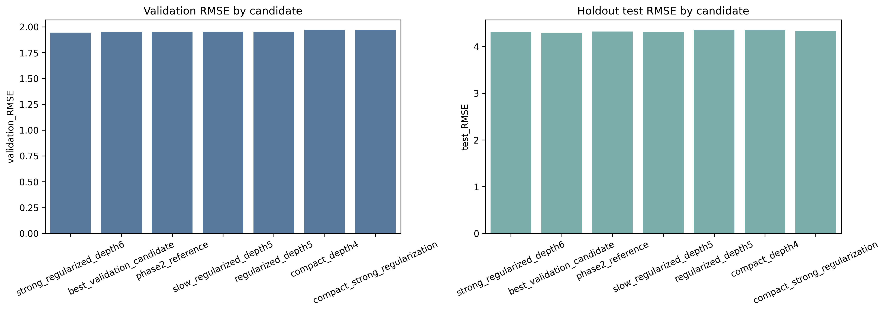

Kjo figurë tregon krahasimin e kandidatëve të tuning-ut sipas `validation_RMSE` dhe `test_RMSE`.


Kjo tabelë paraqet kandidatët kryesorë të fazës së tretë dhe ndihmon të shihet pse konfigurimi final u zgjodh mbi bazë validimi.

---

### Krahasimi CatBoost faza 2 kundrejt fazës 3

Rezultatet e fazës së tretë tregojnë një përmirësim modest, por konsistent në të gjitha metrikat kryesore. Kjo është sjellje e pritshme, sepse modeli i fazës së dytë ishte tashmë mjaft i fortë.

| Metrika | CatBoost faza 2 | CatBoost faza 3 | Përmirësimi absolut | Përmirësimi relativ |
|---|---:|---:|---:|---:|
| MAE | 2.6918 | 2.6794 | 0.0124 | 0.46% |
| RMSE | 4.3210 | 4.3002 | 0.0208 | 0.48% |
| R² | 0.8147 | 0.8165 | 0.0018 | 0.22% |
| MAPE (%) | 23.4860 | 23.3603 | 0.1257 | 0.54% |
| SMAPE (%) | 21.5382 | 21.4653 | 0.0729 | 0.34% |

Përmirësimi nuk duhet prezantuar si ndryshim i madh në performancë, por si fine-tuning i suksesshëm dhe metodologjikisht i pastër. Vlera më e madhe e fazës së tretë është kombinimi i përmirësimit numerik me interpretueshmëri, stabilitet dhe aplikim praktik.


Kjo figurë krahason metrikat kryesore të `CatBoost` para dhe pas tuning-ut.


Kjo tabelë përmbledh përmirësimin absolut dhe relativ të modelit të fazës së tretë kundrejt modelit të fazës së dytë.

#### Parashikimi dhe diagnostika e gabimeve

Përveç metrikave numerike, modeli i tunuar u analizua edhe vizualisht për të parë se si ndjek serinë reale të `PM2.5` dhe si shpërndahen residualet.

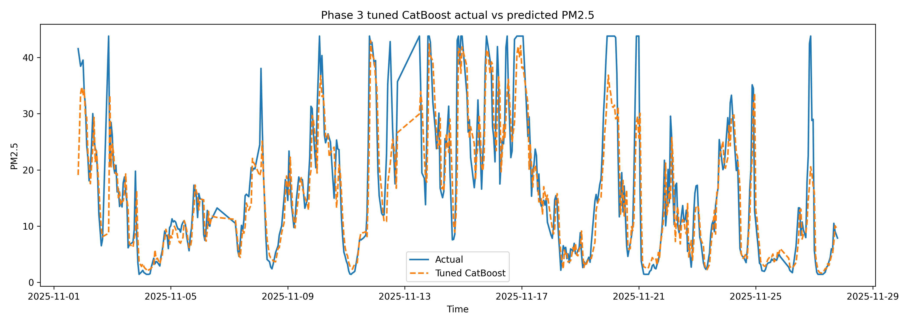

Kjo figurë tregon përputhjen mes vlerave reale dhe parashikimeve të `CatBoost` të tunuar në test set.

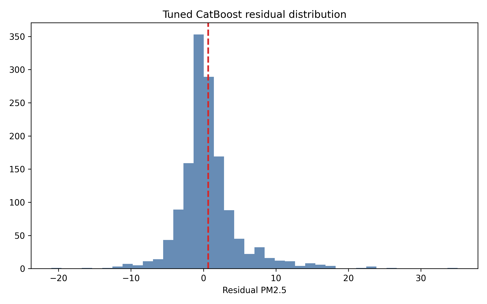

Kjo figurë paraqet shpërndarjen e residualeve dhe ndihmon të kuptohet nëse modeli ka gabime të përqendruara apo devijime të mëdha në episode të caktuara.

---

### Interpretueshmëria e modelit

Një nga kontributet kryesore të fazës së tretë është kalimi nga raportimi i thjeshtë i metrikave drejt shpjegimit të modelit. Për këtë arsye janë përdorur dy forma interpretimi:

- `feature importance`, që tregon peshën relative të feature-ave në model;
- `SHAP`, që tregon kontributin mesatar të secilit feature në parashikim.

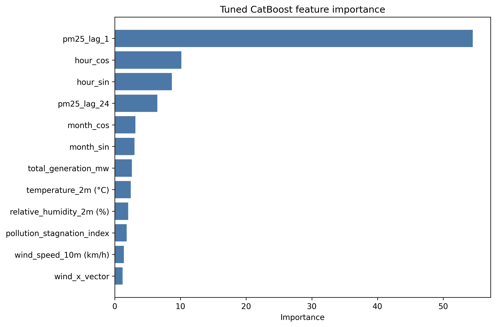

Kjo figurë tregon cilat feature-a kanë ndikimin më të madh në modelin final të tunuar.

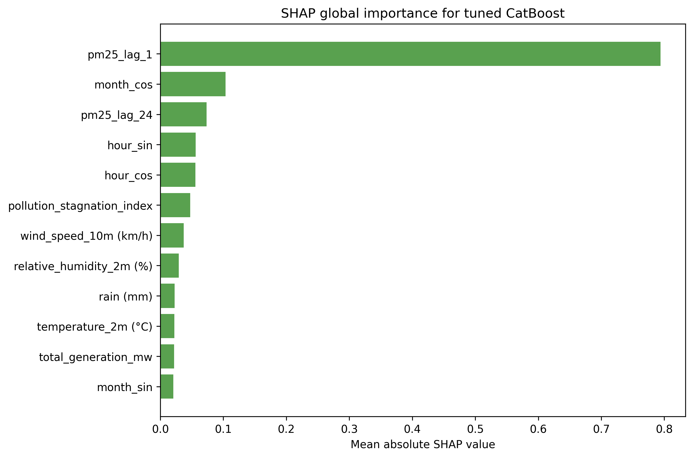

Kjo figurë përdor `mean absolute SHAP value` për të treguar ndikimin mesatar të feature-ave në parashikimin e `PM2.5`.

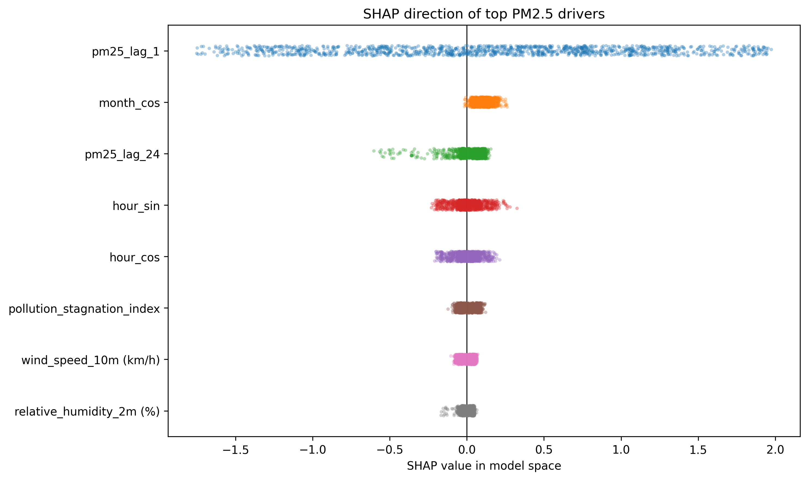

Kjo figurë tregon drejtimin e ndikimit të feature-ave kryesorë, pra nëse vlerat më të larta të tyre priren ta rrisin apo ta ulin parashikimin e modelit.

Sipas rezultateve të `SHAP`, feature-at më të rëndësishme janë:

| Feature | Mean absolute SHAP | Interpretimi |
|---|---:|---|
| `pm25_lag_1` | 0.7939 | Gjendja e ndotjes në orën paraprake është faktori dominues. |
| `month_cos` | 0.1035 | Modeli kap strukturë sezonale në të dhëna. |
| `pm25_lag_24` | 0.0734 | Ekziston cikël ditor dhe varësi nga e njëjta orë e ditës paraprake. |
| `hour_sin` | 0.0561 | Ora e ditës ndikon në dinamikën e ndotjes. |
| `hour_cos` | 0.0557 | Ritmi ditor ka rol të rëndësishëm në parashikim. |
| `pollution_stagnation_index` | 0.0474 | Kushtet e stagnimit atmosferik ndikojnë në rritjen e ndotjes. |

Ky interpretim është shumë i rëndësishëm për projektin, sepse tregon se `CatBoost` nuk po mëson vetëm marrëdhënie të rastësishme numerike, por po mbështetet në faktorë që kanë kuptim fizik dhe kohor: memoria e ndotjes, cikli ditor, sezonaliteti dhe kushtet atmosferike.

---

### Stabiliteti kohor dhe sezonal

Për të kuptuar nëse modeli mbetet i qëndrueshëm në periudha të ndryshme, është përdorur `TimeSeriesSplit(n_splits=5)`. Kjo krijon validime kronologjike ku modeli trajnohet në të kaluarën dhe testohet në segmente më të reja kohore.

Rezultatet sipas folds janë:

| Fold | Periudha e validimit | MAE | RMSE | R² |
|---:|---|---:|---:|---:|
| 1 | 2024-05-26 -> 2024-08-04 | 1.8638 | 2.7602 | 0.6446 |
| 2 | 2024-08-04 -> 2025-04-08 | 3.6857 | 6.4211 | 0.6159 |
| 3 | 2025-04-08 -> 2025-07-04 | 1.4183 | 2.1399 | 0.7646 |
| 4 | 2025-07-04 -> 2025-09-12 | 1.2534 | 1.9648 | 0.7387 |
| 5 | 2025-09-12 -> 2025-11-27 | 2.5258 | 4.1469 | 0.8214 |

Fold-i i dytë ka gabimin më të lartë, sepse përfshin një periudhë më të vështirë kohore dhe më heterogjene. Kjo është pikë e rëndësishme për interpretim: modeli nuk ka performancë identike gjatë gjithë vitit, por kjo është e pritshme në të dhëna reale të cilësisë së ajrit.

Në kod, stabiliteti sezonal është ndërtuar mbi dy profile funksionale që janë të përshtatshme për ndotjen e ajrit në Prishtinë:

- `Heating season`, që përfaqëson periudhat me ndikim më të madh të ngrohjes, stagnimit atmosferik dhe episodeve më të forta të ndotjes;
- `Cooling season`, që përfaqëson periudhat më të favorshme për shpërndarje atmosferike dhe nivele më të ulëta të ndotjes.

| Periudha | MAE | RMSE | MAPE (%) | SMAPE (%) | R² | Pika vlerësimi |
|---|---:|---:|---:|---:|---:|---:|
| Heating season | 3.5576 | 5.9664 | 24.4300 | 23.6458 | 0.6864 | 2472 |
| Cooling season | 1.4917 | 2.2868 | 18.6526 | 17.9410 | 0.7168 | 5293 |

Rezultatet tregojnë se modeli ka gabim më të lartë në `Heating season`, që është e pritshme sepse në këtë periudhë ndotja zakonisht ka dinamikë më komplekse: më shumë stagnim ajri, episode më të forta të `PM2.5` dhe variabilitet më të madh. Kjo e bën krahasimin `Heating/Cooling` të dobishëm për të kuptuar stabilitetin e modelit në kushte të ndryshme atmosferike.

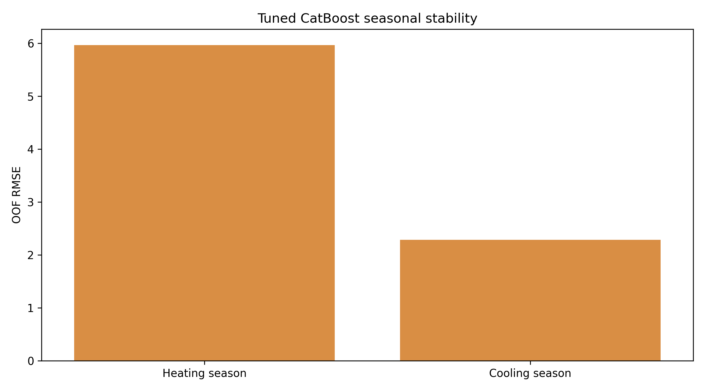

Kjo figurë krahason performancën mes `Heating season` dhe `Cooling season`.

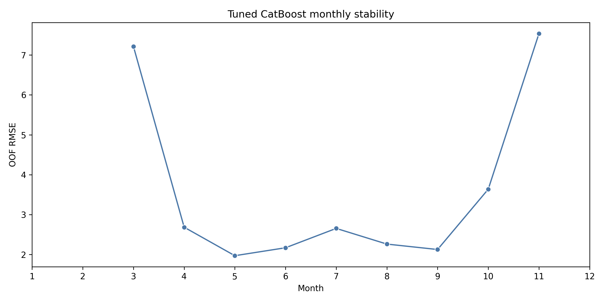

Kjo figurë tregon si ndryshon `RMSE` sipas muajve dhe ndihmon të identifikohen periudhat ku modeli është më i pasigurt.

---

### Snapshot offline për parashikim të ditës së ardhshme

Për ta lidhur modelin me një skenar më praktik, në fazën e tretë është krijuar edhe një snapshot offline për parashikimin e `PM2.5` për ditën e ardhshme. Ky nuk përdoret si evaluim i saktësisë, sepse për ditën e parashikuar nuk ka menjëherë ground truth, por si demonstrim i përdorimit praktik të modelit.

Skripta `build_next_day_forecast_snapshot.py` kryen këto hapa:

1. shkarkon dokumentin zyrtar të KOSTT-it për planin e prodhimit të energjisë për ditën në vijim;
2. ruan snapshot-in në `data/phase_3/forecasting/external/`;
3. merr parashikimin orar të motit nga Open-Meteo;
4. e shpërndan totalin ditor të KOSTT-it në 24 orë sipas profilit historik;
5. përdor modelin `CatBoost` të tunuar për të gjeneruar forecast 24-orësh;
6. ruan rezultatet si CSV dhe figurë për përdorim në prezantim dhe dashboard.

Snapshot-i i ruajtur për demonstrim është:

| Data | KOSTT MWh | PM2.5 mesatar | PM2.5 maksimal | PM2.5 minimal | Risk |
|---|---:|---:|---:|---:|---|
| 2026-05-09 | 4767.878 | 6.6211 | 10.1625 | 4.0161 | Low |


Kjo tabelë përmbledh snapshot-in e ruajtur për forecast-in 24-orësh.


Kjo figurë paraqet forecast-in orar të `PM2.5` për ditën e ardhshme së bashku me profilin e prodhimit të energjisë.

Ky dizajn e bën projektin më të sigurt për prezantim, sepse rezultatet mund të shfaqen edhe pa refresh online në momentin e mbrojtjes. Refresh-i nga KOSTT dhe Open-Meteo mbetet i mundur, por demonstrimi kryesor mbështetet në artefakte të ruajtura.

---

### Pamja dhe karakteristikat e dashboard-it Streamlit në fazën e tretë

Përveç skriptave dhe artefakteve të ruajtura, faza e tretë prezantohet edhe përmes dashboard-it interaktiv në `app.py`, i ndërtuar me `Streamlit` dhe `Plotly`. Ky dashboard e bën projektin më të qartë për prezantim, sepse rezultatet nuk mbeten vetëm në tabela statike, por mund të eksplorohen në mënyrë vizuale dhe interaktive.

Dashboard-i hapet me titullin `Prishtina PM2.5 Forecast Studio` dhe është organizuar në katër pamje kryesore:

1. `Overview` - jep një pamje të përgjithshme të dataset-it, periudhës historike, numrit të rreshtave dhe vlerave më të fundit të `PM2.5`.
2. `Historical scenario replay` - lejon testimin e skenarëve mbi të dhëna historike, duke krahasuar vlerën reale, parashikimin bazë dhe parashikimin pas ndryshimeve të vendosura nga përdoruesi.
3. `Future forecast` - paraqet snapshot-in 24-orësh të fazës së tretë, të ndërtuar nga plani day-ahead i KOSTT-it dhe parashikimi i motit nga Open-Meteo.
4. `Model center` - shfaq rezultatet e modeleve, krahasimin `CatBoost` faza 2 kundrejt fazës 3, `SHAP`, stabilitetin sezonal dhe metrikat e ruajtura.

Në anën e majtë dashboard-i ka panelin `Scenario setup`, ku përdoruesi mund të zgjedhë preset-e dhe të ndryshojë faktorë si:

- zhvendosja e prodhimit të energjisë;
- ndryshimi i temperaturës;
- ndryshimi i reshjeve;
- ndryshimi i lagështisë;
- ndryshimi i shpejtësisë së erës;
- ndryshimi i drejtimit të erës.

Këto kontrolle e bëjnë dashboard-in të dobishëm për demonstrim, sepse përdoruesi mund të shohë si ndryshon parashikimi i `PM2.5` kur ndryshojnë kushtet atmosferike ose profili i prodhimit të energjisë. Në vend që modeli të shfaqet vetëm si rezultat numerik, Streamlit e paraqet atë si një mjet eksplorues ku mund të kuptohen më lehtë lidhjet mes motit, energjisë dhe ndotjes së ajrit.


Kjo pamje paraqet faqen kryesore të dashboard-it, ku shihen periudha historike, numri i rreshtave dhe trendi ditor i `PM2.5`.


Kjo pamje demonstron skenarët historikë, ku krahasohen vlera reale, parashikimi bazë dhe parashikimi pas ndryshimit të faktorëve.


Kjo pamje paraqet forecast-in praktik 24-orësh të fazës së tretë të ndërtuar nga KOSTT, Open-Meteo dhe `CatBoost` i tunuar.


Kjo pamje shfaq qendrën e rezultateve të modelit, duke përmbledhur metrikat, krahasimet dhe rezultatet kryesore të fazës së tretë.

Karakteristikat kryesore të dashboard-it janë:

- përdorimi i grafikëve interaktivë `Plotly` për seri kohore, krahasime dhe rezultate të modeleve;
- shfaqja e metrikave kryesore me `st.metric`, si mesatarja, maksimumi, risku dhe horizonti i parashikimit;
- përdorimi i tabelave interaktive për forecast-et, rezultatet e modeleve dhe kontrollin e skenarëve;
- mbështetja në artefakte të ruajtura, që e bën prezantimin stabil edhe nëse nuk bëhet refresh online gjatë demonstrimit;
- ndarja e qartë e pamjeve në tabs, që e bën aplikacionin më të lehtë për t'u ndjekur nga përdorues teknikë dhe jo-teknikë.

Në këtë mënyrë, Streamlit në fazën e tretë shërben si shtresa praktike e projektit: ai lidh modelin e tunuar `CatBoost`, forecast-in 24-orësh dhe interpretimin e rezultateve në një mjedis të vetëm vizual.

---

### Vizualizimet e fazës së tretë

Ky seksion i mbledh në një vend figurat analitike kryesore të fazës së tretë. Qëllimi është që rezultatet e tuning-ut, interpretueshmërisë, stabilitetit dhe forecast-it të jenë të lehta për t'u parë dhe krahasuar gjatë leximit ose prezantimit.

#### Referenca nga faza e dytë dhe tuning-u i CatBoost


Kjo tabelë shërben si pikënisje e fazës së tretë, duke paraqitur rezultatet e modeleve supervised nga faza e dytë.


Kjo figurë tregon vizualisht pse `CatBoost` u zgjodh si modeli kryesor për rievaluim dhe përmirësim.


Kjo figurë krahason kandidatët e tuning-ut sipas `validation_RMSE` dhe `test_RMSE`.


Kjo tabelë paraqet parametrat kryesorë të kandidatëve të testuar dhe metrikat e tyre kryesore.


Kjo figurë krahason metrikat kryesore të `CatBoost` para dhe pas tuning-ut të fazës së tretë.


Kjo tabelë përmbledh përmirësimin absolut dhe relativ të modelit të tunuar kundrejt versionit të fazës së dytë.

#### Diagnostika dhe interpretueshmëria e modelit


Kjo figurë tregon sa afër janë parashikimet e modelit të tunuar me vlerat reale të `PM2.5` në test set.


Kjo figurë paraqet shpërndarjen e residualeve dhe ndihmon të kuptohet struktura e gabimeve të modelit.


Kjo figurë tregon feature-at me rëndësinë më të madhe sipas modelit `CatBoost` të tunuar.


Kjo figurë shpjegon ndikimin mesatar të feature-ave në parashikim duke përdorur `mean absolute SHAP value`.


Kjo figurë tregon drejtimin e ndikimit të feature-ave kryesorë, pra nëse ato priren ta rrisin apo ta ulin parashikimin.

#### Stabiliteti kohor dhe sezonal


Kjo figurë krahason performancën e modelit në `Heating season` dhe `Cooling season`.


Kjo figurë tregon si ndryshon `RMSE` sipas muajve dhe ndihmon të dallohen periudhat më sfiduese për modelin.

#### Forecast praktik i ditës së ardhshme


Kjo tabelë përmbledh snapshot-in e ruajtur për forecast-in 24-orësh të `PM2.5`.


Kjo figurë paraqet forecast-in orar të `PM2.5` për ditën e ardhshme bashkë me profilin e shpërndarë të prodhimit të energjisë.

---

### Ekzekutimi dhe riprodhueshmëria e fazës së tretë

Për ta riprodhuar fazën e tretë në mënyrë të kontrolluar, skriptat ekzekutohen në këtë rend:

```powershell
python src/phase_3/supervised/catboost_phase3_tuning.py
python src/phase_3/forecasting/build_next_day_forecast_snapshot.py
python src/phase_3/comparison/build_phase3_standardized_outputs.py
```

`catboost_phase3_tuning.py` kryen fine-tuning të modelit `CatBoost`, ruan modelin final në `models/phase_3/catboost_tuned/` dhe krijon metrikat, forecast-et, rëndësinë e veçorive, SHAP dhe stabilitetin kohor. `build_next_day_forecast_snapshot.py` ndërton snapshot-in 24-orësh duke kombinuar planin day-ahead të KOSTT-it me parashikimin e motit nga Open-Meteo. `build_phase3_standardized_outputs.py` i bashkon rezultatet në tabela dhe figura krahasuese për README, dashboard dhe prezantim.

Kjo e bën fazën e tretë të verifikueshme: fillimisht përmirësohet modeli, pastaj krijohet skenari praktik i forecast-it, dhe në fund standardizohen artefaktet për raportim.

---

### Artefaktet e fazës së tretë

Faza e tretë krijon këto artefakte kryesore:

#### Supervised tuning

- `data/phase_3/supervised/catboost_tuned/catboost_tuned_metrics.csv`
- `data/phase_3/supervised/catboost_tuned/catboost_tuning_candidates.csv`
- `data/phase_3/supervised/catboost_tuned/catboost_tuned_forecasts.csv`
- `data/phase_3/supervised/catboost_tuned/catboost_tuned_feature_importance.csv`
- `data/phase_3/supervised/catboost_tuned/catboost_tuned_shap_global_importance.csv`
- `data/phase_3/supervised/catboost_tuned/catboost_tuned_timeseries_fold_metrics.csv`
- `data/phase_3/supervised/catboost_tuned/catboost_tuned_seasonal_stability.csv`
- `data/phase_3/supervised/catboost_tuned/catboost_tuned_monthly_stability.csv`
- `models/phase_3/catboost_tuned/catboost_phase3_tuned_model.cbm`
- `models/phase_3/catboost_tuned/catboost_phase3_feature_columns.pkl`

#### Forecast snapshot

- `data/phase_3/forecasting/next_day_pm25_daily_summary_snapshot.csv`
- `data/phase_3/forecasting/next_day_pm25_hourly_forecast_snapshot.csv`
- `data/phase_3/forecasting/kostt_next_day_generation_snapshot.csv`
- `data/phase_3/forecasting/kostt_hourly_generation_profile_from_daily_total.csv`
- `data/phase_3/forecasting/external/open_meteo_next_day_weather_snapshot.csv`
- `data/phase_3/forecasting/external/open_meteo_next_day_weather_snapshot.json`

#### Krahasime dhe tabela

- `data/phase_3/comparison/phase2_supervised_reference.csv`
- `data/phase_3/comparison/catboost_phase2_vs_phase3_improvement.csv`
- `data/phase_3/comparison/catboost_phase3_tuning_reference.csv`
- `data/phase_3/comparison/next_day_forecast_snapshot_reference.csv`
- `pictures/phase_3/comparison/phase2_supervised_reference_table.png`
- `pictures/phase_3/comparison/phase2_supervised_metrics_reference.png`
- `pictures/phase_3/comparison/catboost_phase2_vs_phase3_metrics.png`
- `pictures/phase_3/comparison/catboost_phase2_vs_phase3_improvement_table.png`
- `pictures/phase_3/comparison/catboost_phase3_tuning_reference_table.png`
- `pictures/phase_3/comparison/next_day_forecast_snapshot_table.png`

---

### Interpretimi final i fazës së tretë

Pas fazës së tretë, projekti nuk përfundon vetëm me një model të trajnuar, por me një workflow më të plotë të machine learning:

- modeli më i mirë supervised u rievaluua dhe u përmirësua me tuning të kontrolluar;
- përmirësimi numerik është modest, por konsistent në të gjitha metrikat kryesore;
- interpretueshmëria u forcua me `feature importance` dhe `SHAP`;
- stabiliteti u analizua me `TimeSeriesSplit`, muaj dhe periudha funksionale `Heating/Cooling`;
- modeli u lidh me një rast praktik për forecast 24-orësh;
- rezultatet u organizuan në mënyrë të përshtatshme për dokumentim, prezantim dhe dashboard.

Në aspekt praktik, ky projekt mund t'u ndihmojë përdoruesve teknikë dhe jo-teknikë të lexojnë më qartë marrëdhënien mes kushteve meteorologjike, prodhimit të energjisë dhe ndotjes së ajrit. Për qytetarët, kjo mund të shërbejë si sinjal informues për cilësinë e ajrit; për institucione lokale, si bazë për analiza më të avancuara; dhe për punë të ardhshme akademike, si pipeline i riprodhueshëm për forecasting dhe interpretim të ndotjes.

Në këtë mënyrë, faza e tretë e forcon ndjeshëm projektin, sepse e zhvendos nga trajnim modelesh drejt një sistemi më të shpjegueshëm, më të krahasueshëm dhe më praktik. Përveç performancës numerike, projekti tani tregon edhe pse modeli merr vendime të caktuara, si sillet në periudha të ndryshme kohore dhe si mund të përdoret për një forecast 24-orësh.

### Kush përfiton dhe si?

#### 1. Qytetarët e Prishtinës → Informim më i mirë për cilësinë e ajrit

Parashikimet e `PM2.5` mund t'u ndihmojnë qytetarëve të kuptojnë më herët kur pritet rritje e ndotjes.

Përdoruesit mund të marrin vendime më të informuara për aktivitetet jashtë, sidomos në periudha me rrezik më të lartë.

Forecast-i 24-orësh mund të shërbejë si sinjal i hershëm informues, veçanërisht për fëmijët, të moshuarit dhe personat me probleme respiratore.

#### 2. Institucionet lokale dhe mjedisore → Monitorim dhe planifikim më i mirë

Komuna, institucionet mjedisore dhe organet publike mund ta përdorin këtë qasje si bazë për monitorim më proaktiv të ndotjes.

Modeli ndihmon në identifikimin e periudhave kur ndotja ka gjasa të jetë më e lartë, sidomos gjatë `Heating season`.

Rezultatet mund të përdoren për planifikim të masave parandaluese, informim publik dhe analiza të mëtejshme mjedisore.

#### 3. Sektori i shëndetit publik → Paralajmërim për grupe të ndjeshme

Parashikimi i ndotjes mund të ndihmojë në vlerësimin e periudhave me rrezik më të lartë për shëndetin.

Institucionet shëndetësore mund të përdorin rezultate të tilla për të lidhur episodet e ndotjes me rritjen e ankesave respiratore.

Kjo krijon bazë për rekomandime më të targetuara ndaj grupeve të ndjeshme.

#### 4. Planifikimi urban, energjia dhe transporti → Vendimmarrje më e bazuar në të dhëna

Lidhja mes `PM2.5`, kushteve atmosferike dhe prodhimit të energjisë ndihmon në analizimin e faktorëve që ndikojnë në ndotje.

Skenarët në dashboard mund të përdoren për të kuptuar si ndryshojnë parashikimet kur ndryshojnë kushtet meteorologjike ose profili energjetik.

Kjo është e dobishme për diskutime rreth mobilitetit urban, ngrohjes, energjisë dhe masave lokale për uljen e ndotjes.

#### 5. Hulumtimi akademik → Bazë për punë të mëtejshme

Dataset-i i ndërtuar dhe pipeline-i i fazës së tretë ofrojnë bazë të riprodhueshme për studime të tjera mbi cilësinë e ajrit.

Metodologjia e përdorur kombinon modele supervised, interpretueshmëri, stabilitet kohor dhe forecast praktik.

Projekti mund të zgjerohet lehtë me të dhëna të reja, modele më të avancuara ose analiza krahasuese për qytete të tjera.

---

## Konkluzione

Përfundimet kryesore:

Modelimi i të dhënave të cilësisë së ajrit është i mundshëm dhe i përdorshëm për parashikimin afatshkurtër të `PM2.5` në Prishtinë. Saktësia e arritur nga modeli i tunuar `CatBoost` me `R² ≈ 0.8165` e validon këtë qasje si të përshtatshme për një projekt praktik dhe akademik.

`CatBoost` është modeli më i përshtatshëm supervised për këtë fazë, sepse ofroi performancën më të mirë nga modelet e krahasuara në fazën e dytë dhe u përmirësua më tej me tuning të kontrolluar në fazën e tretë.

Të dhënat historike të ndotjes kanë fuqi të madhe parashikuese. Feature-i `pm25_lag_1` rezulton dominues, që tregon se gjendja e ndotjes në orën paraprake është shumë e rëndësishme për forecast-in e orës në vijim.

Faktorët sezonalë dhe kohorë janë të rëndësishëm për modelin. `month_cos`, `pm25_lag_24`, `hour_sin` dhe `hour_cos` tregojnë se modeli kap ritme sezonale dhe ditore të ndotjes.

Stabiliteti nuk është i njëjtë në të gjitha periudhat. Gabimi është më i lartë gjatë `Heating season`, gjë që është e pritshme për shkak të ngrohjes, stagnimit atmosferik dhe episodeve më të forta të ndotjes.

Optimizimi i parametrave ishte i dobishëm, edhe pse përmirësimi numerik ishte modest. Vlera kryesore e fazës së tretë nuk është vetëm rritja e `R²`, por kombinimi i performancës me interpretueshmëri, stabilitet dhe demonstrim praktik.

Dashboard-i Streamlit e bën projektin më të kuptueshëm dhe më të prezantueshëm, sepse përdoruesi mund të shohë forecast-in, skenarët, metrikat dhe interpretimin e modelit në një vend të vetëm.

---

## Perspektiva të ardhshme dhe rekomandime

Përmirësimet e mundshme:

#### Përfshirja e më shumë faktorëve mjedisorë dhe urbanë

Në të ardhmen mund të shtohen të dhëna më të detajuara për trafikun, ngrohjen individuale, burimet industriale dhe lëvizjen urbane.

Këta faktorë mund ta përmirësojnë aftësinë e modelit për të kapur episode lokale të ndotjes që nuk shpjegohen vetëm nga moti dhe historia e `PM2.5`.

#### Integrimi i të dhënave zyrtare në kohë reale

Një zgjerim i rëndësishëm do të ishte lidhja direkte me burime të përditësuara të cilësisë së ajrit, motit dhe energjisë.

Kjo do ta kthente dashboard-in nga një demonstrim akademik në një sistem më afër përdorimit real operacional.

#### Modelim sezonal më i avancuar

Përdorimi i modeleve si `ARIMA`, `SARIMA` ose kombinimi i tyre me machine learning mund të ndihmojë në kapjen më të mirë të strukturës kohore.

Kjo do të ishte veçanërisht e dobishme për periudha me sezonalitet të fortë, si dimri dhe sezoni i ngrohjes.

#### Deep Learning për seri kohore

Modele si `LSTM`, `GRU` ose arkitektura të tjera neurale për seri kohore mund të testohen për të kapur varësi më të gjata kohore.

Këto modele mund të jenë të dobishme nëse dataset-i zgjerohet me më shumë vite, më shumë stacione matëse dhe më shumë variabla hyrëse.

#### Modelim i veçantë sipas periudhave ose profileve të ndotjes

Në vend të një modeli të vetëm global, mund të ndërtohen modele të veçanta për `Heating season`, `Cooling season`, ditët me stagnim atmosferik ose episode të larta të ndotjes.

Kjo mund të përmirësojë saktësinë në situata ku sjellja e ndotjes ndryshon ndjeshëm nga mesatarja.

#### Zgjerimi në ndotës të tjerë

Projekti mund të zgjerohet për të parashikuar edhe ndotës të tjerë si `PM10`, `NO2`, `SO2`, `O3` ose `CO`, nëse sigurohen të dhëna të mjaftueshme.

Kjo do të krijonte një pamje më të plotë të cilësisë së ajrit dhe ndikimit të faktorëve të ndryshëm mjedisorë.

#### Analiza e rrezikut dhe skenarëve ekstremë

Modelet mund të përdoren për analiza të skenarëve, për shembull ditë me mot të ftohtë, erë të dobët, lagështi të lartë ose prodhim më të lartë energjie.

Kjo do të ndihmonte në vlerësimin e kushteve ku `PM2.5` ka më shumë gjasa të rritet dhe ku nevojiten masa më të hershme informuese.

#### Përmirësimi i dashboard-it Streamlit

Dashboard-i mund të zgjerohet me filtrime më të avancuara, krahasim mes periudhave, ngjyrosje sipas kategorive të rrezikut dhe eksportim të rezultateve.

Një version i ardhshëm mund të përfshijë edhe refresh automatik të të dhënave, ruajtje të skenarëve dhe pamje më të detajuara për përdorues institucionalë.

## Anëtarët e grupit

- **Diellza Përvetica**
- **Fatjeta Gashi**
- **Festina Klinaku**

---

## Acknowledgments

- Universiteti i Prishtinës
- Fakulteti i Inxhinierisë Elektrike dhe Kompjuterike
- Dr. Sc. Mërgim H. Hoti
- Burimet publike dhe institucionale të përdorura për ndërtimin e dataset-eve hyrëse
- Të gjithë anëtarët e grupit që kontribuan në ndërtimin e pipeline-it
