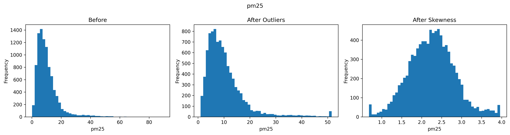
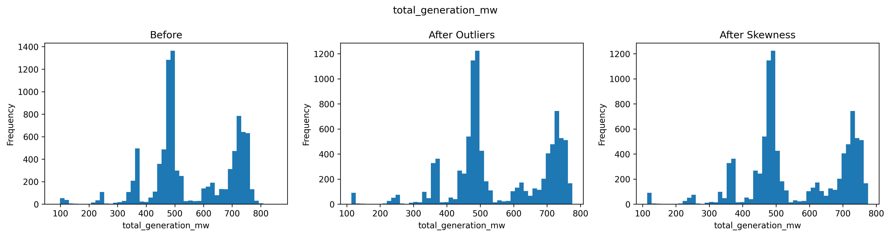
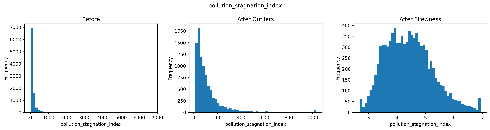
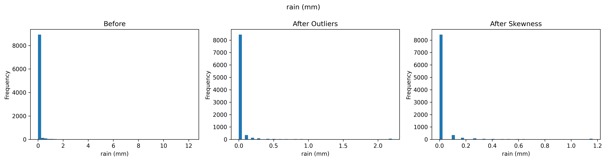
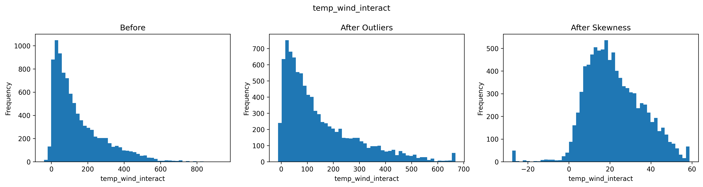
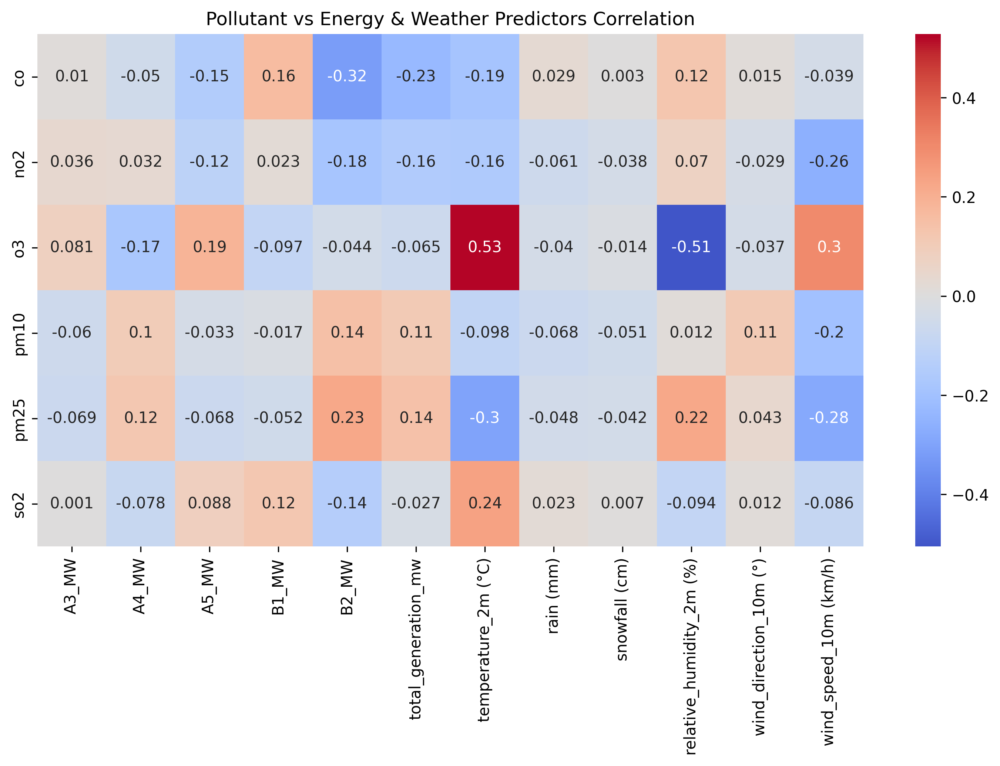
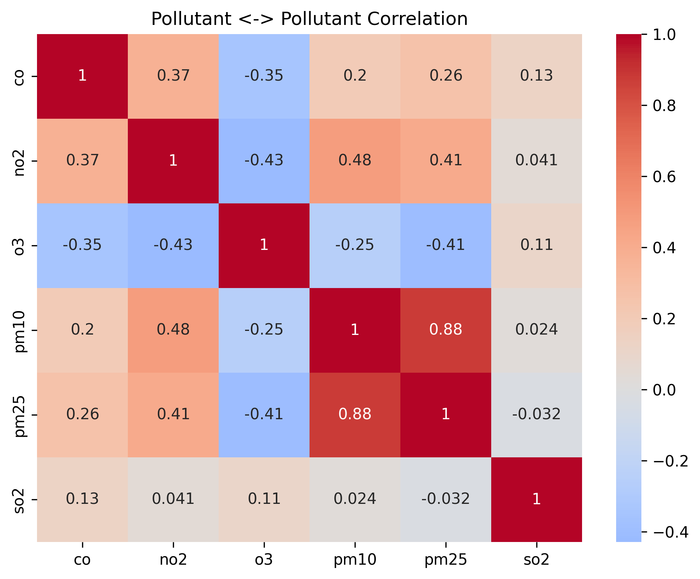

# Prishtina Air Pollution, Weather and Energy Production Pipeline (2023–2026)

<table>
  <tr>
    <td width="150" align="center" valign="center">
      
    </td>
    <td valign="top">
      <p><strong>Universiteti i Prishtinës</strong></p>
      <p>Fakulteti i Inxhinierisë Elektrike dhe Kompjuterike</p>
      <p>Inxhinieri Kompjuterike dhe Softuerike – Programi Master</p>
      <p><strong>Projekti nga lënda:</strong> Përgatitja dhe vizualizimi i të dhënave</p>
      <p><strong>Profesor:</strong> Dr. Sc. Lule Ahmedi</p>
      <p><strong>Asistent:</strong> Dr. Sc. Mërgim H. Hoti</p>
      <p><strong>Studentët:</strong></p>
      <ul>
        <li>Diellza Përvetica</li>
        <li>Fatjeta Gashi</li>
        <li>Festina Klinaku</li>
      </ul>
    </td>
  </tr>
</table>

---

## Përmbajtja

1. [Përmbledhje e projektit](#përmbledhje-e-projektit)
2. [Qëllimi i punimit](#qëllimi-i-punimit)
3. [01 Përgatitja e modelit](#01-përgatitja-e-modelit)
   - [Burimet e të dhënave](#burimet-e-të-dhënave)
   - [Përshkrimi i dataset-eve hyrëse](#përshkrimi-i-dataset-eve-hyrëse)
   - [Struktura e repository-t](#struktura-e-repository-t)
   - [Topologjia e pipeline-it](#topologjia-e-pipeline-it)
   - [Përshkrimi i detajuar i çdo skripte](#përshkrimi-i-detajuar-i-çdo-skripte)
     - [Data collection](#data-collection)
     - [Integration](#integration)
     - [Distinct values](#distinct-values)
     - [Data cleaning](#data-cleaning)
     - [Feature engineering](#feature-engineering)
     - [Preprocessing](#preprocessing)
   - [Artefaktet dhe output-et e krijuara](#artefaktet-dhe-output-et-e-krijuara)
   - [Vizualizimet e gjeneruara](#vizualizimet-e-gjeneruara)
   - [Teknikat e zbatuara dhe lidhja me lëndën](#teknikat-e-zbatuara-dhe-lidhja-me-lëndën)
   - [Ekzekutimi i projektit](#ekzekutimi-i-projektit)
   - [Rezultati final i pipeline-it](#rezultati-final-i-pipeline-it)
   - [Zgjerime në vazhdim](#zgjerime-në-vazhdim)
4. [02 Modelimi dhe analiza](#02-modelimi-dhe-analiza)
   - [Qasja e përgjithshme](qasja-e-përgjithshme)
   - [CatBoost për parashikimin e PM2.5](catboost-për-parashikimin-e-PM2.5)
   - [HDBSCAN për analizë unsupervised](hdbscan-për-analizë-unsupervised)
   - [Validimi korrekt pa leakage](validimi-korrekt-pa-leakage])
   - [Metrikat dhe interpretimi i rezultateve](metrikat-dhe-interpretimi-i-rezultateve)
   - [Artefaktet e krijuara nga modelet](artefaktet-e-krijuara-nga-modelet)
   - [Vizualizimet interaktive](vizualizimet-interaktive)
6. [Zgjerime në vazhdim](zgjerime-në-vazhdim)
7. [Anëtarët e grupit](anëtarët-e-grupit)
8. [Acknowledgments](acknowledgments)
---
## Përmbajtja
1. Përmbledhje e projektit
2. Qëllimi i punimit
3. 01 Përgatitja e modelit
   * Burimet e të dhënave
   * Përshkrimi i dataset-eve hyrëse
   * Struktura e repository-t
   * Topologjia e pipeline-it
   * Përshkrimi i detajuar i çdo skripte
     * Data collection
     * Integration
     * Distinct values
     * Data cleaning
     * Feature engineering
     * Preprocessing
   * Artefaktet dhe output-et e krijuara
   * Vizualizimet e gjeneruara
   * Teknikat e zbatuara dhe lidhja me lëndën
   * Ekzekutimi i projektit
   * Rezultati final i pipeline-it
4. 02 Modelimi dhe analiza
   * Qasja e përgjithshme
   * CatBoost për parashikimin e PM2.5
   * HDBSCAN për analizë unsupervised
   * Validimi korrekt pa leakage
   * Metrikat dhe interpretimi i rezultateve
   * Artefaktet e krijuara nga modelet
   * Vizualizimet interaktive
5. Zgjerime në vazhdim
6. Anëtarët e grupit
7. Acknowledgments
---

## Përmbledhje e projektit

Ky projekt implementon një pipeline të plotë, modular dhe të riprodhueshëm për ndërtimin e një dataset-i analitik dhe model-ready për analizën dhe parashikimin e ndotjes së ajrit në Prishtinë, me fokus të veçantë te `PM2.5`.

Pipeline-i ndërtohet mbi integrimin e tre burimeve të ndryshme të të dhënave, të mbledhura për periudhën 2023–2026:

1. të dhënat për prodhimin e energjisë elektrike nga termocentralet e Kosovës,
2. të dhënat meteorologjike për Prishtinën,
3. të dhënat për ndotjen e ajrit në Prishtinë.

Më pas, këto burime:
- harmonizohen në nivel kohor orë-pas-ore,
- pastrohen,
- validohen,
- plotësohen për vlerat mungesë,
- pasurohen me karakteristika të reja,
- trajtohen për outlier-a dhe skewness,
- standardizohen,
- dhe në fund reduktohen në një subset tiparesh më të qëndrueshëm për modelim.

Ky projekt demonstron të gjithë ciklin e përgatitjes së të dhënave: nga kolektimi, integrimi dhe kontrolli i cilësisë, deri te feature engineering, transformimi statistikor dhe feature selection.

Në fazën e dytë, dataset-i final `4E_selected_dataset.csv` është përdorur edhe për modelim dhe analizë eksploruese të avancuar. Konkretisht, është implementuar një model supervised `CatBoostRegressor` për parashikimin e `PM2.5` mbi ndarjen kronologjike `train/validation/test`, si dhe një model unsupervised `HDBSCAN` për identifikimin e strukturave natyrore, cluster-ëve dhe outlier-ave në të dhënat e përgatitura. Kjo e zgjeron projektin nga një pipeline i përgatitjes së të dhënave në një workflow të plotë analitik dhe modelues.

---

## Qëllimi i punimit

Qëllimi kryesor i këtij projekti është të ndërtojë një dataset të pastër dhe analitikisht të qëndrueshëm për të studiuar marrëdhëniet ndërmjet:

- prodhimit të energjisë elektrike,
- kushteve meteorologjike,
- dhe ndotësve atmosferikë në Prishtinë,

me fokus të veçantë në përdorimin e këtyre të dhënave për parashikimin e `PM2.5`.

Objektivat kryesore janë:

- të integrohen burime heterogjene të të dhënave në një bosht të përbashkët kohor;
- të kontrollohet cilësia e të dhënave dhe të korrigjohen vlera të pasakta;
- të trajtohen mungesat pa humbur informacion të vlefshëm;
- të krijohen tipare të reja kohore, meteorologjike dhe ndërvepruese;
- të zbutet ndikimi i outlier-ave dhe shpërndarjeve shumë të shtrembëruara;
- të standardizohet dataset-i për përdorim në modele statistikore dhe machine learning;
- të eliminohet multikolineariteti i tepërt përmes VIF-based feature selection.
- të përdoret dataset-i final i përzgjedhur për ndërtimin dhe validimin e një modeli supervised për parashikimin e `PM2.5`;
- të analizohet struktura e brendshme e të dhënave përmes një metode unsupervised clustering, me qëllim identifikimin e regjimeve të ndryshme të ndotjes dhe kushteve atmosferike.

---

## 01 Përgatitja e modelit

### Burimet e të dhënave

Ky projekt bazohet në tre burime kryesore të të dhënave:

#### 1. Prodhimi i energjisë elektrike nga termocentralet e Kosovës
Dataset-i përmban prodhimin orar të njësive energjetike:
- `A3_MW`
- `A4_MW`
- `A5_MW`
- `B1_MW`
- `B2_MW`

Nga këto është ndërtuar edhe:
- `total_generation_mw`

Të dhënat janë marrë nga KOSTT dhe janë harmonizuar në nivel orar.

#### 2. Të dhënat meteorologjike për Prishtinën
Dataset-i meteorologjik përmban atribute si:
- temperatura,
- reshjet,
- bora,
- lagështia relative,
- drejtimi i erës,
- shpejtësia e erës.

Këto të dhëna janë përdorur për të modeluar kushtet atmosferike që ndikojnë në përhapjen ose stagnimin e ndotjes. Të dhënat janë marrë nga OpenMeteo.

#### 3. Të dhënat e ndotjes së ajrit në Prishtinë
Dataset-i i cilësisë së ajrit përmban matje të ndotësve:
- `co`
- `no2`
- `o3`
- `pm10`
- `pm25`
- `so2`

Këto të dhëna janë mbledhur dhe konsoliduar për Prishtinën përmes burimeve të tipit OpenAQ / arkivave përkatëse / notebook-ut të kolektimit të përdorur në projekt.

#### Shtrirja kohore
Burimet hyrëse mbulojnë periudhën 2023–2026. Megjithatë, dataset-i i integruar final ruan vetëm intervalin ku të tre burimet kanë mbulim të përbashkët orar, prandaj output-i i parë i integruar ruhet si:

- `1A_merged_data_hourly_2023_2025.csv`

Kjo e bën integrimin kohor të saktë dhe shmang boshllëqet e krijuara nga mungesa e përbashkët midis burimeve.

#### Dataset-i i integruar

Pas bashkimit (`merge`) të tre burimeve me `inner join`, dataset-i final përmban vetëm intervalin e përbashkët kohor:

- Numri i rreshtave: **9,370**
- Numri i kolonave: **22**
- Numri total i vlerave: **206,140**
- Intervali kohor: **2023-08-01 → 2025-11-27**

- Reduktimi i numrit të rreshtave është rezultat i sinkronizimit strikt kohor ndërmjet burimeve, ku ruhen vetëm momentet për të cilat ekzistojnë të dhëna në të tre dataset-et.
---

### Përshkrimi i dataset-eve hyrëse

Pipeline-i përdor tre skedarë bruto të ruajtur në `data/raw/`:

- `prishtina_air_quality_2023_2025.csv`
- `prishtina_weather_2023_2026.csv`
- `prishtina_energy_production_2023_2026.csv`

#### Dataset-i i ndotjes së ajrit
Përmban kolonën `datetime` dhe ndotësit kryesorë atmosferikë:
- `co`
- `no2`
- `o3`
- `pm10`
- `pm25`
- `so2`

Karakteristikat e dataset-it:
- Numri i rreshtave: **10,147**
- Numri i kolonave: **7**
- Numri total i vlerave: **71,029**
- Intervali kohor: **2023-03-14 → 2025-11-27**

#### Dataset-i meteorologjik
Përmban kolonën kohore dhe atributet:
- `temperature_2m (°C)`
- `rain (mm)`
- `snowfall (cm)`
- `relative_humidity_2m (%)`
- `wind_direction_10m (°)`
- `wind_speed_10m (km/h)`

Karakteristikat e dataset-it:
- Numri i rreshtave: **27,813**
- Numri i kolonave: **7**
- Numri total i vlerave: **194,691**
- Intervali kohor: **2023-01-01 → 2026-03-05**

#### Dataset-i i energjisë
Përmban:
- kolonën e datës,
- kolonën e orës,
- prodhimin për secilën njësi termocentrali,
- dhe totalin e gjenerimit të energjisë.

Gjatë leximit, ky dataset kërkon pastrim shtesë të header-it, sepse struktura e tij fillestare nuk është menjëherë tabulare në formën standarde CSV.

Karakteristikat e dataset-it:
- Numri i rreshtave: **22,581**
- Numri i kolonave: **7**
- Numri total i vlerave: **158,067**
- Intervali kohor: **2023-08-01 → 2026-03-03**
---

### Struktura e repository-t
```text
AIR_POLLUTION_PREDICTION_PRISHTINA/
│
├── app.py                       # Vizualizimi i tërë projektit
│
├── src/
│   ├── catboost_model/
│   │   ├── catboost_info/
│   │   └── catboost_model.py
│   │
│   ├── hdbscan_model/
│   │   └── hdbscan_model.py
│   │
│   ├── data_cleaning/
│   │   ├── 2A_datetime_and_duplicates.py
│   │   ├── 2B_data_quality_cleaning.py
│   │   ├── 2C_missing_values_handling.py
│   │   └── 2D_validate_final_dataset.py
│   │
│   ├── data_collection/
│   │   ├── get_kosova_air_quality_data.ps1
│   │   └── get_prishtina_air_quality_data.ipynb
│   │
│   ├── distinct_values/
│   │   └── 1B_distinct_values.py
│   │
│   ├── feature_engineering/
│   │   ├── 3A_target_analysis.py
│   │   └── 3B_feature_engineering.py
│   │
│   ├── integration/
│   │   └── 1A_merge_data.py
│   │
│   └── preprocessing/
│       ├── 4A_outlier_treatment.py
│       ├── 4B_skewness_treatment.py
│       ├── 4C_visualization_before_after.py
│       ├── 4D_feature_scaling.py
│       └── 4E_feature_selection.py
│
├── data/
│   ├── raw/
│   ├── 1B_distinct_values/
│   ├── 1A_merged_data_hourly_2023_2025.csv
│   ├── 2A_cleaned_no_duplicates.csv
│   ├── 2B_quality_checked.csv
│   ├── 2C_missing_values_handled.csv
│   ├── 2D_validated_final_dataset.csv
│   ├── 3B_engineered_dataset.csv
│   ├── 4A_outliers_handled.csv
│   ├── 4B_skewness_handled.csv
│   ├── 4D_scaled_dataset.csv
│   ├── 4E_selected_dataset.csv
│   ├── catboost_forecasts.csv
│   ├── catboost_metrics.csv
│   ├── catboost_feature_importance.csv
│   ├── catboost_split_summary.csv
│   ├── hdbscan_clustered_dataset.csv
│   ├── hdbscan_metrics.csv
│   ├── hdbscan_cluster_summary.csv
│   └── hdbscan_feature_summary.csv
│
├── models/
│   ├── scaler.pkl
│   ├── catboost_model/
│   └── hdbscan_model/
│
├── pictures/
│   ├── catboost_model/
│   └── hdbscan_model/
│
├── README.md
├── test.py
└── .gitignore
```text
---

### Topologjia e pipeline-it

Pipeline-i është ndërtuar si një sekuencë hapash modularë, ku secili skript:

- lexon një output të fazës paraprake,
- kryen një transformim të caktuar,
- dhe shkruan një output të ri të versionuar.

Rrjedha logjike është kjo:

1. **Mbledhja e të dhënave**  
   Shkarkimi / përgatitja e burimeve bruto.

2. **Integrimi i të dhënave**  
   Bashkimi i ndotjes, motit dhe energjisë në një dataset të përbashkët orar.

3. **Distinct value profiling**  
   Nxjerrja e vlerave unike për atribute kyçe numerike.

4. **Data cleaning dhe quality checks**  
   Heqja e duplikateve, korrigjimi i vlerave jo-logjike, plotësimi i mungesave, validimi kronologjik dhe fizik.

5. **Target analysis dhe exploratory correlation analysis**  
   Analiza statistikore fillestare e ndotësve dhe lidhjeve me tiparet shpjeguese.

6. **Feature engineering**  
   Krijimi i tipareve kohore, lag-ve, rolling windows, ndërveprimeve dhe vektorëve të erës.

7. **Outlier handling**  
   Kufizimi i vlerave ekstreme me quantile capping.

8. **Skewness handling**  
   Transformime `log1p` dhe `Yeo-Johnson` për kolonat e shtrembëruara.

9. **Before/after visualization**  
   Krahasime histogramash para dhe pas transformimeve.

10. **Scaling**  
    Standardizimi i të gjitha kolonave numerike.

11. **Feature selection**  
    Heqja e tipareve problematike dhe reduktimi i multikolinearitetit me VIF.

---

### Përshkrimi i detajuar i çdo skripte

### App.py - Dashboard

- Ky projekt përfshin gjithashtu një dashboard interaktiv të ndërtuar me Streamlit, i cili shërben si një simulator vizual për eksplorimin në kohë reale të ndikimit që kanë prodhimi i termocentraleve dhe kushtet meteorologjike në ndotjen e ajrit në Prishtinë. Përmes këtij vizualizimi, përdoruesi mund të ndryshojë në mënyrë dinamike parametrat e prodhimit energjetik, temperaturës, reshjeve, lagështisë dhe erës, dhe të vëzhgojë menjëherë se si këto ndryshime reflektohen në nivelet e ndotësve kryesorë atmosferikë, veçanërisht te PM2.5. Dashboard-i është konceptuar si një komponent interaktiv dhe intuitiv që e bën analizën më të kuptueshme, më eksploruese dhe më afër një skenari simulues të botës reale.


### Data collection

#### `get_kosova_air_quality_data.ps1`
Ky skript PowerShell përdoret për shkarkimin e të dhënave arkivore nga OpenAQ për disa `location IDs` të lidhura me Prishtinën ose pikat përkatëse të matjes.

##### Çfarë bën skripta
- krijon folder-in bazë të ruajtjes në disk,
- iteron mbi një listë `location IDs`,
- për secilin lokacion përdor komandën `aws s3 cp` për të shkarkuar skedarët `.csv.gz` nga arkiva publike e OpenAQ,
- ruan të dhënat në nënfolderë të ndarë sipas `location ID`.

##### Qëllimi
Ky hap siguron mbledhjen e të dhënave bruto të ndotjes / matjeve për përpunim të mëtejshëm.

##### Lokacionet e përdorura
Në versionin aktual përdoren:
- `2536`
- `7674`
- `7931`
- `7933`
- `9337`

##### Output
Skedarët bruto ruhen lokalisht në strukturë të ndarë sipas lokacionit.

---

#### `get_prishtina_air_quality_data.ipynb`
Ky notebook shërben si mjedis interaktiv për mbledhje, eksplorim, filtrime dhe/ose konsolidim të të dhënave të cilësisë së ajrit për Prishtinën.

Meqë logjika e plotë e notebook-ut nuk është përfshirë këtu në README, roli i tij në projekt është:
- të ndihmojë në eksplorimin fillestar të të dhënave,
- të përgatisë ose eksportojë skedarët bruto/finalë të përdorur më pas në pipeline,
- të shërbejë si hap ndërmjetës midis burimeve online dhe CSV-ve në `data/raw/`.

---

### Integration

#### `1A_merge_data.py`
Ky është hapi themelor i integrimit të të tre burimeve.

##### Input
- `data/raw/prishtina_air_quality_2023_2025.csv`
- `data/raw/prishtina_weather_2023_2026.csv`
- `data/raw/prishtina_energy_production_2023_2026.csv`

##### Hapat kryesorë
1. Lexon dataset-in e ndotjes së ajrit.
2. Lexon dataset-in meteorologjik, duke anashkaluar rreshtat hyrës jo-standardë.
3. Lexon dataset-in e energjisë pa header standard dhe e zbulon automatikisht rreshtin e header-it.


   
5. Normalizon emrat e kolonave të energjisë:
   - `Ora Hour` → `hour`
   - `DATA Date` → `date`
   - `A3 (MW)` → `A3_MW`
   - `A4 (MW)` → `A4_MW`
   - `A5 (MW)` → `A5_MW`
   - `B1 (MW)` → `B1_MW`
   - `B2 (MW)` → `B2_MW`


6. Konverton kolonat kohore në `datetime`.
8. Harmonizon timezone-in e ndotjes dhe motit në `Europe/Belgrade`, pastaj i kthen në naive timestamps.


10. Pastron duplikatet sipas `datetime`.
11. Për dataset-in e energjisë:
   - konverton `date`,
   - konverton `hour`,
   - krijon `datetime`,
   - llogarit `total_generation_mw`.


11. Zgjedh vetëm kolonat relevante nga secili burim.


13. Kryen dy merge-e me `how="inner"`:
    - ndotja + moti,
    - pastaj rezultati + energjia.
14. Krijon kolonat:
    - `date`
    - `hour`
    - `interval_start`


##### Output
- `data/1A_merged_data_hourly_2023_2025.csv`


##### Roli në pipeline
Ky skript krijon dataset-in e parë të integruar orar, që shërben si bazë për të gjitha hapat pasues.

---

### Distinct values

#### `1B_distinct_values.py`
Ky skript bën profilizimin e vlerave unike për një grup kolonash kryesore.

##### Input
- `data/1A_merged_data_hourly_2023_2025.csv`

##### Kolonat e përfshira
- ndotësit: `co`, `no2`, `o3`, `pm10`, `pm25`, `so2`
- atributet meteorologjike:
  - temperatura
  - reshjet
  - bora
  - lagështia relative
  - drejtimi i erës
  - shpejtësia e erës
- kolonat e energjisë:
  - `A3_MW`
  - `A4_MW`
  - `A5_MW`
  - `B1_MW`
  - `B2_MW`
  - `total_generation_mw`


##### Çfarë bën
- lexon dataset-in e integruar,


- për secilën kolonë nxjerr vlerat unike jo-null,
- i rendit,
- dhe i ruan si CSV të ndarë në folderin `data/1B_distinct_values/`.


##### Output
Folderi `1B_distinct_values/` përmban një skedar të veçantë për secilin atribut, p.sh.:
- `distinct_co.csv`
- `distinct_no2.csv`
- `distinct_o3.csv`
- `distinct_pm10.csv`
- `distinct_pm25.csv`
- `distinct_so2.csv`
- `distinct_a3_mw.csv`
- `distinct_a4_mw.csv`
- `distinct_a5_mw.csv`
- `distinct_b1_mw.csv`
- `distinct_b2_mw.csv`
- `distinct_total_generation_mw.csv`
- si dhe skedarët për atributet meteorologjike të pastruara sipas emërtimit.

Pamje nga skedaret unik:


##### Roli ne pipeline
Ky hap mbështet eksplorimin fillestar të shpërndarjeve dhe kontrollin e domenit të vlerave.

---

### Data cleaning

#### `2A_datetime_and_duplicates.py`
Ky skript kryen pastrimin fillestar të dimensionit kohor dhe duplikateve.

##### Input
- `data/1A_merged_data_hourly_2023_2025.csv`

##### Çarë bën
- konverton `datetime` në format korrekt,
- heq rreshtat ku `datetime` është invalid,
- rendit dataset-in sipas kohës,


- numëron duplikatet,
- heq duplikatet e plota.


##### Output
- `data/2A_cleaned_no_duplicates.csv`

##### Roli ne pipeline
Siguron që dataset-i i integruar të ketë rend kronologjik korrekt dhe të mos ketë rreshta të përsëritur.

---

#### `2B_data_quality_cleaning.py`
Ky skript zbaton rregulla të cilësisë së të dhënave.

##### Input
- `data/2A_cleaned_no_duplicates.csv`

##### Cfarë bën
1. Për ndotësit:
   - zëvendëson vlerat negative me `NaN`, sepse fizikisht nuk kanë kuptim.


2. Për drejtimin e erës:
   - normalizon këndet me operatorin `% 360`.


3. Për reshjet dhe borën:
   - kufizon vlerat minimale në `0`.


4. Për kolonat e energjisë:
   - kufizon vlerat negative në `0`.


5. Për lagështinë relative:
   - kufizon vlerat në intervalin `[0, 100]`.


6. Për `total_generation_mw`:
   - e rillogarit nga `A3_MW + A4_MW + A5_MW + B1_MW + B2_MW`
   - dhe korrigjon mospërputhjet me totalin ekzistues.


7. Rrumbullakon kolonat numerike në 3 shifra dhjetore.


##### Output
- `data/2B_quality_checked.csv`

##### Roli në pipeline
Ky hap vendos validim fizik dhe konsistencë numerike mbi të dhënat.

---

#### `2C_missing_values_handling.py`
Ky skript trajton vlerat mungesë.

##### Input
- `data/2B_quality_checked.csv`

##### Strategjia e trajtimit
- `pm10` dhe `pm25`: plotësohen me `backfill`
- `co`, `no2`, `o3`, `so2`: plotësohen me `forward fill`
- në fund aplikohet kombinimi `ffill().bfill()` për gjithë dataset-in

##### Çfarë bën
- llogarit mungesat për kolonë dhe përqindjen e tyre,


- raporton sa vlera janë plotësuar për secilin ndotës,


- plotëson vlerat mungesë sipas logjikës së përcaktuar,


- verifikon sa `NULL` mbeten në fund.


##### Output
- `data/2C_missing_values_handled.csv`

##### Roli në pipeline
Ky hap shmang humbjen e rreshtave dhe prodhon një dataset të plotë për analizat pasuese.

---

#### `2D_validate_final_dataset.py`
Ky skript bën validimin final të dataset-it pas trajtimit të mungesave.

##### Input
- `data/2C_missing_values_handled.csv`

##### Çfarë bën
1. Kontrollon raportin fizik ndërmjet:
   - `pm25`
   - `pm10`
   
   dhe korrigjon rastet kur `pm25 > pm10` duke vendosur `pm25 = pm10`.


3. Kontrollon gaps kohore:
   - konverton `datetime`,
   - llogarit diferencën ndërmjet rreshtave,
   - numëron boshllëqet më të mëdha se 1 orë.


3. Kontrollon nëse kanë mbetur `NULL`.


##### Output
- `data/2D_validated_final_dataset.csv`


##### Roli në pipeline
Ky është dataset-i final i pastruar dhe validuar, mbi të cilin kryhen analiza dhe inxhinierim tiparesh.

---

### Feature engineering

#### `3A_target_analysis.py`
Ky skript kryen analizën fillestare të target-it dhe marrëdhënieve të tij me tiparet shpjeguese.

##### Input
- `data/2D_validated_final_dataset.csv`

##### Çfarë bën
1. Gjeneron statistika përmbledhëse për ndotësit:
   - `co`
   - `no2`
   - `o3`
   - `pm10`
   - `pm25`
   - `so2`


2. Formon një subset me:
   - ndotësit,
   - kolonat e energjisë,
   - kolonat meteorologjike.

3. Llogarit matricën e korrelacionit.

  


5. Krijon dy heatmap-a:
   - korrelacioni i ndotësve me energjinë dhe motin,
   - korrelacioni mes vetë ndotësve.

##### Output
- `pictures/pollutant_vs_predictors_heatmap.png`
- `pictures/pollutant_correlation_heatmap.png`

##### Roli në pipeline
Ky hap ndihmon në identifikimin e lidhjeve lineare fillestare dhe në justifikimin e tipareve të përdorura më pas në feature engineering.

---

#### `3B_feature_engineering.py`
Ky skript ndërton dataset-in e pasuruar me tipare të reja.

##### Input
- `data/2D_validated_final_dataset.csv`

##### Target
- `pm25`

##### Çfarë bën

###### 1. Përgatitje kohore
- konverton `datetime`,
- rendit dataset-in kronologjikisht,
- nxjerr:
  - `hour`
  - `day_of_week`
  - `month`


###### 2. Encodim ciklik
Krijon:
- `hour_sin`
- `hour_cos`
- `month_sin`
- `month_cos`


Qëllimi është të përfaqësojë natyrën ciklike të orës dhe muajit.

###### 3. Lag features
Për kolonat:
- `total_generation_mw`
- `wind_speed_10m (km/h)`
- `temperature_2m (°C)`

krijohen lag-e:
- `lag_1h`
- `lag_3h`
- `lag_6h`


###### 4. Rolling features
Krijohen:
- `total_gen_rolling_sum_12h`
- `total_gen_rolling_sum_24h`


###### 5. Interaction features
Krijohen:
- `temp_wind_interact`
- `generation_humidity_interact`


###### 6. Stagnation proxy
Krijohet:
- `pollution_stagnation_index = total_generation_mw / (wind_speed + 0.1)`

Ky indikator përpiqet të përfaqësojë situatat kur ka prodhim të lartë dhe erë të ulët, pra kushte më të favorshme për grumbullim ndotjesh.


###### 7. Wind vector decomposition
Nga shpejtësia dhe drejtimi i erës krijohen:
- `wind_x_vector`
- `wind_y_vector`


###### 8. Heqja e rreshtave me `NaN`
Pas krijimit të lag-eve dhe rolling windows hiqen rreshtat fillestarë që mbeten pa vlera të plota.


##### Output
- `data/3B_engineered_dataset.csv`

##### Roli në pipeline
Ky është dataset-i i parë i pasuruar me tipare që modelojnë dinamikat kohore, ndikimet meteorologjike dhe ndërveprimet me prodhimin e energjisë.

---

### Preprocessing

#### `4A_outlier_treatment.py`
Ky skript trajton outlier-at me quantile capping.

##### Input
- `data/3B_engineered_dataset.csv`

##### Strategjia
Për secilën kolonë numerike kandidate:
- kufiri i poshtëm = quantile `0.1%`
- kufiri i sipërm = quantile `99%`

Vlerat jashtë këtij intervali nuk fshihen, por priten në kufijtë përkatës.

##### Kolonat e përjashtuara
- `datetime`
- `date`
- disa tipare ciklike dhe vektorë strukturorë si:
  - `hour_sin`
  - `hour_cos`
  - `month_sin`
  - `month_cos`
  - `wind_x_vector`
  - `wind_y_vector`

##### Çfarë bën
- identifikon kolonat numerike kandidate,


- llogarit kufijtë e poshtëm dhe të sipërm,


- numëron sa vlera u cap-en në secilin krah,


- krijon një raport për tiparet me më shumë vlera të kufizuara.


##### Output
- `data/4A_outliers_handled.csv`

##### Roli në pipeline
Ky hap redukton ndikimin e vlerave ekstreme pa humbur rreshta.

---

#### `4B_skewness_treatment.py`
Ky skript trajton shtrembërimin e shpërndarjes së kolonave numerike.

##### Input
- `data/4A_outliers_handled.csv`

##### Strategjia
Për secilën kolonë numerike:
- llogaritet skewness,
- nëse `|skew| > 1.0`, zbatohet transformim.

##### Llojet e transformimit
- nëse kolona ka vetëm vlera jo-negative:
  - përdoret `log1p`
- ndryshe:
  - përdoret `PowerTransformer(method="yeo-johnson")`

##### Çfarë bën
- krahason skewness para dhe pas transformimit,


- ruan metodën e përdorur për secilën kolonë,


- raporton mean absolute skewness dhe median absolute skewness para/pas.


##### Output
- `data/4B_skewness_handled.csv`


##### Roli në pipeline
Ky hap i bën shpërndarjet më të përshtatshme për standardizim, analiza lineare dhe modele machine learning.

---

#### `4C_visualization_before_after.py`
Ky skript gjeneron histogramat krahasuese para dhe pas trajtimit të outlier-ave dhe skewness.

##### Input
- `data/3B_engineered_dataset.csv`
- `data/4A_outliers_handled.csv`
- `data/4B_skewness_handled.csv`

##### Tiparet e vizualizuara
- `pm25`
- `total_generation_mw`
- `pollution_stagnation_index`
- `rain (mm)`
- `temp_wind_interact`

##### Çfarë bën
Për secilin atribut:
- vizaton tre histogramë në të njëjtën figurë:
  - para trajtimit,
  - pas trajtimit të outlier-ave,
  - pas trajtimit të skewness.

##### Output
Folderi:
- `pictures/4C_visualization_before_after/`

me figurat:

##### PM2.5 Distribution Comparison


##### Total Generation MW Distribution Comparison


##### Pollution Stagnation Index Distribution Comparison


##### Rain (mm) Distribution Comparison


##### Temperature-Wind Interaction Distribution Comparison


##### Roli ne pipeline
Ky hap dokumenton vizualisht efektin e transformimeve statistikore.

---

#### `4D_feature_scaling.py`
Ky skript standardizon të gjitha kolonat numerike.

##### Input
- `data/4B_skewness_handled.csv`

##### Çfarë bën
- ndan kolonat jo-numerike:
  - `datetime`
  - `date`


- standardizon të gjitha kolonat e tjera me `StandardScaler`,


- rikombinon kolonat kohore me kolonat e shkallëzuara,


- ruan scaler-in e trajnuar.


##### Output
- `data/4D_scaled_dataset.csv`
- `models/scaler.pkl`

##### Roli në pipeline
Ky hap siguron që tiparet numerike të jenë në të njëjtën shkallë dhe gati për feature selection ose modelim.

---

#### `4E_feature_selection.py`
Ky skript kryen reduktimin final të tipareve.

##### Input
- `data/4D_scaled_dataset.csv`

##### Target
- `pm25`

##### Strategjia e seleksionimit

###### 1. Heqje manuale e kolonave jo të dëshiruara
Hiqen:
- ndotësit e tjerë si variabla hyrëse:
  - `co`
  - `no2`
  - `o3`
  - `pm10`
  - `so2`
- kolona strukturore:
  - `A3_MW`
  - `A4_MW`
  - `A5_MW`
  - `B1_MW`
  - `B2_MW`
  - `hour`
  - `month`
  - `day_of_week`
- të gjitha kolonat me `lag` në emër
- çdo kolonë tjetër që përmban `pm25` përveç target-it


###### 2. Heqje e kolonave konstante ose pothuajse konstante
- kolona me vetëm 1 vlerë unike
- kolona me devijim standard pothuajse zero


###### 3. VIF-based elimination
Për kolonat e mbetura:
- llogaritet `Variance Inflation Factor (VIF)`
- hiqet iterativisht kolona me VIF më të lartë derisa:
  - VIF maksimal të jetë më i vogël ose i barabartë me `7.0`

<div>

</div>

<div>

</div>

###### 4. Raportim
Në fund raportohet:
- madhësia e dataset-it fillestar,
- madhësia e dataset-it final,
- numri i tipareve finale,
- tiparet e mbajtura, të renditura sipas korrelacionit absolut me `pm25`.


##### Output
- `data/4E_selected_dataset.csv`


##### Roli në pipeline
Ky është dataset-i final i reduktuar, i përgatitur për modelim statistikor ose machine learning me target `pm25`.

---

### Artefaktet dhe output-et e krijuara

#### Dataset-et e ruajtura ne `data/`
- `1A_merged_data_hourly_2023_2025.csv`  
  Dataset-i i parë i integruar orar.

- `2A_cleaned_no_duplicates.csv`  
  Versioni pa duplikate dhe me `datetime` të validuar.

- `2B_quality_checked.csv`  
  Versioni pas rregullave të cilësisë.

- `2C_missing_values_handled.csv`  
  Versioni pas imputimit dhe plotësimit të mungesave.

- `2D_validated_final_dataset.csv`  
  Dataset-i final i pastruar dhe validuar.

- `3B_engineered_dataset.csv`  
  Dataset-i me tipare të reja.

- `4A_outliers_handled.csv`  
  Dataset-i pas outlier capping.

- `4B_skewness_handled.csv`  
  Dataset-i pas transformimeve kundër skewness.

- `4D_scaled_dataset.csv`  
  Dataset-i i standardizuar.

- `4E_selected_dataset.csv`  
  Dataset-i final i reduktuar për modelim.

#### Artefakte shtesë
- `models/scaler.pkl`  
  Objekti i `StandardScaler` për ripërdorim në inferencë ose pipeline të mëtejshme.

- `data/1B_distinct_values/`  
  Folder me vlera unike për atributet kryesore.

---

### Vizualizimet e gjeneruara

#### 1. Heatmap-at nga analiza fillestare
##### `pictures/pollutant_vs_predictors_heatmap.png`
Paraqet korrelacionin ndërmjet ndotësve dhe tipareve të energjisë + motit.

##### `pictures/pollutant_correlation_heatmap.png`
Paraqet korrelacionin ndërmjet vetë ndotësve atmosferikë.

#### 2. Histogramat krahasuese para/pas
Folderi `pictures/4C_visualization_before_after/` përmban figura që krahasojnë shpërndarjen:
- para trajtimit,
- pas trajtimit të outlier-ave,
- pas trajtimit të skewness.

##### Figurat aktuale
- `pm25_distribution_comparison.png`
- `pollution_stagnation_index_distribution_comparison.png`
- `rain_mm_distribution_comparison.png`
- `temp_wind_interact_distribution_comparison.png`
- `total_generation_mw_distribution_comparison.png`

#### Figurat e projektit

##### Pollutant vs Predictors Heatmap


##### Pollutant Correlation Heatmap


##### PM2.5 Distribution Comparison


##### Total Generation MW Distribution Comparison


##### Pollution Stagnation Index Distribution Comparison


##### Rain (mm) Distribution Comparison


##### Temperature-Wind Interaction Distribution Comparison


### Teknikat e zbatuara dhe lidhja me lëndën

Ky projekt përmbush në mënyrë të drejtpërdrejtë temat kryesore të lëndës “Machine Learning”.

#### 1. Data collection
- Shkarkim dhe konsolidim i të dhënave nga burime të ndryshme.
- Përdorim i PowerShell, notebook-ut dhe CSV-ve bruto.

#### 2. Data integration
- Bashkim i tre burimeve heterogjene mbi bosht kohor të përbashkët.
- Harmonizim i formateve të kohës dhe timezone.

#### 3. Data cleaning
- Heqja e duplikateve.
- Korrigjimi i vlerave jo-logjike.
- Kufizim i vlerave fizike jashtë intervaleve të pranueshme.

#### 4. Missing value handling
- Forward fill
- Backfill
- Plotësim i të dhënave pa heqje agresive të rreshtave

#### 5. Validation
- Kontrolli fizik `PM2.5 <= PM10`
- Kontrolli i gaps kohore
- Kontrolli final i `NULL`

#### 6. Exploratory data analysis
- Statistika përmbledhëse
- Matrica korrelacioni
- Heatmap-a për target-in dhe predictor-at

#### 7. Feature engineering
- Encodim ciklik i kohës
- Lag features
- Rolling features
- Interaction terms
- Wind decomposition
- Domain-inspired stagnation index

#### 8. Outlier handling
- Quantile capping me kufijtë `0.5%` dhe `99.5%`
- Qasje robuste pa fshirje të rreshtave

#### 9. Skewness handling
- `log1p`
- `Yeo-Johnson`
- Krahasim para/pas me statistika dhe vizualizime

#### 10. Scaling
- Standardizim i kolonave numerike me `StandardScaler`

#### 11. Feature selection
- Heqje manuale e kolonave jorelevante ose problematike
- Heqje e kolonave konstante
- Reduktim i multikolinearitetit përmes `VIF`

---

### Ekzekutimi i projektit

#### Parakushtet
- Python 3.10+ ose më i ri
- `pip`
- mjedis virtual i rekomanduar
- për skriptin PowerShell: qasje në `aws cli` nëse përdoret shkarkimi nga OpenAQ archive

#### Instalimi i librarive
```bash
pip install pandas numpy matplotlib seaborn scikit-learn statsmodels
```

#### Ekzekutimi i pipeline-it
Skriptat ekzekutohen sipas rendit logjik:

```bash
python src/integration/1A_merge_data.py
python src/distinct_values/1B_distinct_values.py

python src/data_cleaning/2A_datetime_and_duplicates.py
python src/data_cleaning/2B_data_quality_cleaning.py
python src/data_cleaning/2C_missing_values_handling.py
python src/data_cleaning/2D_validate_final_dataset.py

python src/feature_engineering/3A_target_analysis.py
python src/feature_engineering/3B_feature_engineering.py

python src/preprocessing/4A_outlier_treatment.py
python src/preprocessing/4B_skewness_treatment.py
python src/preprocessing/4C_visualization_before_after.py
python src/preprocessing/4D_feature_scaling.py
python src/preprocessing/4E_feature_selection.py
```

#### Renditja e varësive
Çdo skript varet nga output-i i mëparshëm. Prandaj rekomandohet ekzekutimi në rend strikt.

---

### Rezultati final i pipeline-it

Produkti final i këtij projekti është:

- një dataset i integruar, i pastër dhe i validuar,
- një dataset i pasuruar me tipare domethënëse kohore dhe meteorologjike,
- një version i trajtuar për outlier-a dhe skewness,
- një version i standardizuar,
- dhe në fund një subset final tiparesh me multikolinearitet të reduktuar.

Dataset-i final:
- `data/4E_selected_dataset.csv`

është forma më e përshtatshme për:
- modelim prediktiv të `PM2.5`,
- regresion,
- krahasim modelesh machine learning,
- analiza statistikore të marrëdhënieve mes energjisë, motit dhe ndotjes.
---

````md
---

## 02 Modelimi dhe analiza

Pas përfundimit të pipeline-it të përgatitjes së të dhënave, dataset-i final `data/4E_selected_dataset.csv` është përdorur si hyrje për një fazë të dytë të projektit, e fokusuar në modelim dhe analizë të avancuar. Kjo fazë e zgjeron projektin nga një pipeline i pastrimit dhe përgatitjes së të dhënave në një workflow të plotë të machine learning dhe data analysis.

Në këtë fazë janë zhvilluar dy qasje komplementare:

- një qasje **supervised**, për parashikimin e `PM2.5` me `CatBoostRegressor`;
- një qasje **unsupervised**, për analizimin e strukturës së brendshme të të dhënave me `HDBSCAN`.

Qëllimi i kësaj pjese nuk është vetëm ndërtimi i modeleve, por edhe demonstrimi që dataset-i final i krijuar nga pipeline-i është realisht i përdorshëm për:

- parashikim,
- validim korrekt kohor,
- interpretim të tipareve,
- dhe eksplorim të cluster-ëve dhe outlier-ave në të dhënat mjedisore dhe energjetike.

---

### Qasja e përgjithshme

Faza e modelimit është ndërtuar mbi parimet e mëposhtme:

1. **Përdorim i dataset-it final të selektuar**
   - Input kryesor për modelet është:
     - `data/4E_selected_dataset.csv`

2. **Ruajtje e rendit kronologjik**
   - Për modelin supervised, ndarja e të dhënave është bërë sipas kohës dhe jo rastësisht, për të shmangur leakage dhe për të simuluar më mirë një skenar real parashikimi.

3. **Përdorim i tipareve numerike të përzgjedhura**
   - Dataset-i final tashmë përmban një përzgjedhje tiparesh të reduktuara përmes preprocessing dhe VIF-based feature selection, prandaj është përdorur drejtpërdrejt si bazë për modelim.

4. **Ruajtje e artefakteve**
   - Çdo model ruan output-et e veta në `data/`, `models/` dhe `pictures/`, në mënyrë që rezultatet të jenë të gjurmueshme dhe të riprodhueshme.

---

### CatBoost për parashikimin e PM2.5

Për modelimin supervised është përdorur `CatBoostRegressor`, një algoritëm gradient boosting shumë i përshtatshëm për të dhëna tabulare, marrëdhënie jo-lineare dhe ndërveprime komplekse ndërmjet tipareve meteorologjike, energjetike dhe kohore.

Ky model është zgjedhur sepse:

- punon shumë mirë me të dhëna tabulare të përpunuara paraprakisht,
- është më i lehtë për t’u trajnuar sesa modelet deep learning të tipit time-series,
- është i qëndrueshëm ndaj noise-it dhe feature interactions,
- dhe jep lehtësisht interpretim përmes `feature importance`.

#### Input

Modeli lexon dataset-in final:

- `data/4E_selected_dataset.csv`

dhe identifikon kolonën kohore (`datetime` ose `date`) për të ruajtur renditjen kronologjike të vëzhgimeve.

#### Target

Target-i i përzgjedhur për modelin supervised është:

- `pm25`

#### Feature-at hyrëse

Pas leximit të dataset-it:

- kolonat boolean, nëse ekzistojnë, kthehen në `int`,
- mbahen kolonat numerike,
- target-i hiqet nga lista e feature-ave,
- përjashtohen kolonat teknike me prapashtesë `"_was_missing"` nëse ekzistojnë.

Në ekzekutimin aktual, modeli ka përdorur këto feature-a:

- `hour_sin`
- `hour_cos`
- `month_sin`
- `month_cos`
- `pollution_stagnation_index`
- `wind_x_vector`
- `wind_y_vector`
- `total_generation_mw`
- `temperature_2m (°C)`
- `rain (mm)`
- `relative_humidity_2m (%)`
- `wind_direction_10m (°)`
- `wind_speed_10m (km/h)`

#### Fragment kyç i kodit: konfigurimi i hyrjes

```python
BASE_DIR = Path(__file__).resolve().parent.parent.parent

INPUT_PATH = BASE_DIR / "data" / "4E_selected_dataset.csv"

MODEL_DIR = BASE_DIR / "models" / "catboost_model"
PLOTS_DIR = BASE_DIR / "pictures" / "catboost_model"

OUTPUT_FORECASTS = BASE_DIR / "data" / "catboost_forecasts.csv"
OUTPUT_METRICS = BASE_DIR / "data" / "catboost_metrics.csv"
OUTPUT_FEATURES = BASE_DIR / "data" / "catboost_feature_importance.csv"
OUTPUT_SPLIT_SUMMARY = BASE_DIR / "data" / "catboost_split_summary.csv"

TARGET = "pm25"
TIME_CANDIDATES = ["datetime", "date"]
````

#### Data quality check në këtë fazë

Para trajnimit, skripta bën kontrollin bazë të cilësisë për këtë fazë të modelimit:

* kontrollon ekzistencën e target-it,
* kontrollon mungesat në target dhe feature-a,
* zëvendëson `inf` dhe `-inf` me `NaN`,
* dhe heq rreshtat jo të plotë vetëm nëse janë të nevojshëm.

Në ekzekutimin e raportuar:

* numri i rreshtave hyrës ka qenë **9347**
* numri i feature-ave ka qenë **13**
* mungesa në kolonat e modelit kanë qenë **0**
* rreshta të hequr pas cleaning: **0**

#### Fragment kyç i kodit: kontrollet para modelit

```python
numeric_cols = df.select_dtypes(include=[np.number]).columns.tolist()
feature_cols = [c for c in numeric_cols if c != TARGET and not c.endswith("_was_missing")]

for c in [TARGET] + feature_cols:
    df[c] = pd.to_numeric(df[c], errors="coerce")

df[[TARGET] + feature_cols] = df[[TARGET] + feature_cols].replace([np.inf, -np.inf], np.nan)
df = df.dropna(subset=[TARGET] + feature_cols).copy()
```

#### Validimi korrekt pa leakage

Për këtë model nuk është përdorur `random train_test_split`, por një ndarje kronologjike në tri pjesë:

* `train`
* `validation`
* `test`

Kjo qasje është shumë e rëndësishme për problemin tonë, sepse të dhënat janë kohore dhe modeli duhet të testojë aftësinë për të parashikuar të ardhmen nga e kaluara, jo nga vlera të përziera rastësisht.

Në ekzekutimin aktual, ndarja ka qenë:

* `Train rows: 6542`
* `Val rows: 1402`
* `Test rows: 1403`

me intervale:

* `Train range: 2023-08-18 09:00:00 -> 2025-07-17 21:00:00`
* `Val range: 2025-07-17 22:00:00 -> 2025-09-18 12:00:00`
* `Test range: 2025-09-18 13:00:00 -> 2025-11-27 19:00:00`

#### Fragment kyç i kodit: ndarja kronologjike

```python
n = len(df)
train_end_idx = int(n * TRAIN_RATIO)
val_end_idx = int(n * (TRAIN_RATIO + VAL_RATIO))

train_df = df.iloc[:train_end_idx].copy()
val_df = df.iloc[train_end_idx:val_end_idx].copy()
test_df = df.iloc[val_end_idx:].copy()
```

#### Parametrat e modelit

Modeli `CatBoostRegressor` është inicializuar me parametrat:

* `iterations = 600`
* `learning_rate = 0.03`
* `depth = 6`
* `loss_function = "RMSE"`
* `eval_metric = "RMSE"`
* `early_stopping_rounds = 50`

Ky konfigurim është zgjedhur për të krijuar një model mjaftueshëm të fuqishëm për parashikim, por njëkohësisht praktik për trajnim dhe debug në mjedis lokal.

#### Fragment kyç i kodit: inicializimi i modelit

```python
model = CatBoostRegressor(
    iterations=600,
    learning_rate=0.03,
    depth=6,
    loss_function="RMSE",
    eval_metric="RMSE",
    random_seed=42,
    verbose=100
)
```

#### Trajnimi

Gjatë trajnimit, skripta:

* përdor `train` për mësim,
* përdor `validation` për kontroll të performancës,
* aktivizon `use_best_model=True`,
* dhe përdor `early_stopping_rounds=50`.

#### Fragment kyç i kodit: trajnimi dhe validimi

```python
model.fit(
    X_train, y_train,
    eval_set=(X_val, y_val),
    use_best_model=True,
    early_stopping_rounds=50
)
```

Në ekzekutimin aktual, modeli ka arritur:

* `bestTest = 0.7030203514`
* `bestIteration = 599`

dhe është ruajtur në:

* `models/catboost_model/catboost_pm25_model.cbm`

#### Predikimi dhe metrikat

Pas trajnimit, modeli gjeneron parashikime mbi test set-in dhe llogarit metrikat:

* `MAE`
* `RMSE`
* `MAPE`
* `SMAPE`
* `R²`

Në ekzekutimin e raportuar, rezultatet kanë qenë:

* `MAE = 0.800051`
* `RMSE = 1.005971`
* `MAPE_pct = 357.542306`
* `SMAPE_pct = 108.638466`
* `R2 = 0.331006`
* `n_eval_points = 1403`

#### Fragment kyç i kodit: metrikat

```python
metrics = {
    "MAE": mae(y_true, y_pred),
    "RMSE": rmse(y_true, y_pred),
    "MAPE_pct": mape(y_true, y_pred),
    "SMAPE_pct": smape(y_true, y_pred),
    "R2": float(r2_score(y_true, y_pred))
}
```

#### Çfarë printohet gjatë ekzekutimit

Skripta e CatBoost-it printon në console këto seksione:

* `DATA QUALITY CHECK`
* `CHRONOLOGICAL SPLIT SUMMARY`
* `TRAINING`
* `PREDICTION + METRICS`
* `DONE`

Pra, gjatë ekzekutimit përdoruesi mund të shohë në mënyrë të drejtpërdrejtë:

* numrin e rreshtave hyrës,
* numrin e feature-ave,
* mungesat para cleaning,
* ndarjen train/val/test,
* progresin e trajnimit,
* metrikat finale,
* dhe rrugët ku ruhen file-t.

#### Artefaktet e gjeneruara nga CatBoost

Skripta ruan këto output-e:

* `data/catboost_forecasts.csv`
  Parashikimet në test set bashkë me vlerat reale dhe residuals.

* `data/catboost_metrics.csv`
  Tabela e metrikave finale.

* `data/catboost_feature_importance.csv`
  Rëndësia e secilit feature.

* `data/catboost_split_summary.csv`
  Përmbledhja e ndarjes kronologjike.

* `models/catboost_model/catboost_pm25_model.cbm`
  Modeli i trajnuar.

* `data/catboost_run_info.json`
  Përmbledhje e konfigurimit dhe output-eve.

#### Vizualizimi interaktiv

Skripta përfshin edhe ndërtimin e një grafiku interaktiv `Observed vs Predicted` me Plotly, ku parashikohet ruajtja e figurave në:

* `pictures/catboost_model/catboost_forecast_interactive.html`
* `pictures/catboost_model/catboost_forecast_interactive.png`

Ky hap ishte implementuar në kod, por në ekzekutimin aktual skripta është ndalur te pjesa e vizualizimit për shkak të një problemi teknik me `Plotly add_vline()` dhe `Timestamp`, pasi modeli dhe metrikat ishin llogaritur tashmë me sukses.

---

### HDBSCAN për analizë unsupervised

Për analizën unsupervised është përdorur `HDBSCAN`, një algoritëm clustering i bazuar në densitet, i cili nuk kërkon përcaktim paraprak të numrit të cluster-ëve dhe është shumë i përshtatshëm për të dhëna reale me shape të parregullt, densitete të ndryshme dhe presence të outlier-ave.

Kjo pjesë është ndërtuar për të eksploruar strukturën latente të dataset-it final dhe për të identifikuar:

* profile të ngjashme të vëzhgimeve,
* cluster-a me kushte të ngjashme meteorologjike dhe energjetike,
* si dhe pikat që sillen si noise ose anomali.

#### Input

Si edhe te CatBoost, hyrja është:

* `data/4E_selected_dataset.csv`

#### Përgatitja e feature-ave

Për HDBSCAN përdoren kolonat numerike të dataset-it final. Në këtë fazë:

* kolonat boolean, nëse ekzistojnë, kthehen në `int`,
* zgjidhen kolonat numerike,
* përjashtohen kolonat teknike ose kolonat që krijohen nga vetë clustering-u,
* përjashtohen kolonat me prapashtesë `"_was_missing"`.

#### Fragment kyç i kodit: përzgjedhja e kolonave numerike

```python
def numeric_feature_columns(df: pd.DataFrame) -> list[str]:
    bool_cols = df.select_dtypes(include=["bool"]).columns.tolist()
    for c in bool_cols:
        df[c] = df[c].astype(int)

    num_cols = df.select_dtypes(include=[np.number]).columns.tolist()

    drop_like = {
        "unnamed: 0",
        "cluster_label",
        "cluster_probability",
        "outlier_score",
        "umap_1",
        "umap_2",
    }

    num_cols = [c for c in num_cols if c not in drop_like and not c.endswith("_was_missing")]
    return num_cols
```

#### Standardizimi

Para clustering-ut, tiparet standardizohen me `StandardScaler`, në mënyrë që kolonat me shkallë të ndryshme të mos dominojnë ndërtimin e cluster-ëve.

#### Fragment kyç i kodit: scaling

```python
scaler = StandardScaler()
X_scaled = scaler.fit_transform(X)
joblib.dump(scaler, SCALER_PATH)
```

#### Parametrat e HDBSCAN

Modeli është konfiguruar me:

* `min_cluster_size = 80`
* `min_samples = 20`
* `cluster_selection_method = "eom"`
* `metric = "euclidean"`

#### Fragment kyç i kodit: inicializimi i HDBSCAN

```python
clusterer = hdbscan.HDBSCAN(
    min_cluster_size=MIN_CLUSTER_SIZE,
    min_samples=MIN_SAMPLES,
    cluster_selection_method=CLUSTER_SELECTION_METHOD,
    metric=METRIC,
    prediction_data=True,
    gen_min_span_tree=True,
)
```

#### Çfarë prodhon HDBSCAN

Pas trajnimit, modeli gjeneron për çdo vëzhgim:

* `cluster_label`
* `cluster_probability`
* `outlier_score`

Këto kolona shtohen në dataset-in final të cluster-uar.

#### Reduktimi dimensional për vizualizim

Për të vizualizuar cluster-at në 2 dimensione, skripta përdor `UMAP` me konfigurim:

* `n_neighbors = 30`
* `min_dist = 0.05`
* `n_components = 2`

#### Fragment kyç i kodit: UMAP

```python
reducer = umap.UMAP(
    n_neighbors=30,
    min_dist=0.05,
    n_components=2,
    metric="euclidean",
    random_state=42,
)

embedding = reducer.fit_transform(X_scaled)
```

Pas këtij hapi krijohen kolonat:

* `umap_1`
* `umap_2`

të cilat përdoren për vizualizimin interaktiv të cluster-ëve.

#### Metrikat e clustering-ut

Për vlerësimin e strukturës së cluster-ëve, skripta llogarit:

* `silhouette_score`
* `davies_bouldin_score`
* `calinski_harabasz_score`

duke përjashtuar pikat `noise` (`cluster_label = -1`) aty ku kërkohet.

#### Fragment kyç i kodit: metrikat e brendshme

```python
internal = {
    "silhouette_score": silhouette_score(X_core, y_core),
    "davies_bouldin_score": davies_bouldin_score(X_core, y_core),
    "calinski_harabasz_score": calinski_harabasz_score(X_core, y_core),
}
```

#### Çfarë printohet gjatë ekzekutimit

Skripta e HDBSCAN është ndërtuar që të printojë në console këto seksione:

* `DATA QUALITY CHECK`
* `SCALING`
* `HDBSCAN TRAINING`
* `UMAP EMBEDDING`
* `CLUSTERING METRICS`
* `INTERACTIVE VISUALIZATION`
* `DONE`

Pra, gjatë ekzekutimit përdoruesi mund të shohë:

* sa rreshta ka dataset-i para dhe pas cleaning,
* cilat feature përdoren,
* metrikat e clustering-ut,
* sa cluster-a janë gjetur,
* sa pika janë klasifikuar si noise,
* dhe ku janë ruajtur output-et.

#### Artefaktet e gjeneruara nga HDBSCAN

Skripta ruan këto output-e:

* `data/hdbscan_clustered_dataset.csv`
  Dataset-i final me kolonat `cluster_label`, `cluster_probability`, `outlier_score`, `umap_1`, `umap_2`.

* `data/hdbscan_metrics.csv`
  Metrikat e clustering-ut dhe përmbledhja e modelit.

* `data/hdbscan_cluster_summary.csv`
  Përmbledhje statistikore për çdo cluster.

* `data/hdbscan_feature_summary.csv`
  Përmbledhje e tipareve që dallojnë më shumë cluster-at.

* `models/hdbscan_model/hdbscan_model.pkl`
  Modeli i trajnuar.

* `models/hdbscan_model/hdbscan_scaler.pkl`
  Scaler-i i përdorur për standardizim.

* `models/hdbscan_model/hdbscan_umap.pkl`
  Objekti i ruajtur i reduktimit dimensional.

* `data/hdbscan_run_info.json`
  Informacion për konfigurimin dhe rrugët e output-eve.

#### Vizualizimi interaktiv

Vizualizimi interaktiv i cluster-ëve gjenerohet në:

* `pictures/hdbscan_model/hdbscan_umap_interactive.html`
* `pictures/hdbscan_model/hdbscan_umap_interactive.png`

Ky vizualizim lejon:

* dallimin e cluster-ëve në plan 2D,
* evidentimin e noise/outlier points,
* dhe inspektimin e feature-ave kryesore për secilin vëzhgim përmes hover.

---

### Metrikat dhe interpretimi i rezultateve

Në këtë fazë janë përdorur dy nivele interpretimi:

#### 1. Interpretimi supervised

Te `CatBoost`, interpretimi bazohet në:

* metrikat e regresionit,
* krahasimin ndërmjet vlerave reale dhe të parashikuara,
* residuals,
* dhe rëndësinë e feature-ave.

Kjo ndihmon në kuptimin se:

* sa mirë modeli e parashikon `PM2.5`,
* cilat tipare ndikojnë më shumë në parashikim,
* dhe sa e qëndrueshme është performanca në test set.

#### 2. Interpretimi unsupervised

Te `HDBSCAN`, interpretimi bazohet në:

* numrin dhe përmasat e cluster-ëve,
* pikat noise,
* probabilitetet e anëtarësimit në cluster,
* outlier scores,
* dhe përmbledhjet statistikore të feature-ave sipas cluster-it.

Kjo ndihmon për të kuptuar:

* nëse të dhënat ndahen në profile natyrore,
* nëse ekzistojnë regjime të ndryshme të ndotjes,
* dhe cilat kombinime të motit dhe energjisë shfaqin sjellje të ngjashme.

---

### Artefaktet e krijuara nga modelet

Pas fazës së dytë të projektit, përveç output-eve të pipeline-it të përgatitjes së të dhënave, janë krijuar edhe artefakte të reja modelimi.

#### CatBoost

* `data/catboost_forecasts.csv`
* `data/catboost_metrics.csv`
* `data/catboost_feature_importance.csv`
* `data/catboost_split_summary.csv`
* `data/catboost_run_info.json`
* `models/catboost_model/catboost_pm25_model.cbm`
* `pictures/catboost_model/catboost_forecast_interactive.html`
* `pictures/catboost_model/catboost_forecast_interactive.png`

#### HDBSCAN

* `data/hdbscan_clustered_dataset.csv`
* `data/hdbscan_metrics.csv`
* `data/hdbscan_cluster_summary.csv`
* `data/hdbscan_feature_summary.csv`
* `data/hdbscan_run_info.json`
* `models/hdbscan_model/hdbscan_model.pkl`
* `models/hdbscan_model/hdbscan_scaler.pkl`
* `models/hdbscan_model/hdbscan_umap.pkl`
* `pictures/hdbscan_model/hdbscan_umap_interactive.html`
* `pictures/hdbscan_model/hdbscan_umap_interactive.png`

---

### Vizualizimet interaktive

Në këtë fazë janë ndërtuar edhe vizualizime të reja, përtej heatmap-ave dhe histogramave të pipeline-it fillestar.

#### Vizualizimi i CatBoost

Grafiku interaktiv `Observed vs Predicted` është konceptuar për të paraqitur:

* serinë reale të `PM2.5`,
* parashikimet në test set,
* residuals,
* dhe kufijtë kohorë ndërmjet `train`, `validation` dhe `test`.

Ky vizualizim ruhet në:

* `pictures/catboost_model/catboost_forecast_interactive.html`

#### Vizualizimi i HDBSCAN

Vizualizimi 2D me `UMAP` është konceptuar për të paraqitur:

* shpërndarjen e vëzhgimeve në hapësirë të reduktuar,
* cluster-at e gjetur nga HDBSCAN,
* noise points,
* dhe karakteristikat kryesore në hover.

Ky vizualizim ruhet në:

* `pictures/hdbscan_model/hdbscan_umap_interactive.html`

---

### Rezultati i zgjeruar i pipeline-it

Produkti final i këtij projekti nuk është më vetëm një dataset i përgatitur, por një bazë e plotë për analizë dhe modelim.

Rezultati final përfshin:

* një dataset të integruar, të pastruar, të validuar dhe të transformuar;
* një subset final tiparesh të përshtatshme për modelim;
* një model supervised `CatBoostRegressor` për parashikimin e `PM2.5`;
* një model unsupervised `HDBSCAN` për clustering dhe outlier analysis;
* artefakte të metrikave, parashikimeve, cluster-ëve dhe rëndësisë së tipareve;
* si dhe vizualizime interaktive për interpretim më të qartë të rezultateve.

Kjo do të thotë se pipeline-i i ndërtuar në këtë projekt tashmë përbën jo vetëm një proces të përgatitjes së të dhënave, por edhe një bazë funksionale për krahasim modelesh, analiza të mëtejshme dhe zgjerim në faza të ardhshme.

---

```
---

## Zgjerime në vazhdim

Në vazhdim, ky projekt mund të zgjerohet me:

- modele decision trees për parashikimin e `PM2.5`,
- krahasim modelesh si Random Forest, XGBoost,
- validim temporal `train/validation/test split` sipas kohës,
- analizë më të avancuar të rëndësisë së tipareve,
- krahasim të performancës para dhe pas feature selection.

---

## Anëtarët e grupit


- **Diellza Përvetica**
- **Fatjeta Gashi**
- **Festina Klinaku**

---

## Acknowledgments

- Universiteti i Prishtinës
- Fakulteti i Inxhinierisë Elektrike dhe Kompjuterike
- Dr. Sc. Mërgim H. Hoti
- Burimet publike dhe institucionale të përdorura për ndërtimin e dataset-eve hyrëse
- Të gjithë anëtarët e grupit që kontribuan në ndërtimin e pipeline-it

